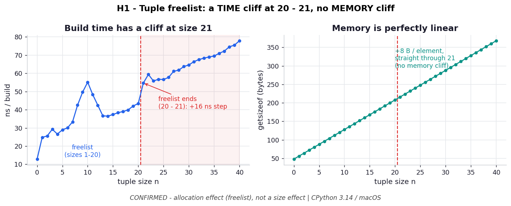

# H1 — The tuple freelist has a sharp cliff at size 20→21

**Chapter 3 hypothesis** — extends `ex07_instantiation_timing.py`.

```bash
.venv/bin/python chapter_3/hypothesis/h01_tuple_freelist_cliff/benchmark.py
```

Numbers below are **CPython 3.14.0 / macOS** — yours will differ in magnitude, but
the *shape* (a time step at 21, no memory step) is the point.

## Chart



*Left: build time climbs gently through the freelist, then jumps ~16 ns at the
20→21 boundary (red line) and keeps rising — sizes >20 always hit the allocator.
Right: `getsizeof` is a straight 8 B/elem line through the same point. The cliff is
in **allocation time**, not size.* Regenerate with
`.venv/bin/python chapter_3/hypothesis/h01_tuple_freelist_cliff/plot.py`.

## Hypothesis

ex07 shows a size-10 tuple literal is ~9× faster to build than a list, and waves
vaguely at "past size 20 the gap narrows." CPython keeps a freelist of up to 2,000
tuples for **each** size 1–20; sizes >20 always `malloc`. So:

- **Time:** building a size-`n` tuple rises gently (per-element copy) but takes a
  discrete **step up at `n=21`**, where the freelist no longer applies.
- **Memory:** `getsizeof(n)` is perfectly linear (8 B/elem) with **no** cliff — the
  cliff is an *allocation* effect, not a size effect.

## Method

For `n` in 0..40, time `tuple(src)` built from a list (so it isn't constant-folded
and must really allocate each of 2,000,000 reps), and record `getsizeof`.

## Results

```
    n   ns/build   getsizeof
   19     41.00      200 B
   20     41.78      208 B
   21     51.10      216 B    <- +9.3 ns in one step
   22     53.09      224 B
   ...
   40     77.76      368 B
```

| Region | Mean ns/build |
| --- | --- |
| `n=15..20` (freelist) | **39.2** |
| `n=21..26` (malloc)   | **55.1** |
| **step across 20→21** | **+15.9 ns** |

`getsizeof` stride is a constant **8 B/elem** straight across the boundary
(208 B → 216 B) — no memory cliff.

## Verdict

**Confirmed.** There is a clean ~16 ns time step exactly at 20→21 sitting on top of
the gentle per-element trend, and the memory curve is dead-linear through it. The
freelist's benefit is purely skipping the allocator round-trip.

## Why it matters

ex07's "tuple is faster" is only unconditionally true for tuples ≤ size 20. The
advantage is a *freelist* effect with a precise boundary — not a property of
immutability or size in general. Past 20, a fresh tuple pays the same allocator
cost as anything else. Always measure near the boundary before assuming.
