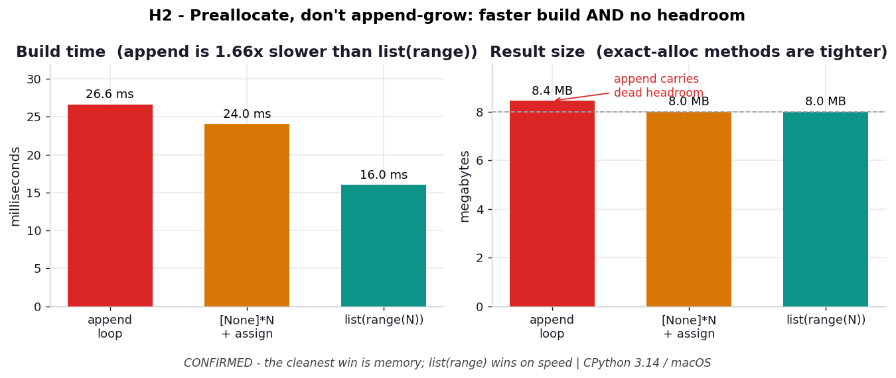

# H2 — Preallocating a list beats append-growing it

**Chapter 3 hypothesis** — extends `ex05_overallocation.py`.

```bash
.venv/bin/python chapter_3/hypothesis/h02_preallocation_vs_append/benchmark.py
```

Numbers: **CPython 3.14.0 / macOS** — yours will differ.

## Chart



*`list(range)` (teal) builds fastest; the append loop (red) is slowest **and** its
result carries ~0.5 MB of dead overallocation headroom that both exact-allocation
methods avoid. The time win from preallocation alone is modest — the clean,
deterministic win is memory.* Regenerate with
`.venv/bin/python chapter_3/hypothesis/h02_preallocation_vs_append/plot.py`.

## Hypothesis

ex05 shows append-growth pays repeated resize+copy. The book (ch6, *"Aren't Python
Lists Good Enough?"*) advises preallocating. Building `N=1,000,000` ints three ways:

- **Time:** `list(range(N))` fastest (C loop, exact alloc) → `[None]*N` + index-assign
  second (no resize, index-store beats append-call) → append loop slowest.
- **Memory:** append leaves overallocation headroom; prealloc and `list(range)` are
  exact and equal.

## Results

| method | time | peak mem | result size |
| --- | --- | --- | --- |
| append loop | 28.3 ms | 38.6 MB | **8.1 MB** |
| `[None]*N` + assign | 23.7 ms | 38.1 MB | 7.6 MB |
| `list(range(N))` | **16.0 ms** | 38.1 MB | 7.6 MB |

→ prealloc is **1.11×** faster than append; `list(range)` is **1.65×** faster.

## Verdict

**Confirmed, with a nuance.** The ordering held exactly as predicted, but the
*time* win from preallocation alone is modest (~1.1×) — a Python-level assignment
loop still dominates, so it can't approach the C-speed `list(range)` (1.65×). The
cleaner, fully deterministic win is **memory**: the append loop's result carries
~0.5 MB of dead headroom (8.1 vs 7.6 MB) that both exact-allocation methods avoid.

## Why it matters

The takeaway isn't "always preallocate" — it's *don't grow by append when you can
allocate the whole thing at once*. If a C-level constructor (`list(range)`, a
comprehension, `list(map(...))`) can build it, that beats any Python loop. Reach for
`[None]*N` + assignment only when values must be computed positionally in a loop you
can't vectorize away. Either way you shed the append headroom ex05 measured.
