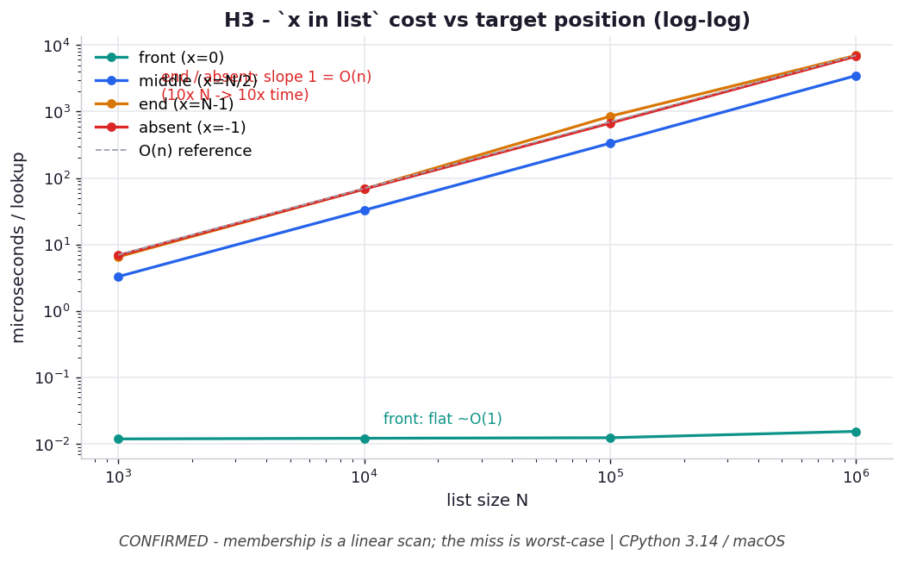

# H3 — `x in list` time is linear in x's position

**Chapter 3 hypothesis** — extends `ex02_binary_search.py` (the linear-scan side).

```bash
.venv/bin/python chapter_3/hypothesis/h03_membership_position/benchmark.py
```

Numbers: **CPython 3.14.0 / macOS** — yours will differ.

## Chart



*On log-log axes, front membership is a flat line (`O(1)`) while middle/end/absent
rise with slope 1 (`O(n)`) — a 10× bigger list costs 10× more, and the miss
(`absent`) is the worst case because it must scan everything before giving up.*
Regenerate with
`.venv/bin/python chapter_3/hypothesis/h03_membership_position/plot.py`.

## Hypothesis

ex02 frames `list.index` as an `O(n)` linear scan; membership (`in`) is the same
scan. Vary *where* the target sits in a list of `N` ints:

- front (`0`) → ~`O(1)` (found on the first compare)
- middle (`N/2`) → ~`O(N/2)`
- end (`N-1`) → ~`O(N)`
- absent (`-1`) → ~`O(N)`, the worst case — scans every element

…and end/absent times should scale linearly with `N`.

## Results — µs per `target in list`

| N | front | middle | end | absent |
| --- | --- | --- | --- | --- |
| 1,000 | 0.0126 | 3.38 | 6.66 | 6.73 |
| 100,000 | 0.0123 | 340.4 | 687.2 | 699.9 |
| 1,000,000 | 0.0168 | 3455.8 | 7070.0 | 7143.7 |

## Verdict

**Confirmed.** Front membership is flat (~0.01 µs) regardless of `N`; middle is
almost exactly half of end; end ≈ absent (both scan the whole list). Crucially,
end/absent grow **~10× for every 10× in `N`** (6.7 → 700 → 7140 µs) — the signature
of an `O(n)` scan.

## Why it matters

`x in some_list` looks `O(1)` because it's one operator, but it's a linear search
whose cost depends on luck (where the item is) and explodes on the miss case — the
worst case is exactly when the item *isn't* there, so you can't shortcut. This is
the membership-shaped version of ex02's lesson, and the direct motivation for the
next chapter: a `set`/`dict` makes `in` genuinely `O(1)` regardless of position.
