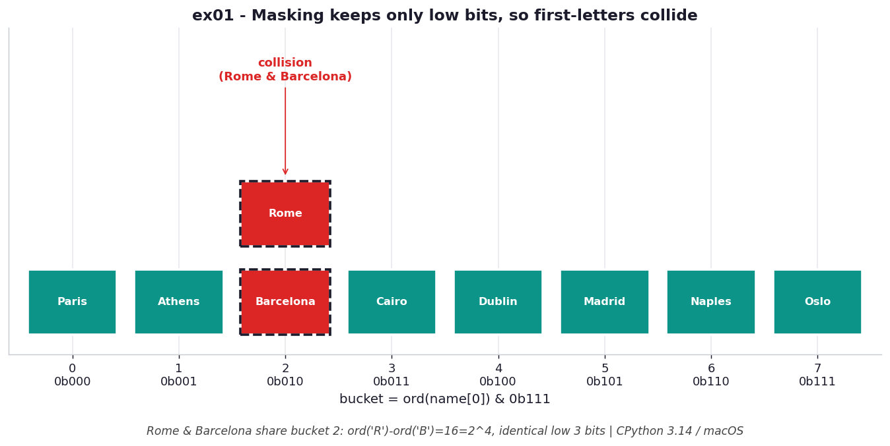

# ex01 — Turning a hash into a bucket index by hand

Every dictionary and set lookup in Python begins with a tiny piece of arithmetic
that you almost never see: the interpreter takes the full hash of your key and
folds it down to a small index that fits inside the table. This exercise does that
fold by hand, computing `hash(key) & (size - 1)` for a handful of city names so you
can watch where each one lands in an eight-bucket table — and, crucially, watch two
different cities land in the *same* bucket.

The reason this matters in real code is that collisions are not an exotic edge case;
they are a direct and predictable consequence of throwing away bits. Once you can do
the masking by hand, the behaviour of every hash table you ever touch stops being
magic and becomes arithmetic you could check on paper.

```bash
.venv/bin/python chapter_4/ex01_hash_mask/ex01_hash_mask.py   # run the benchmark
.venv/bin/python chapter_4/ex01_hash_mask/plot.py             # regenerate the chart
```

## What the benchmark measures

The benchmark times the index computation itself — the `hash(key) & mask` step —
and clocks it at about **55.2 ns/op**. That number is essentially `O(1)`: it is one
bitwise AND on top of the string hash, and the string hash is `O(len)` in the length
of the key rather than in the size of the table. There is no memory cost to speak of
either, because the index is *computed* on demand; nothing is stored anywhere to
help you find it later. This is the whole appeal of hashing — locating a key is
arithmetic, not search.

## Reading the chart



*`ord('R')` and `ord('B')` differ by 16 (`2^4`), so their low three bits are
identical — both land in bucket 2.*

The chart lays out the eight buckets of the table as a strip and drops each city into
the slot its masked hash selects. Most cities scatter into their own buckets, which is
exactly what you want, but Rome and Barcelona both come to rest in bucket 2. The
diagram is conceptual rather than timed: it is showing you *placement*, the structural
fact that two distinct keys can share a slot. Note that this run is CPython 3.14 on
macOS; the precise hashes (and therefore which cities collide) depend on the build and
its hash seed, so the specific pairing is illustrative.

## What it means

Masking with `size - 1` keeps only the low bits of the hash and discards the rest, so
any two keys that happen to agree on those low bits will collide no matter how wildly
their full hashes differ. That is not a bug to be fixed but a tradeoff to be managed:
the table is small, the hash is large, and something has to give. The lesson is that
collisions are normal and expected, which is why the rest of the chapter is really
about handling them gracefully (probing) rather than pretending they won't happen.

## Five whys

1. **Why does a dict find a key without searching?** Because the key is hashed to an
   integer and then masked into a bucket index — the location is computed directly
   rather than looked for.
2. **Why mask the hash instead of using it raw?** A hash can be any integer at all,
   so masking with `size - 1` keeps only the low bits and guarantees the index lands
   inside the allocated buckets (`28975 & 0b111 = 7`).
3. **Why do collisions still happen if the index is computed?** Because masking throws
   away the high bits, so two keys that share the same low bits map to the same bucket
   — Rome and Barcelona both resolve to index 2.
4. **Why do Rome and Barcelona share those low bits in particular?** Their first
   letters differ by exactly 16 (`2^4`), and that difference lives above the three
   bits the mask keeps, so it is discarded and the two become indistinguishable to
   the table.
5. **Why keep so few bits that distinct keys become indistinguishable?** Because the
   table only has eight slots, and an index that addresses eight slots needs just
   three bits — there is physically nowhere for the higher bits to go.

**Root cause:** A hash table buys `O(1)` location by computing an address from the key,
but the address has to fit the table, so the high bits of the hash are deliberately
discarded — and any keys that agreed on the surviving low bits collide as a direct
consequence.
