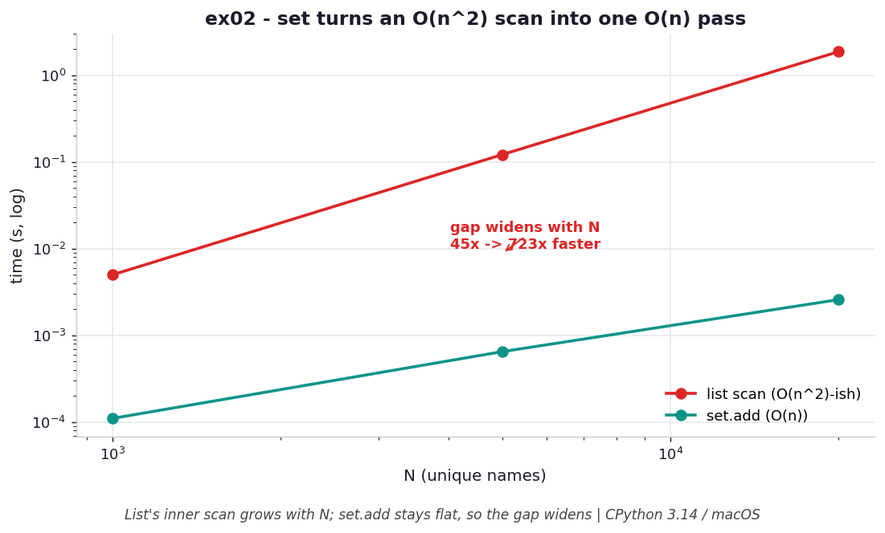

# ex02 — Finding unique names with a set versus a growing list

A very common task is "go through this stream of names and collect the distinct
ones." There are two natural ways to do it. You can keep a list of names you've seen
and, for each new name, scan that list to check whether it's already there. Or you can
keep a set and simply add every name, letting the set absorb the duplicates. Both are
correct; this exercise measures how differently they scale as the input grows.

The reason it matters is that the two approaches have fundamentally different
complexity, and that difference only becomes visible at size. On a few dozen names you
would never notice; on tens of thousands the list-based version becomes painfully slow
while the set-based version barely moves.

```bash
.venv/bin/python chapter_4/ex02_set_vs_list_unique/ex02_set_vs_list_unique.py   # run the benchmark
.venv/bin/python chapter_4/ex02_set_vs_list_unique/plot.py                      # regenerate the chart
```

## What the benchmark measures

The benchmark times both approaches at several input sizes and reports the set's
speedup over the list. The gap is not constant — it *widens* with N: roughly **44×**
at 1,000 names, **199×** at 5,000, and **718×** at 20,000. That widening is the whole
story, because it tells you the two methods are in different complexity classes rather
than just differing by a constant factor. The cost is paid in memory: at N=20,000 the
list method peaks at about **1.1 MB** while the set method peaks at **3.4 MB**, roughly
three times as much.

## Reading the chart



*The list's per-name inner scan grows with N while `set.add` stays flat, so the
speedup keeps widening.*

The chart is log-log, which is the right lens for comparing growth rates: a steeper
line means a worse complexity class, not merely a slower constant. The list curve
climbs noticeably faster than the set curve, and because the axes are logarithmic the
*growing vertical gap* between them is precisely the widening speedup you saw in the
numbers. These are CPython 3.14 / macOS timings and the absolute magnitudes will vary
by machine, but the relative shape — one line pulling away from the other — is what
the data structures dictate and will reproduce anywhere.

## What it means

The list approach hides a loop inside a loop: for each of N names it scans a "seen"
list that itself grows toward N, which is the classic `O(n²)`-shaped cost. The set
approach has no inner loop at all, because `set.add` jumps straight to a computed slot
in `O(1)`, leaving a single `O(n)` pass over the data. You pay for that with about 3×
the memory for the hash table's empty slots. The practical rule is simple: for
membership and de-duplication at any real scale, reach for a set, and treat the extra
memory as the price of staying linear.

## Five whys

1. **Why is finding unique names `O(n)` with a set but roughly `O(n²)` with a list?**
   The set has no inner loop — `set.add` is `O(1)` — so only the single pass over the
   names counts; the list must search its growing "seen" list on every name.
2. **Why does the list's inner search inflate the cost?** The "seen" list grows toward
   N as names prove unique, so each of N names triggers a linear scan over an
   ever-larger list.
3. **Why can the set add in `O(1)` without scanning?** It stores keys in a hash table,
   so it jumps straight to the key's computed slot to test membership instead of
   comparing against every key already stored.
4. **Why does that gap *widen* with N rather than stay a fixed multiple?** The scan
   factor the list pays grows with the data size, while the set's per-operation cost
   stays flat, so their ratio grows without bound — 44× at 1k, 718× at 20k.
5. **Why does the set's per-operation cost stay flat as the data grows?** Because a
   hash table locates a key by computing its address, and that arithmetic costs the
   same whether the table holds ten keys or ten million.

**Root cause:** A hash-indexed structure removes the per-element comparison entirely —
you pay `O(1)` to locate by key instead of `O(n)` to search — and that constant-versus-
growing difference compounds as the data grows, which is why the speedup keeps widening.
