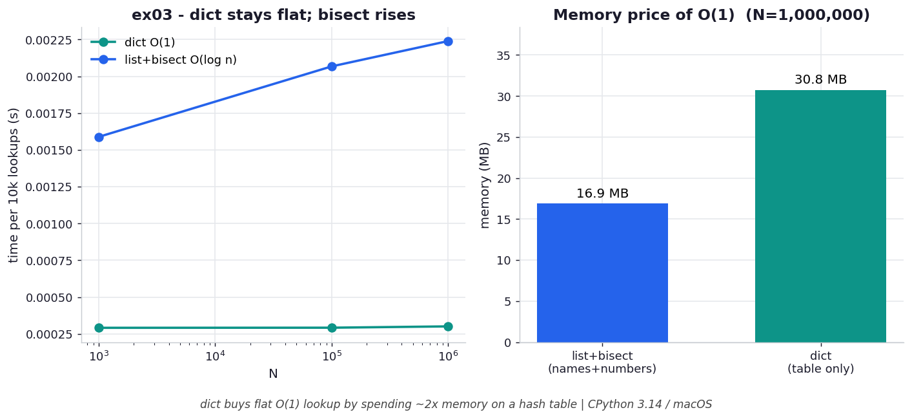

# ex03 — Constant-time dict lookup versus a sorted list with bisect

When you need to look things up by key, a dictionary is the obvious tool, but it is
not the only one. If your keys are sortable you can keep them in a sorted list and use
binary search (`bisect`) to find them in `O(log n)` time. This exercise pits the two
against each other on both axes that matter — lookup time and memory — so you can see
the tradeoff rather than assume one always wins.

This is a genuinely practical decision. Sorted-list-plus-bisect is attractive when
memory is tight or when you also need ordered iteration and range queries; a dict is
attractive when lookups are frequent and you want them flat and fast. Knowing the shape
of each cost lets you pick deliberately.

```bash
.venv/bin/python chapter_4/ex03_dict_vs_bisect/ex03_dict_vs_bisect.py   # run the benchmark
.venv/bin/python chapter_4/ex03_dict_vs_bisect/plot.py                  # regenerate the chart
```

## What the benchmark measures

The benchmark times a lookup in each structure across growing N and tracks the memory
each one occupies. The dict's lookup time stays flat while bisect's creeps upward, so
the dict's advantage grows with size: the ratio moves from **5.2×** at N=1,000 to
**7.0×** at 100,000 to **7.7×** at 1,000,000. The memory ledger runs the other way: at
N=1,000,000 the list-plus-bisect representation (names and numbers) uses about
**16.1 MB**, while the dict uses **29.3 MB** — roughly double. So the dict is faster and
fatter; bisect is leaner and slower-growing.

## Reading the chart



*dict lookup stays flat while `bisect` climbs with N — paid for with roughly double the
memory of the list+bisect approach.*

The chart has two panels. The left panel plots lookup time against N: the dict line is
essentially horizontal (`O(1)`), while the bisect line drifts upward because each
doubling of N adds one more comparison to the binary search (`O(log n)`). The right
panel is the memory comparison, two bars showing the dict's hash table costing about
twice the compact sorted arrays. These are CPython 3.14 / macOS numbers and absolute
values shift by machine, but the qualitative split — flat-but-heavy versus
growing-but-light — is structural.

## What it means

The dict buys flat, constant-time lookup by spending memory on a hash table that is
deliberately kept partly empty, whereas bisect buys low memory by accepting a lookup
cost that grows, however gently, with the logarithm of N. Neither is universally
correct. If you do enormous numbers of lookups and have the RAM, the dict's flatness
pays off; if memory is your constraint, or you need the ordering that a sorted list
gives you for free, bisect's `O(log n)` is a small price. Pick per your lookup volume
and your memory budget.

## Five whys

1. **Why does the dict's lookup stay flat while bisect's grows?** The dict computes the
   key's address and goes straight there in `O(1)`; bisect must repeatedly halve a
   sorted range, doing `O(log n)` comparisons.
2. **Why does halving the range cost more as N grows?** Each doubling of N adds exactly
   one more halving step before the search narrows to a single element, so the work
   rises with the logarithm of N.
3. **Why can the dict avoid that searching entirely?** It stores keys in a hash table
   and locates each one by arithmetic on its hash, so it never compares against the
   other keys at all.
4. **Why does that constant-time lookup cost about twice the memory?** A hash table is
   kept only partly full (≤ 2/3) to keep collisions rare, so it always carries empty
   slots, whereas the sorted list packs its elements with no slack.
5. **Why must the table stay partly empty instead of packing tight?** Because a fuller
   table collides far more often, lengthening probe chains and eroding the very `O(1)`
   lookup that justified using a dict in the first place.

**Root cause:** The two structures sit at opposite ends of a time-versus-space
tradeoff — the dict spends deliberately wasted memory to make lookup a single address
computation, while the sorted list spends extra lookup time to stay packed; you choose
which resource you'd rather spend.
