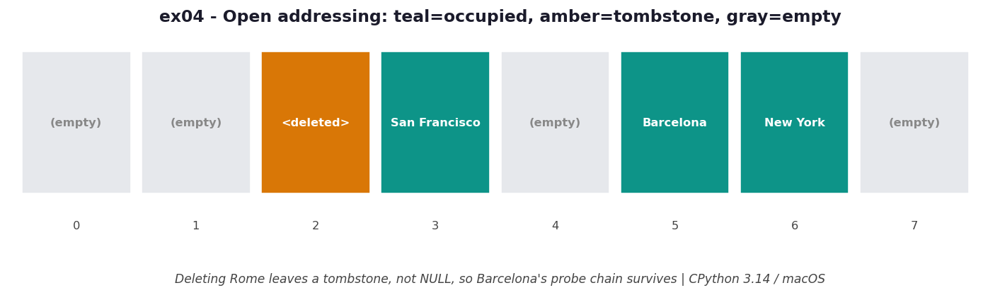

# ex04 — Tracing the probe sequence, a missed lookup, and the tombstone on delete

Once you accept that collisions happen (ex01), the next question is what the table does
about them. CPython resolves collisions with *open addressing*: when a key's first
bucket is taken, it follows a deterministic, perturbed probe sequence to the next
candidate slot, and the next, until it finds either the key or an empty slot. This
exercise implements that perturbed probe sequence by hand and traces three things — a
chain of collisions, a lookup that *misses*, and what happens to a slot when you delete
the key that lived there.

This is the heart of how dictionaries actually work, and the tombstone behaviour in
particular is the kind of detail that, if you got it wrong in a from-scratch hash table,
would silently corrupt lookups. Seeing it traced makes the invariant obvious.

```bash
.venv/bin/python chapter_4/ex04_probing_trace/ex04_probing_trace.py   # run the benchmark
.venv/bin/python chapter_4/ex04_probing_trace/plot.py                 # regenerate the chart
```

## What the benchmark measures

This exercise is structural rather than a stopwatch race, so the "measurement" is the
shape of the work. A lookup costs *one probe per collision in the chain*: with a good
hash that keeps chains short it is `O(1)` amortized, but in the worst case where
everything collides it degrades to `O(n)` (which is exactly what ex06 demonstrates).
The table itself is `O(n)` in buckets and is deliberately kept no more than two-thirds
full so the chains stay short. Deletion does not shrink anything or reclaim the slot
immediately; it leaves a tombstone behind, and the real cleanup is deferred to the next
resize.

## Reading the chart



*After deleting Rome, slot 2 holds a tombstone (not `NULL`), so Barcelona's probe chain
keeps walking instead of stopping early.*

The chart draws the eight slots of the table as cells and colours them by state:
occupied buckets in teal, empty buckets in gray, and the deleted slot in amber to mark
the tombstone. The diagram depicts a precise moment — just after Rome is deleted from
slot 2. Because Barcelona collided with Rome and was probed *past* slot 2 to a later
slot, that amber tombstone is load-bearing: it tells a future search for Barcelona to
keep walking the chain rather than conclude the table is empty here. These are
CPython 3.14 / macOS placements and the exact slots depend on the hash seed.

## What it means

Probing makes a bucket's meaning depend on its neighbours: a key may live several slots
*past* the bucket it originally hashed to, reachable only by following the chain
through the slots ahead of it. That is why deletion cannot simply write `NULL` — `NULL`
is the signal that *ends* a probe search, and writing it would sever the chain and
lose every key stored beyond the deleted slot. The fix is a tombstone, a dummy sentinel
that means "empty, but keep going." It costs a slot until the next resize sweeps it
away, and that's a bargain compared to re-probing the whole table on every delete.

## Five whys

1. **Why can't a deleted bucket just be set to `NULL`?** Because `NULL` is the sentinel
   that *stops* a probe search; writing it would make chains terminate early and lose
   any key stored past the deleted slot.
2. **Why would a key be stored past the deleted slot?** Collisions push later keys
   further along the probe sequence — a lookup for Barcelona must pass *through* Rome's
   slot to reach it.
3. **Why does a special dummy sentinel fix this?** It marks the slot as empty-but-
   formerly-used, so a probe skips over it and keeps following the index sequence
   instead of concluding the key is absent.
4. **Why not compact the table immediately on delete to remove the dummy?** That would
   force re-probing and reinserting many keys on every single deletion; dummies are
   cheap, and the slots get reclaimed later for free.
5. **Why is deferring that cleanup to resize acceptable?** Because resize already
   reinserts every element with recomputed indices, so the dummy slots are dropped
   then anyway — and resize is rare relative to how often you delete.

**Root cause:** Probing makes a bucket's meaning depend on its neighbours, so a delete
must not break the chain — it leaves a tombstone that preserves the path and lets the
next resize do the real cleanup.
