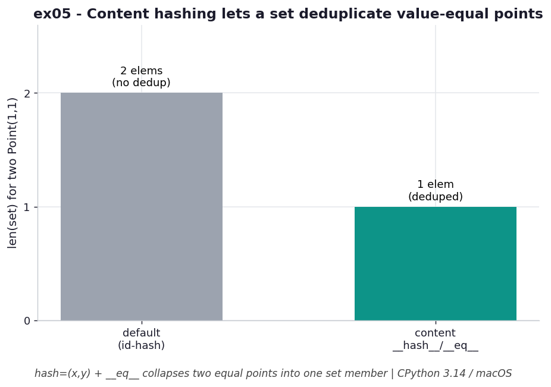

# ex05 — A content-based `__hash__` so value-equal objects deduplicate

By default, a custom Python object is hashed by its identity — essentially its memory
address — so two objects are "the same" only if they are literally the same object.
That is usually wrong for value types. If you make a `Point(1, 1)` and another
`Point(1, 1)`, you almost certainly want a set to treat them as one. This exercise
defines `__hash__` and `__eq__` in terms of the point's contents (its `(x, y)` tuple)
so that value-equal points collapse to a single set member.

This matters anywhere you put your own objects into sets or use them as dict keys:
configuration records, coordinates, value objects of any kind. Get the hash/eq pair
right and de-duplication "just works"; get it wrong and you get silent duplicates or,
worse, an unhashable class.

```bash
.venv/bin/python chapter_4/ex05_point_hash/ex05_point_hash.py   # run the benchmark
.venv/bin/python chapter_4/ex05_point_hash/plot.py             # regenerate the chart
```

## What the benchmark measures

The benchmark times the content-based `__hash__` and clocks it at about
**100.8 ns/op**, since it hashes the underlying `(x, y)` tuple rather than reading an
identity. That is a touch slower than the trivial identity hash the default would give
you, but the point here is correctness, not speed: the goal is that a set actually
deduplicates value-equal points. The memory cost is `O(1)` per object — defining a hash
doesn't add storage. The thing to keep in mind is that the hash stays `O(1)`, because
every set and dict operation will inherit whatever cost you put in `__hash__`.

## Reading the chart



*With a content-based `__hash__`/`__eq__`, two value-equal `Point(1, 1)` objects
collapse to a single set member.*

The chart is a simple before/after: two bars showing the size of a set after inserting
two `Point(1, 1)` objects. With the default identity hash the set has two members,
because the two objects have different addresses and therefore look distinct. With the
content-based hash the set has one member, because the two points hash and compare
equal and so collapse. The diagram depicts *behaviour*, not timing — it's illustrating
the correctness consequence of how you define the hash. This is CPython 3.14 / macOS.

## What it means

The lesson is twofold. First, a custom hash must stay `O(1)`: if your `__hash__` does
something expensive, every membership test, every insert, every lookup pays that cost,
and it compounds across the whole program. Second, hashing and equality are a matched
pair — Python enforces this by making a class unhashable if you define `__eq__` without
`__hash__`, because a set's invariant ("equal keys share a slot") breaks the moment two
objects compare equal but hash differently. Define both together, in terms of the same
fields, and keep the computation cheap.

## Five whys

1. **Why do two `Point(1, 1)` objects count as one set member after this change?**
   Because `__hash__` and `__eq__` are now computed from the point's contents, so the
   two equal points produce the same hash and compare equal — the set collapses them.
2. **Why does sharing a hash and comparing equal collapse them?** A set places a key by
   its hash and then confirms with `==`; two keys with the same hash that test equal are
   treated as the same key, so the second insert is a no-op.
3. **Why does the default hash *not* collapse them?** The default hashes by identity
   (the object's address), so two separately constructed points get different hashes
   and look like distinct keys.
4. **Why must `__hash__` stay `O(1)` for this to be worth doing?** Because the set
   calls it on every operation, so any cost inside the hash is multiplied across every
   insert, lookup, and membership test the program performs.
5. **Why does Python make the class unhashable if you define `__eq__` alone?** Because
   equal objects that hash differently would land in different buckets and silently
   break the set's "equal keys share a slot" invariant, so Python refuses rather than
   let you corrupt it.

**Root cause:** A set's correctness rests on the contract that equal keys produce equal
hashes; defining `__hash__` and `__eq__` together from the same content honours that
contract, and keeping the hash `O(1)` keeps the whole structure fast.
