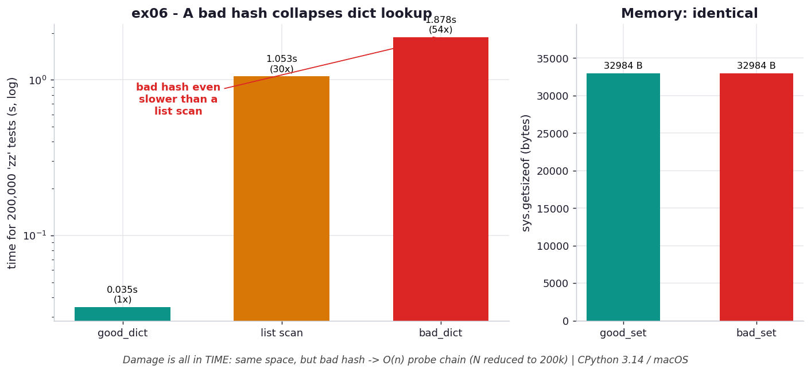

# ex06 — What a degenerate hash function does to dict performance

A dictionary's famous `O(1)` lookup is not a guarantee — it is a promise conditional on
a good hash function. This exercise breaks that promise on purpose. It compares a
`BadHash` class whose `__hash__` returns the constant 42 for *every* key against a
`GoodHash` whose hashing spreads keys perfectly, and throws in a plain list scan as a
baseline, then watches what each costs for a million membership tests.

The point is to feel, in seconds, how much the dict's speed depends on the hash. It is
easy to write a custom `__hash__` that quietly collides far more than you intended, and
this exercise shows the worst case so you know what's at stake — a dict that has become
slower than the list it was supposed to beat.

```bash
.venv/bin/python chapter_4/ex06_good_bad_hash/ex06_good_bad_hash.py   # run the benchmark
.venv/bin/python chapter_4/ex06_good_bad_hash/plot.py                 # regenerate the chart
```

## What the benchmark measures

The benchmark runs 1,000,000 membership tests of `"zz"` against each structure. The
good dict finishes in **0.172 s** and serves as the baseline. The plain list scan takes
**5.29 s**, about **30.7×** slower. The bad dict is worst of all at **9.46 s**, about
**54.9×** slower — meaning a dict with a degenerate hash loses even to a linear list
scan. The striking part is memory: across 676 entries, `good_set` and `bad_set` occupy
**identical** bytes (32,984 B each), with the list at 6,136 B. The bad hash costs you
nothing in space and everything in time.

## Reading the chart



*The bad hash is even slower than a plain list scan, yet `bad_set` and `good_set` occupy
identical bytes — a degenerate hash costs only time. (N reduced to 200k here;
magnitudes differ from the prose above.)*

The chart uses a logarithmic y-axis for time because the differences span orders of
magnitude: the good dict's bar is tiny, the list scan's is large, and the bad dict's is
the tallest of the three. Alongside, the memory bars for the two sets are the same
height, making the central point visible at a glance — equal storage, wildly unequal
speed. Note the chart regenerates with N reduced to 200k, so its absolute magnitudes
differ from the prose numbers above; the *shape* (bad dict worst, memory equal) is the
takeaway. CPython 3.14 / macOS.

## What it means

When a hash collapses every key onto one value, the table stops being a hash table and
becomes a linked linear search: all the keys land in one probe chain, and finding any
one of them means walking the whole chain slot by slot — plus paying hash and equality
overhead at each step, which is why it loses even to a bare list scan. And it does all
this in exactly the same memory as a perfect hash, because the number of slots is
unchanged; only the *distribution* of keys across them collapsed. The damage from a bad
hash is invisible in a memory profile and brutal in a time profile.

## Five whys

1. **Why can a dict lookup ever become `O(n)`?** Because if the hash maps many keys to
   one value — `BadHash` returns 42 for everything — they all collide into a single
   probe chain that has to be walked linearly.
2. **Why does one shared hash force walking the chain?** Every colliding key sits along
   the same probe sequence, so finding the right one means probing slot after slot —
   which is exactly a linear search.
3. **Why is a constant (or near-constant) hash so destructive?** It yields almost no
   distinct values — one for `BadHash` — so all the keys crowd into a single bucket;
   low entropy means crowded buckets and long chains.
4. **Why does *entropy* capture whether a hash is good?** Entropy is highest when every
   hash value is equally likely; an ideal hash spreads keys uniformly across buckets,
   which minimizes the longest probe chain.
5. **Why does the slowdown reach 54× — worse than a plain list?** Because with all keys
   colliding the dict does a linear scan *plus* hash and equality overhead on every
   probe, so it loses even to a list's bare comparison loop.

**Root cause:** The dict's `O(1)` is a promise conditional on a high-entropy hash; a
hash that collides everything turns the table back into a linear search and erases the
entire advantage — while costing exactly the same memory.
