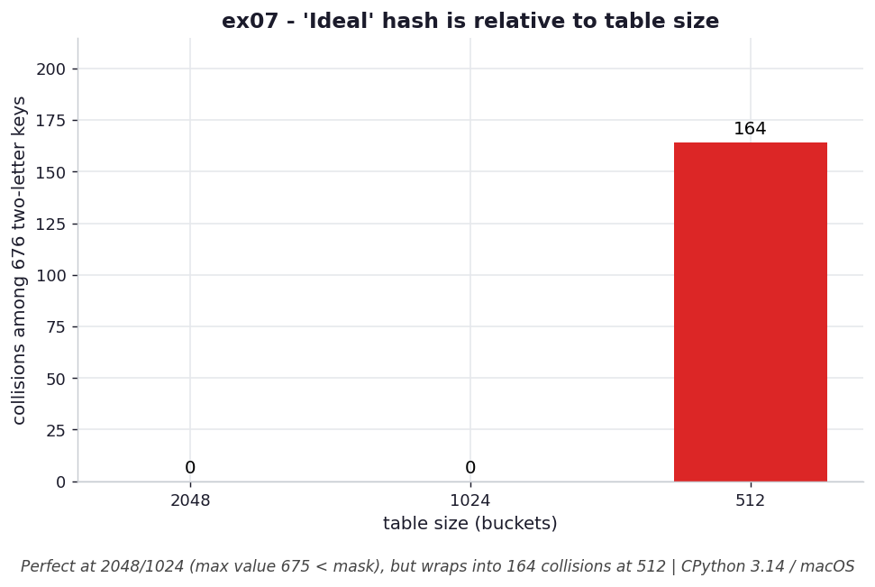

# ex07 — Why a "perfect" hash is only perfect at the right table size

It is tempting to think a hash function is good or bad on its own, but goodness is
always relative to the table it feeds. This exercise builds a hand-crafted hash for all
676 two-letter strings (`aa` through `zz`) that produces 676 distinct hash values — a
genuinely collision-free mapping — and then asks the sharper question: does it *stay*
collision-free once you mask those hashes into tables of different sizes?

This is the subtle trap behind ex06. A hash with perfect entropy can still collide
badly if the table is too small to hold its range, because masking discards exactly the
bits that distinguished the keys. Designing a collision-free hash means designing it for
a specific table size, not in the abstract.

```bash
.venv/bin/python chapter_4/ex07_twoletter_hash/ex07_twoletter_hash.py   # run the benchmark
.venv/bin/python chapter_4/ex07_twoletter_hash/plot.py                  # regenerate the chart
```

## What the benchmark measures

The benchmark counts how many of the 676 keys collide once their hashes are masked into
tables of three sizes. At table size 2048 and at 1024 there are **0 collisions** —
every key keeps its own slot, so every lookup is a single probe (`O(1)`). At table size
512, however, the same "perfect" hash produces **164 collisions**, because the mask now
keeps fewer bits than the largest key value (675) needs, and keys begin wrapping onto
each other. Collisions translate directly into longer probe chains, so the same hash
quietly stops being `O(1)` per lookup.

## Reading the chart



*The same "perfect" two-letter hash is collision-free at 2048/1024 buckets but wraps
into 164 collisions once the 512-bucket mask drops below the max key value (675).*

The chart is three bars, one per table size, showing the collision count: flat at zero
for 2048 and 1024, then jumping to 164 at 512. The diagram makes the threshold vivid —
nothing degrades gradually here; collisions are zero right up until the mask becomes too
narrow to represent the full key range, and then they appear in bulk. This is a
structural count rather than a timing, and it's deterministic: it does not depend on the
machine, only on the arithmetic. (Computed under CPython 3.14 / macOS.)

## What it means

"Ideal" is a property of the hash *and* the mask together, not the hash alone. A
function that assigns 676 keys to 676 distinct values is collision-free only while the
table is large enough to keep all the bits that distinguish those values; the moment the
table shrinks below the key range, the mask amputates the high bits and distinct keys
start landing in the same slot. To design a collision-free hash you have to know both
the value range you're hashing and the table size you'll mask into — one without the
other tells you nothing.

## Five whys

1. **Why does the same perfect hash collide at 512 buckets but not at 1024?** Because at
   512 the mask keeps fewer bits than the largest hash value (675) needs, so the high
   bits that distinguished keys are discarded and some keys land together.
2. **Why does masking discard the bits that distinguish the keys?** The index must fit
   the table, so masking with `size - 1` keeps only the low bits; any information living
   above those bits is thrown away.
3. **Why is 1024 enough bits but 512 not?** 675 needs ten bits to represent, and a
   1024-slot table keeps ten bits while a 512-slot table keeps only nine — one bit short
   of the key range.
4. **Why does losing that one bit cause collisions specifically?** Keys whose hashes
   differ only in the dropped bit become indistinguishable after masking, so each such
   pair collapses into a single bucket.
5. **Why does that collapse hurt lookups?** Collided keys share a probe chain, so a
   lookup must walk several slots instead of one, eroding the `O(1)` the perfect hash
   was supposed to deliver.

**Root cause:** A hash is only collision-free relative to a mask wide enough to preserve
its full key range; shrink the table below that range and masking destroys the
distinguishing bits, so even a perfectly designed hash collides.
