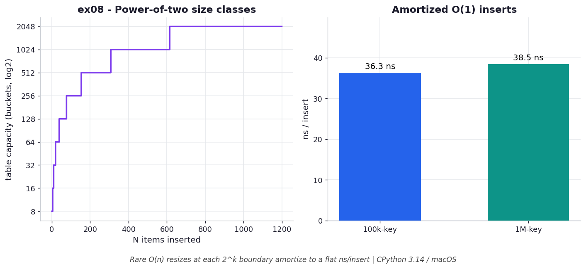

# ex08 — Resize arithmetic, the shrink quirk, and amortized-O(1) inserts

A hash table can't stay one fixed size forever — as it fills up it has to grow, and
growing means allocating a bigger table and reinserting every existing key with a fresh,
recomputed index. That sounds expensive, and a single resize genuinely is `O(n)`. This
exercise works through the resize arithmetic (the power-of-two size classes), checks an
old claim about shrinking from the book against current CPython, and times inserts at
two very different scales to confirm they stay flat.

It matters because "amortized `O(1)`" is one of those phrases that's easy to recite and
hard to feel. Watching the per-insert time stay flat across a 10× change in size, even
though resizes are firing along the way, is what makes the amortization real. The shrink
check also doubles as a lesson in re-profiling assumptions across interpreter versions.

```bash
.venv/bin/python chapter_4/ex08_resizing/ex08_resizing.py   # run the benchmark
.venv/bin/python chapter_4/ex08_resizing/plot.py            # regenerate the chart
```

## What the benchmark measures

On the memory side, the table grows through size classes 8 / 16 / 32 / …, so 1039 keys
land in a 2048-bucket table. The 2nd-edition book's claim that inserting after deletions
triggers a shrink **does not hold on CPython 3.14**: after popping 999 of 1000 keys and
inserting one, the table stays at **36,952 B** rather than shrinking, and only an
explicit `dict.copy()` rebuilds it down to **224 B**. On the time side, building a
100,000-key dict costs **35.9 ns/insert** and a 1,000,000-key dict costs
**38.2 ns/insert** — essentially flat across a 10× size jump, despite the `O(n)` resizes
that fired at each power-of-two boundary. That flatness is amortized `O(1)` in action.

## Reading the chart



*Capacity jumps through power-of-two size classes (left), yet ns/insert stays flat for
100k versus 1M keys (right) — the rare `O(n)` resizes amortize to `O(1)`.*

The left panel is a step plot of table capacity as keys are added: it holds flat, then
jumps to the next power of two, holds flat, jumps again — the staircase of size classes.
The right panel shows ns/insert for the 100k and 1M builds as two nearly equal bars,
which is the whole argument made visual: the staircase on the left has those `O(n)`
resize jumps in it, yet the average per-insert cost on the right barely moves. These are
CPython 3.14 / macOS numbers and the absolute nanoseconds vary by machine; the flatness
is what's structural.

## What it means

The reason inserts stay cheap on average is that the expensive resizes are rare — one
`O(n)` rebuild only after roughly `n` cheap `O(1)` inserts — so spreading that one big
cost across all the small ones leaves the average at `O(1)`. Power-of-two sizing is what
keeps each individual insert's index math down to a single bitwise AND. The shrink quirk
carries a second, meta-level lesson the chapter itself flags: performance behaviour
changes between CPython versions, so claims you read in a book are hypotheses to re-test,
not facts to trust forever.

## Five whys

1. **Why does insertion stay `O(1)` when the table sometimes resizes?** Because resize
   fires only when the table crosses two-thirds full (three-fifths for sets), not on
   every insert, so its cost is spread out rather than paid each time.
2. **Why resize at two-thirds full specifically?** A table kept ≤ 2/3 full balances
   memory against collisions — fuller tables collide too often, emptier ones waste
   space.
3. **Why is the resize itself expensive?** A larger table is allocated and *every*
   existing key is reinserted with a recomputed index, because the mask changed, so one
   resize is `O(n)`.
4. **Why doesn't that `O(n)` resize make inserts `O(n)`?** Because it happens only after
   roughly `n` cheap inserts, so amortized over all of them the per-insert cost is still
   `O(1)` — which is exactly why 100k and 1M show the same ~36–38 ns.
5. **Why are the sizes always powers of two (8, 16, 32, …)?** So the mask can be a clean
   run of low bits (`size - 1`), reducing the hash-to-index step to a single bitwise AND.

**Root cause:** Amortization — rare `O(n)` resizes spread across many `O(1)` inserts
keep the average at `O(1)`, and power-of-two sizing keeps each insert's index math a
single AND; the lone caveat is that exact behaviour (like the missing shrink) shifts
between CPython versions, so always re-profile.
