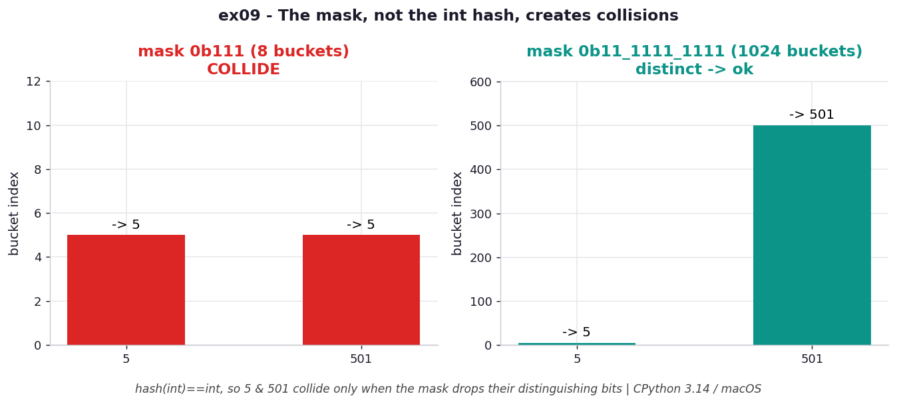

# ex09 — `hash(int) == int`, and how a finite table reintroduces collisions

Integers are the simplest case in the whole chapter, because Python's hash for an int
(in range) is the integer itself: `hash(5)` is `5`, `hash(501)` is `501`. That has a
lovely consequence — in an infinite table, integers would never collide, since distinct
integers have distinct hashes by definition. This exercise pins down that identity and
then shows precisely where collisions sneak back in: not from the hash, but from the
finite mask.

It matters because it isolates the *source* of collisions cleanly. With strings the
hash and the mask both contribute, so it's hard to tell which is to blame. With ints the
hash is a perfect identity, so anything that goes wrong is unambiguously the mask's doing
— which makes ints the clearest possible illustration of ex01's lesson.

```bash
.venv/bin/python chapter_4/ex09_int_hash/ex09_int_hash.py   # run the benchmark
.venv/bin/python chapter_4/ex09_int_hash/plot.py            # regenerate the chart
```

## What the benchmark measures

The work here is pure bit math — `O(1)` in time and with no allocation, so there is no
memory cost to track. The result that matters is structural: `5` and `501` **collide**
in an 8-bucket table (both mask down to bucket 5) but **do not collide** in a 1024-bucket
table, where they keep distinct slots. Since the hash is an exact identity, the two
integers are perfectly distinguishable; the only thing that can erase that distinction
is a mask too narrow to keep the bits where they differ.

## Reading the chart



*Since `hash(int) == int`, 5 and 501 collide only when the small 8-bucket mask discards
the bits that distinguish them; a 1024-bucket mask keeps them apart.*

The chart has two panels, one per mask. In the left panel (mask `0b111`, eight buckets)
both 5 and 501 are drawn landing in the same cell — bucket 5 — because masking 501 to
three bits gives `501 & 7 = 5`. In the right panel (1024 buckets) the two integers sit in
separate cells, distinct again. The diagram depicts placement under each mask, making the
collision a thing you can point at rather than a number you have to take on faith. The
arithmetic is deterministic, independent of machine; computed under CPython 3.14 / macOS.

## What it means

The headline is that the hash function is *not* where integer collisions come from — it's
flawless, an identity map. Collisions are entirely a consequence of finiteness: a real
table has a fixed number of buckets, so the mask must throw bits away, and any two
integers that agreed on the surviving low bits collapse together. Make the table big
enough to keep the distinguishing bits and the collision vanishes. This is ex01's lesson
in its purest form — the mask, not the hash, is the collision machine.

## Five whys

1. **Why do 5 and 501 collide in an 8-bucket table but not a 1024-bucket one?** Because
   the 8-bucket mask keeps only three bits, and `5` and `501` share those three low bits
   (`501 & 7 == 5`); the 1024-bucket mask keeps ten bits, where they differ.
2. **Why does masking to three bits make them identical?** The two integers differ only
   in bits above the third, and an 8-slot table addresses just three bits, so everything
   above that is discarded.
3. **Why must those higher bits be discarded at all?** Because the index has to fit the
   table — eight slots can be addressed by exactly three bits, and there is nowhere for
   the rest to go.
4. **Why isn't the hash function to blame, the way it is for a bad string hash?** Because
   `hash(int) == int` is a perfect identity: every distinct integer has a distinct hash,
   so the hash contributes zero collisions on its own.
5. **Why, then, do integer collisions exist in real dicts at all?** Because real tables
   are finite, so the mask is unavoidable, and any keys that coincide on the bits the
   mask keeps will collide regardless of how perfect the hash is.

**Root cause:** With integers the hash is a flawless identity, so collisions come purely
from the finite mask discarding the high bits — grow the table to retain those bits and
the collision disappears, which proves the mask, not the hash, is the source.
