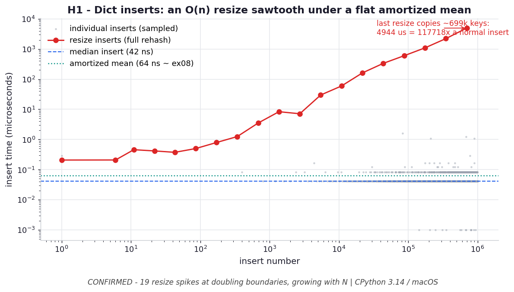

# H1 — Dict inserts hide an O(n) resize "sawtooth"

**Chapter 4 hypothesis** — extends `ex08_resizing.py`.

```bash
.venv/bin/python chapter_4/hypothesis/h01_insert_sawtooth/benchmark.py
```

Numbers: **CPython 3.14.0 / macOS** — yours will differ.

## Chart



*Each red dot is a resize that rehashes the whole table; they sit on power-of-two
boundaries and grow without bound (the last ≈ 5 ms), while the grey cloud of normal
inserts hugs the median (blue dashed). The amortized mean (teal dotted) is the flat
~38–60 ns ex08 reports — the spikes are real but rare.* Regenerate with
`.venv/bin/python chapter_4/hypothesis/h01_insert_sawtooth/plot.py`.

## Hypothesis

ex08 reports inserts are *amortized* flat (~38 ns each). That average **hides** the
mechanism: most inserts are `O(1)`, but the rare insert that crosses ⅔-full triggers
a full rehash that copies every existing key — an `O(n)` spike. Timing each
individual insert should reveal a handful of spikes, located exactly at the
capacity-doubling boundaries (cross-checked via `getsizeof`), whose **magnitude grows
with dict size**, while the baseline insert stays flat.

## Method

Insert 0..1,000,000 one at a time under `perf_counter_ns`; report every insert where
`getsizeof` jumped (a real resize) with its timing.

## Results

```
median insert:            42 ns
90th-pct non-resize:      83 ns   (the flat baseline)
mean over ALL inserts:    59.9 ns (amortized -- compare ex08 ~38 ns)
```

The **19** capacity-doubling resizes (each at ~2× the previous position):

| at insert # | insert time | capacity jump | × median |
| --- | --- | --- | --- |
| 42 | 0.6 µs | 1.1 KB → 2.2 KB | 14× |
| 1,365 | 4.3 µs | 36.1 KB → 72.1 KB | 102× |
| 10,922 | 73.0 µs | 288 KB → 576 KB | 1,738× |
| 87,381 | 572 µs | 2.5 MB → 5.0 MB | 13,629× |
| 349,525 | 2,207 µs | 10 MB → 20 MB | 52,550× |
| **699,050** | **4,624 µs** | 20 MB → 40 MB | **110,094×** |

## Verdict

**Confirmed, emphatically.** Exactly 19 spikes, sitting on the doubling boundaries
(42, 85, 170, 341, 682, 1365, … 699050 — each 2× the last). The largest copies
~700k keys and costs **4.6 ms = 110,094× a normal 42 ns insert**. The cheap inserts
in between drag the *mean* back to ~60 ns ≈ ex08's amortized figure.

## Why it matters

"Amortized `O(1)`" doesn't mean "never `O(n)`" — it means "**rarely** `O(n)`,
spread thin." ex08 proves the average is flat; this proves *why*, and exposes the
catch: if you build a huge dict inside a latency-sensitive path, individual inserts
**will** occasionally stall for milliseconds at a resize. Presize with
`dict(...)`/comprehension when you know the size, just like preallocating a list (see
chapter 3 H2).
