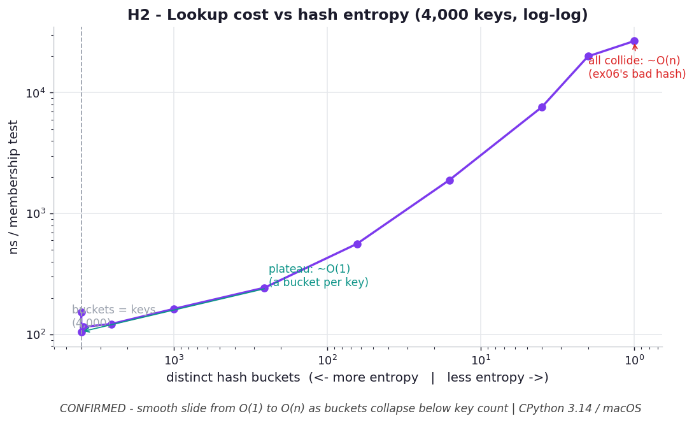

# H2 — Lookup time degrades smoothly as hash entropy drops

**Chapter 4 hypothesis** — generalizes `ex06_good_bad_hash.py`.

```bash
.venv/bin/python chapter_4/hypothesis/h02_collision_entropy_curve/benchmark.py
```

Numbers: **CPython 3.14.0 / macOS** — yours will differ.

## Chart



*Cost is flat (`O(1)`) while there are more buckets than keys (left), then slides
smoothly up toward the all-collide `O(n)` case (right) as entropy collapses. ex06's
"constant hash" is simply the right end of this curve — the degradation is graceful,
which is what makes a mediocre `__hash__` easy to miss.* Regenerate with
`.venv/bin/python chapter_4/hypothesis/h02_collision_entropy_curve/plot.py`.

## Hypothesis

ex06 only tests the two endpoints — a perfect hash (`O(1)`) vs a constant hash
returning 42 (`O(n)`). Reality is a spectrum. Take real string hashes but mask them
to `b` usable bits (≈`2**b` distinct buckets). As `b` shrinks, keys crowd into fewer
buckets, probe chains lengthen, and average set-membership time should rise
**smoothly** from ~`O(1)` toward the all-collide case — a curve, not a step.

## Results — 4,000 keys, average membership

| bits | distinct buckets | ns/lookup | vs 64-bit |
| --- | --- | --- | --- |
| 64 | 4,000 | 166 | 1.0× |
| 16 | 3,879 | 104 | 0.6× |
| 10 | 1,003 | 154 | 0.9× |
| 8 | 256 | 234 | 1.4× |
| 6 | 64 | 574 | 3.5× |
| 4 | 16 | 1,865 | 11.2× |
| 2 | 4 | 7,797 | 46.9× |
| 1 | 2 | 19,822 | 119× |
| 0 | 1 | 25,369 | **153×** |

## Verdict

**Confirmed, with a threshold nuance.** While there are enough buckets to give most
keys their own slot (≳10 bits → ≥1,000 buckets for 4,000 keys), membership stays
flat ~`O(1)` (the wobble at 64/16 bits is just masking overhead). Once buckets fall
below the key count, the chains lengthen and the cost climbs **smoothly and
monotonically** — 234 → 574 → 1,865 → 7,797 → 25,369 ns — each halving of entropy
roughly multiplying the walk. ex06's "constant hash" (0 bits, 153×) is simply the
right end of this curve.

## Why it matters

A hash isn't "good" or "bad" in isolation — what matters is its entropy **relative to
the table size**. The degradation is graceful, which is dangerous: a mediocre custom
`__hash__` won't fail loudly, it'll just quietly tax every lookup by 2–10×. ex06
shows the cliff edge; this shows you're often somewhere on the slope.
