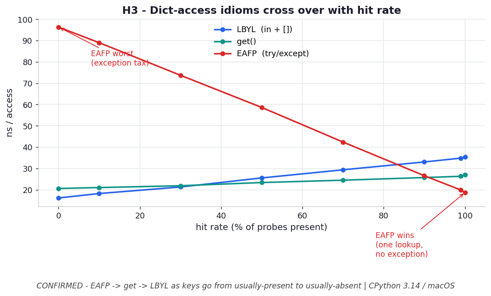

# H3 — The best dict-access idiom depends on the hit rate

**Chapter 4 hypothesis** — new (practical follow-on to the dict-access discussion).

```bash
.venv/bin/python chapter_4/hypothesis/h03_eafp_vs_lbyl/benchmark.py
```

Numbers: **CPython 3.14.0 / macOS** — yours will differ.

## Chart



*The three idioms cross over: EAFP (red) is cheapest when keys are usually present
but becomes the **worst** as misses dominate (the exception tax); `get()` (teal) is
the robust middle, never best by much, never terrible; LBYL (blue) pays two lookups
but never an exception, so it wins only at low hit rates.* Regenerate with
`.venv/bin/python chapter_4/hypothesis/h03_eafp_vs_lbyl/plot.py`.

## Hypothesis

Three ways to read a maybe-missing key:

```python
if k in d: x = d[k]            # LBYL  -- two lookups when present
x = d.get(k)                   # get   -- one lookup + None check
try: x = d[k]                  # EAFP  -- one lookup, exception if missing
except KeyError: x = None
```

When keys are usually **present**, EAFP should win (single lookup, exception almost
never fires) and LBYL should be slowest (it hashes the key twice). As the hit rate
falls, EAFP's exception cost should dominate and flip it to **slowest**. So there's a
crossover — no single idiom is always best.

## Results — ns per access (100,000 probes, dict of 1,000 keys)

| hit rate | LBYL (`in`+`[]`) | `get()` | EAFP (`try`) | winner |
| --- | --- | --- | --- | --- |
| 100% | 34.2 | 26.2 | **19.1** | EAFP |
| 99% | 34.8 | 26.2 | **19.0** | EAFP |
| 90% | 32.4 | **25.2** | 25.5 | get |
| 50% | 24.8 | **22.7** | 56.9 | get |
| 10% | **18.1** | 20.8 | 88.2 | LBYL |
| 0% | **15.9** | 20.2 | 97.3 | LBYL |

## Verdict

**Confirmed — a clean three-way crossover.** EAFP is fastest when keys almost always
exist (single hash, no exception). Raising/catching `KeyError` costs ~70–80 ns, so by
~90% hit rate EAFP has already lost to `get()`, and by low hit rates it's ~5× slower
than LBYL. `get()` is the robust middle: never best by much, never terrible.

## Why it matters

"EAFP is Pythonic" is true *and* a performance claim with a domain of validity. In a
hot loop:
- keys almost always present → `try/except` (or `d[k]` if a miss is truly
  exceptional).
- misses common → `k in d` / `d.get(k)`; **never** pay for exceptions on the
  expected path.
- don't know / mixed → `d.get(k)` is the safe default.

LBYL's hidden cost is the double hash — relevant precisely when hashing is expensive
(long string keys; see H4).
