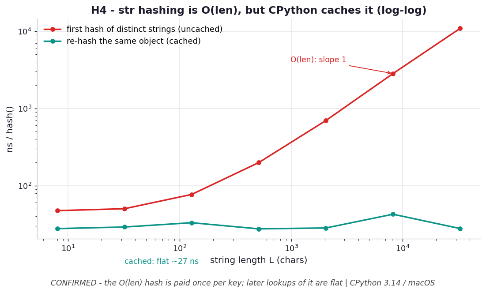

# H4 — String hashing is O(len), but CPython caches it

**Chapter 4 hypothesis** — new (resolves a tension in the chapter's `O(1)` claim).

```bash
.venv/bin/python chapter_4/hypothesis/h04_str_hash_caching/benchmark.py
```

Numbers: **CPython 3.14.0 / macOS** — yours will differ.

## Chart



*First-time hashing of distinct strings (red) rises with length on log-log axes
(slope ≈ 1, i.e. `O(len)`); re-hashing the same object (teal) is flat at ~27 ns — the
hash CPython cached inside the string. A dict pays the `O(len)` cost once per key,
then every later lookup of that object is genuinely flat.* Regenerate with
`.venv/bin/python chapter_4/hypothesis/h04_str_hash_caching/plot.py`.

## Hypothesis

ch4 says a dict's `O(1)` promise is conditional on the hash being `O(1)` — yet
hashing a *string* is `O(len)`. The resolution: CPython computes a `str`'s hash once
and **caches it inside the string object**, so only the *first* hash pays `O(len)`.

- Hashing many **distinct** length-`L` strings (each hashed for the first time)
  should cost ~`O(L)` per string.
- Hashing **one** string `N` times should be flat ~`O(1)` regardless of `L`.

## Results — ns per `hash()`

| len L | uncached (distinct) | cached (one obj) | ratio |
| --- | --- | --- | --- |
| 8 | 36 | 27.0 | 1.3× |
| 64 | 53 | 25.4 | 2.1× |
| 512 | 205 | 26.3 | 7.8× |
| 4,096 | 1,347 | 27.6 | 48.8× |
| 32,768 | 11,144 | 27.0 | **412.7×** |

## Verdict

**Confirmed.** First-time hashing scales linearly with length (36 → 11,144 ns as `L`
goes 8 → 32,768), while re-hashing the *same* object is dead flat at ~27 ns — the
cached value. At 32 KB strings the cache is a **413×** difference.

## Why it matters

The chapter's `O(1)` lookup is really "`O(1)` *amortized over repeated access to the
same key object*." The `O(len)` hash is paid once — on insertion or the first lookup
— then every subsequent lookup of that interned/reused string is genuinely flat. Two
practical corollaries:
- Reuse/intern long string keys instead of rebuilding equal-but-fresh strings each
  time; a fresh object re-pays the `O(len)` hash.
- This is exactly why LBYL's double lookup (H3) hurts more with long keys — though
  in practice the second hash within one expression hits the cache, so the real
  double-hash cost lands on *cache-cold* keys.
