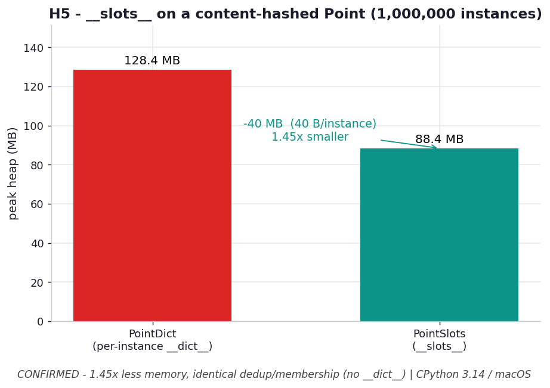

# H5 — `__slots__` shrinks the ex05 Point without changing it

**Chapter 4 hypothesis** — extends `ex05_point_hash.py`.

```bash
.venv/bin/python chapter_4/hypothesis/h05_slots_memory/benchmark.py
```

Numbers: **CPython 3.14.0 / macOS** — yours will differ.

## Chart



*Same data, far less heap: dropping the per-instance `__dict__` via `__slots__` saves
~40 B/instance (~38 MB across a million Points) for a 1.45× cut — with byte-for-byte
identical hashing and set membership.* Regenerate with
`.venv/bin/python chapter_4/hypothesis/h05_slots_memory/plot.py`.

## Hypothesis

ex05 gives `Point` a content-based `__hash__`/`__eq__` so a `set` dedups value-equal
points. Each instance carries a per-instance `__dict__` (~tens of bytes). Replacing
it with `__slots__` should cut memory hard while behaving identically:

- **Memory:** building `N=1,000,000` slotted Points uses far less heap (no per-
  instance `__dict__`).
- **Behavior:** both dedup identically in a `set` and membership still works —
  correctness untouched, only footprint changes.

## Results — peak heap building 1,000,000 points

| class | peak heap |
| --- | --- |
| `PointDict` (per-instance `__dict__`) | 122.5 MB |
| `PointSlots` (`__slots__`) | **84.3 MB** |

→ `__slots__` uses **1.45× less** — saved **38.2 MB (~40 B/instance)**.

Behavior check (both classes):
```
set({(1,1),(1,1),(2,3)}) -> 2 elems;  (1,1) in set? True
PointSlots instance has __dict__? False
```

## Verdict

**Confirmed.** `__slots__` removed ~40 B/instance (the `__dict__` pointer + the dict's
share of per-instance storage) for a 1.45× memory cut at a million instances, and the
dedup/membership semantics are byte-for-byte identical. The slotted instance has no
`__dict__` at all.

## Why it matters

ex05's content-hashed `Point` is exactly the kind of object you mint by the million
(coordinates, records, graph nodes). The book's ch3 lesson — small per-object
overheads compound across millions — applies to *attributes*, not just containers.
`__slots__` is the object-level analogue of casting a comprehension back to a tuple:
drop the flexible-but-heavy bookkeeping (`__dict__`, dynamic attributes) you aren't
using. Cost: no ad-hoc attributes and slightly more care with inheritance — usually
a fine trade for a value object.
