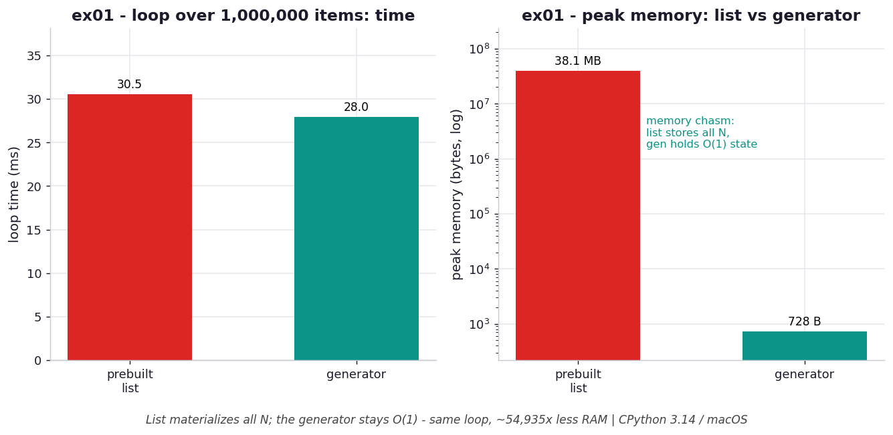

# ex01 — A `for` loop, taken apart

Every `for` loop in Python hides a small protocol. When you write `for x in thing`,
the interpreter first calls `iter(thing)` once to obtain an *iterator*, then calls
`next()` on that iterator over and over until it raises `StopIteration`. This
exercise pulls that protocol into the open and asks a sharp question: if a loop
only ever needs one value at a time, what is the real cost of handing it a fully
built list versus a generator? The answer matters because so much everyday code
builds a list it then simply walks once and throws away.

```bash
.venv/bin/python chapter_5/ex01_for_deconstructed/ex01_for_deconstructed.py   # run the benchmark
.venv/bin/python chapter_5/ex01_for_deconstructed/plot.py                     # regenerate the chart
```

Numbers below are from **CPython 3.14.0 / macOS** — magnitudes vary by machine.

## What the benchmark measures

The benchmark loops over 1,000,000 items two ways: once from a prebuilt list and
once from a generator that yields the same values lazily. It records both the wall
time of the loop and the peak memory each approach holds. The headline is the gap
between those two axes. On time they are close — the prebuilt list takes about
**31.5 ms** and the generator about **28.5 ms** — but on memory they are worlds
apart: the list peaks at roughly **38.1 MB** while the generator peaks at just
**728 B**. The list pays to allocate and store all 1,000,000 values up front; the
generator keeps only the few locals it needs to compute the next one.

## Reading the chart



*Same 1M-item loop: time is comparable, but the prebuilt list's peak memory is orders of magnitude above the generator's O(1) state (log scale).*

The chart sets the two approaches side by side. The time bars are nearly the same
height, which is the point — iterating is cheap either way once the data exists.
The memory panel uses a log scale precisely because a linear scale would render the
generator's bar invisible: 728 B against 38 MB is a difference of roughly five
orders of magnitude. The flat, tiny generator bar is the visual signature of
`O(1)` state, while the towering list bar is `O(n)` storage you never actually
needed for a single pass.

## What it means

The lesson is that the *iteration* is not where the cost lives — the *materialization*
is. A list forces every element into existence before the loop even begins, holds
them all for the loop's lifetime, and then discards them. A generator produces each
value on demand and lets it be collected immediately after use. When you loop over
something exactly once and never index backward into it, a generator gives you the
same answer at the same speed while spending almost no memory. The tradeoff, as
always, is that the generator is single-pass: you cannot loop it twice or index it.

## Five whys

1. **Why must a `for` loop's object be iterable?** Because `for` is just sugar for calling `iter(obj)` once to get an iterator and then `next()` repeatedly until `StopIteration`, so the object has to be able to produce an iterator.
2. **Why does the generator skip a cost the list pays here?** A generator *is* already an iterator, so `iter()` on it returns itself with no new object; a list must build a separate list-iterator on top of the already-allocated list.
3. **Why is the list's extra step more than just "make an iterator"?** The list had to be fully precomputed and stored first — every one of the 1,000,000 elements allocated and set — even though the loop consumes one value at a time.
4. **Why is precomputing all of that wasteful when you loop once?** You hold the entire dataset in memory for the loop's whole duration but use each value exactly once and never look back, so the 38 MB of storage buys you nothing.
5. **Why can the generator avoid holding it all?** Because `yield` suspends the function with its locals intact and resumes on the next `next()`, so only the current value plus a few locals exist at any instant.

**Root cause:** a list separates *building* from *consuming* and so must keep the whole sequence alive at once, whereas a generator fuses the two through `yield`, keeping only the state needed for the next value.
