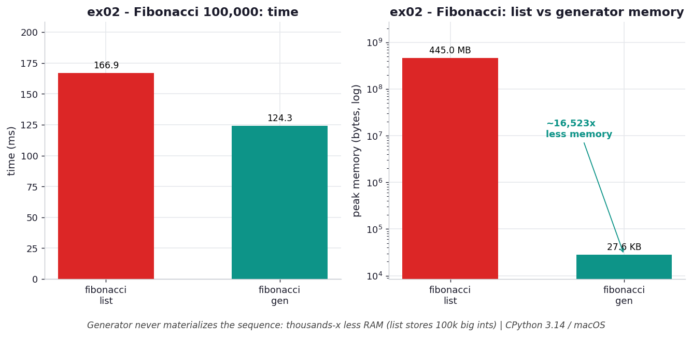

# ex02 — Fibonacci two ways: list versus generator

This exercise computes the Fibonacci sequence in the two most obvious styles. One
function builds a list of the first N Fibonacci numbers and returns it; the other
is a generator that yields them one at a time. Both produce the same sequence, but
they differ enormously in what they cost to run. The reason this is the canonical
generator example is that Fibonacci numbers grow without bound, so by the
hundred-thousandth term each value is a genuinely large integer — which turns the
"do I store everything or not?" question from an abstraction into a multi-hundred-megabyte
fact.

```bash
.venv/bin/python chapter_5/ex02_fib_list_vs_gen/ex02_fib_list_vs_gen.py   # run the benchmark
.venv/bin/python chapter_5/ex02_fib_list_vs_gen/plot.py                   # regenerate the chart
```

Numbers below are from **CPython 3.14.0 / macOS** — magnitudes vary by machine.

## What the benchmark measures

The benchmark generates 100,000 Fibonacci numbers each way and records time and
peak memory. The list version takes about **170 ms** and the generator about
**126 ms**, so the generator is roughly **1.3× faster** — a modest win. The memory
gap is the real story: the list peaks at about **445 MB** while the generator holds
about **27.6 KB**, which is roughly **16,500× less memory**. That enormous ratio is
not an accident of the count alone; it is because the list must store 100,000 *big*
integers simultaneously, while the generator only ever keeps the two locals `a` and
`b` it needs to produce the next term.

## Reading the chart



*The generator's headline win is memory — ~16,500× less than the list, which stores 100,000 big ints (right panel, log scale).*

The left panel shows time, where the bars are close and the generator edges ahead.
The right panel shows peak memory on a log scale, and here the list bar towers over
the generator's by more than four orders of magnitude. The log axis is doing real
work: on a linear scale the generator's 27.6 KB would be a line you could not see
next to 445 MB. The shape tells you the speed difference is incidental but the
memory difference is structural — one approach scales its footprint with N, the
other does not.

## What it means

The structural win here is memory, and it is `O(1)` versus `O(n)`. A generator never
materializes the sequence, so its footprint stays constant regardless of how many
terms you ask for; the list's footprint grows with the count and, because Fibonacci
values themselves grow, faster than linearly in bytes. The speed advantage is a nice
bonus that comes from skipping 100,000 `append` calls and the list's internal
reallocations, but it is the memory that decides whether a computation is even
*possible*. Asking for ten times as many terms is a non-event for the generator and
a potential out-of-memory crash for the list.

## Five whys

1. **Why does the generator use kilobytes while the list uses hundreds of megabytes?** The list appends and stores all 100,000 numbers up front, whereas the generator keeps only the current `a, b` and yields one value at a time.
2. **Why does holding one value at a time also make it faster?** It skips 100,000 `append` calls plus the list's overallocation and copy overhead, and it never allocates the large backing array.
3. **Why might the list version eventually not run at all?** Precomputing needs room for the *entire* dataset, so asking for a hundred million terms would try to build a multi-gigabyte list that can exceed available RAM.
4. **Why is even "generate, then `len([...])`" still wasteful?** Wrapping a generator in a list comprehension re-materializes everything just to count it and then throws it away, reintroducing the same `O(n)` cost.
5. **Why does the plain generator avoid that entirely?** Because `yield` emits one value, the caller folds or uses it immediately, and nothing is ever accumulated — same sequence, no storage.

**Root cause:** the list's footprint is `O(n)` because it must hold every value at once to return them together, while the generator's is `O(1)` because `yield` lets the caller consume each value before the next is computed.
