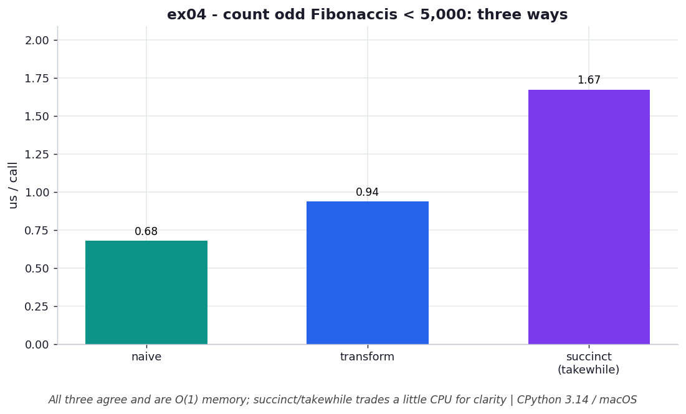

# ex04 — An infinite Fibonacci generator with early termination

A generator built around `while True: yield` never returns on its own — it
describes an *infinite* series. That sounds dangerous until you remember that the
caller controls how many values are ever pulled. This exercise defines an infinite
Fibonacci generator and then counts the odd Fibonacci numbers below 5,000 in three
different styles: a naive version that interleaves generating and counting, a
"transform" version that keeps a clean generator and counts in a separate step, and
a succinct version built from `itertools.takewhile`. The point is to see that
"infinite" is perfectly safe when consumption is demand-driven, and to compare how
the three framings trade clarity, reusability, and a little CPU.

```bash
.venv/bin/python chapter_5/ex04_infinite_fib/ex04_infinite_fib.py   # run the benchmark
.venv/bin/python chapter_5/ex04_infinite_fib/plot.py               # regenerate the chart
```

Numbers below are from **CPython 3.14.0 / macOS** — magnitudes vary by machine.

## What the benchmark measures

The benchmark times each of the three approaches and confirms they agree on the
answer. Per call, the naive version runs in about **0.66 µs**, the transform version
in about **0.95 µs**, and the succinct `takewhile` version in about **1.66 µs**. All
three are `O(1)` in memory: the infinite generator only ever holds its two running
locals `i, j`, and the consumer — whether a `break`, a `takewhile`, or an explicit
bound — stops pulling once the values cross 5,000, so the "infinite" part is never
actually evaluated to completion.

## Reading the chart



*All three agree and are O(1) memory; the succinct `takewhile` form trades a little CPU per call for reusability and clarity.*

The chart compares the per-call time of the three styles. They sit within a small
factor of each other, with the naive version cheapest and the `takewhile` version a
touch more expensive. That ordering is the interesting part: the more composable,
reusable framings pay slightly more per call because they route values through an
extra layer of generator or `itertools` machinery. None of this changes the memory
story — every bar represents the same tiny `O(1)` footprint, since nothing
materializes the unbounded sequence.

## What it means

Generators can express infinite series because the caller pulls only what it needs
and then stops; the producer is suspended at its `yield` forever after. Just as
valuable is the structural lesson in the three styles. The naive version mixes two
jobs — *generating* numbers and *counting* the odd ones — which hides the real
computation inside the loop. Splitting them so that a pure generator produces the
series and a separate transform counts over it makes that transform reusable: it
works over *any* series you hand it, and you can swap the data source or stack more
stages without rewriting the logic. The `takewhile` form is the same idea expressed
with library plumbing. You pay a little CPU per call for that flexibility, which is
usually a bargain.

## Five whys

1. **Why can a generator encapsulate an *infinite* series like all Fibonacci numbers?** Because an unbounded `while True: yield` never returns; the caller pulls only as many values as it wants and then stops, so "infinite" is never fully evaluated.
2. **Why is that impossible with a list-building version?** A list must finish building before it can return, so an infinite series would loop forever allocating memory and never hand back a value.
3. **Why prefer the transform over the all-in-one naive function?** The naive version interleaves *generating* numbers with *counting* them, hiding the real work; the transform consumes a separate generator so each function does exactly one job.
4. **Why does that split matter beyond readability?** A pure transform works over *any* series passed in, so you can stack transforms or swap the data source without rewriting the counting logic.
5. **Why does that composability fall out of generators specifically?** Because generators are single-responsibility data sources you can chain — one produces values, ordinary functions act on the stream — so you reconfigure a pipeline by re-wiring it rather than rewriting it.

**Root cause:** `yield` makes a generator a pausable, demand-driven data source, so an unbounded loop is safe (the caller decides when to stop) and producing can be cleanly separated from transforming, which is what makes the pipeline composable.
