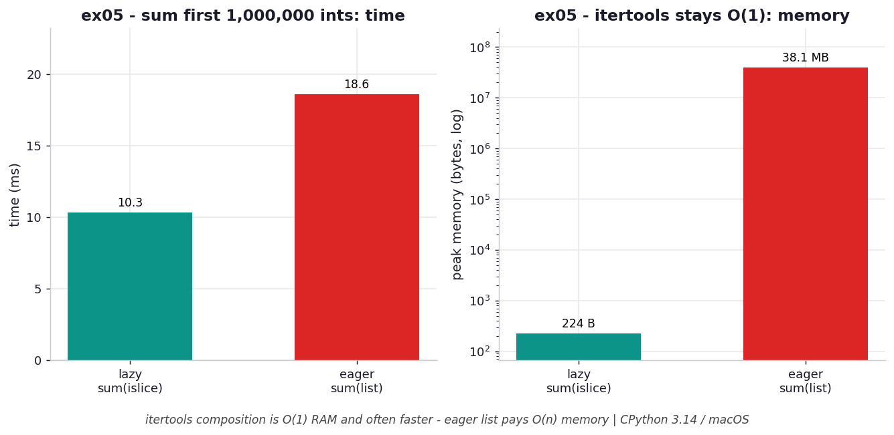

# ex05 — `itertools` drills: composing lazy streams

The `itertools` module is the standard library's toolbox for building and combining
iterators without materializing anything in between. This exercise drills the core
tools — `islice` to take a slice of a stream, `chain` to concatenate streams,
`cycle` to repeat one endlessly, and `takewhile` to stop on a condition — and then
benchmarks the flagship pattern: summing the first 1,000,000 integers lazily with
`sum(islice(count(), N))` versus eagerly with `sum(list(range(N)))`. The eager
version looks harmless, but it builds a throwaway list of a million integers just to
add them up.

```bash
.venv/bin/python chapter_5/ex05_itertools_drills/ex05_itertools_drills.py   # run the benchmark
.venv/bin/python chapter_5/ex05_itertools_drills/plot.py                    # regenerate the chart
```

Numbers below are from **CPython 3.14.0 / macOS** — magnitudes vary by machine.

## What the benchmark measures

The benchmark sums the first 1,000,000 integers both ways and records time and peak
memory. The lazy `sum(islice(count(), N))` runs in about **10.4 ms**, while the
eager `sum(list(range(N)))` runs in about **19.6 ms** — so the lazy form is roughly
twice as fast here. On memory the gap is far larger: the lazy form peaks at about
**224 B** while the eager form peaks at about **38.1 MB**, because it allocates a
real list of a million integers before `sum` ever sees the first value.

## Reading the chart



*Summing 1M ints: the lazy `islice` form is faster AND stays at ~224 B, while `sum(list(range(N)))` materializes a ~38 MB list (right panel, log scale).*

The left panel shows the lazy form winning on time by roughly a factor of two; the
right panel, on a log scale, shows it winning on memory by roughly five orders of
magnitude. What makes this case satisfying is that the two axes agree — the lazy
composition is *both* faster and smaller. The shape tells you there is no tradeoff
being made here: not building the intermediate list saves the allocation time and
the storage at once, which is the opposite of the usual "speed versus memory"
tension.

## What it means

`itertools` composition stays `O(1)` in memory because nothing is materialized
between stages — each tool pulls one item from the previous stage, transforms or
forwards it, and passes it on. The added bonus is that skipping the intermediate
list often makes the pipeline faster too, since allocating and filling a
million-element list is itself real work that the lazy form never does. The mental
model to carry away: `count`, `islice`, `chain`, `cycle`, and friends are
plumbing, not buckets. They route a stream rather than pool it, so you can express
"take the first N", "glue these together", or "repeat forever" without ever paying
to hold the whole thing.

## Five whys

1. **Why does the lazy `islice` sum peak at ~224 B while the eager version uses ~38 MB?** `islice` pulls one integer from `count()` at a time and hands it straight to `sum`, whereas `list(range(N))` builds and stores all 1,000,000 integers before summing begins.
2. **Why does building that list also make the eager version slower?** Materializing a million-element list means a million allocations plus the list's repeated growth and copying — real work that the lazy pipeline simply never performs.
3. **Why does `itertools` composition avoid intermediate storage between stages?** Each tool is itself an iterator that requests exactly one value from the stage before it on demand, so no stage ever accumulates a buffer of results.
4. **Why is demand-driven the default behavior of these tools?** They are written to compute lazily — they hold only their own small state and produce the next item when `next()` is called — so consumption pulls values through rather than work pushing them ahead.
5. **Why does that pull-based design give both wins at once?** Because nothing is precomputed or stored, there is no allocation cost to pay *and* no footprint to carry, so the lazy form saves time and memory together rather than trading one for the other.

**Root cause:** `itertools` tools are lazy, pull-based iterators that forward one item at a time, so a composed pipeline never materializes an intermediate collection — eliminating both its allocation cost and its memory footprint simultaneously.
