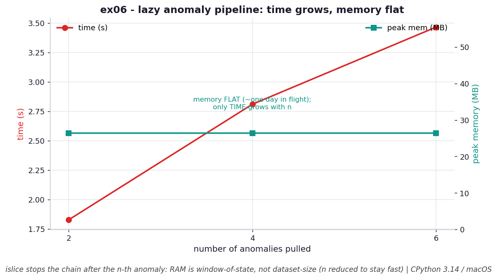

# ex06 — A lazy anomaly-detection pipeline

This exercise builds a small data pipeline out of chained generators: a source
reads records, a stage groups them by day, a stage filters for anomalies, and an
`islice` at the end takes the first few results. Crucially, the source is treated as
*infinite* — it can keep producing forever — and the whole chain is lazy, so each
stage only does work when the stage after it asks for the next item. The question
the benchmark answers is what happens to memory and time as you pull more results
out of the end. This is the practical payoff of everything in the chapter: a way to
scan a dataset far larger than RAM by keeping only a small window of state in flight.

```bash
.venv/bin/python chapter_5/ex06_anomaly_pipeline/ex06_anomaly_pipeline.py   # run the benchmark
.venv/bin/python chapter_5/ex06_anomaly_pipeline/plot.py                    # regenerate the chart
```

Numbers below are from **CPython 3.14.0 / macOS** — magnitudes vary by machine.

## What the benchmark measures

The benchmark pulls the first 5, then 10, then 20 anomalies from the pipeline and
records time and peak memory for each. Memory stays **flat at about 26.4 MB**
regardless of how many anomalies you ask for, because at any instant only about one
day's worth of data is ever in flight. Time, by contrast, grows with the work
pulled — roughly **3.4 s, 6.6 s, and 13.0 s** for the first 5, 10, and 20 results.
The flat memory line is the headline: asking for more output does not enlarge the
footprint, it only makes the pipeline read further into the source.

## Reading the chart



*Dual axis: time (red) climbs with the number of anomalies pulled, but peak memory (teal) stays flat — only ~one day of data is ever in flight (n reduced here to keep the script fast; the benchmark's full-N times are larger).*

The chart uses a dual axis so you can see the two trends at once. The red time line
climbs steadily with the number of anomalies requested, while the teal memory line
runs flat across the same range. Note that the chart was generated with reduced work
sizes so the plotting script stays fast — the full benchmark's times are larger, but
the *shape* is identical and that shape is the lesson. Rising time, flat memory: you
pay for more output in CPU, never in RAM.

## What it means

Lazy evaluation makes memory depend on the *window of state* a pipeline must hold,
not on the size of the dataset it scans. Each `next()` at the end propagates back up
the chain, and the source reads exactly enough to satisfy it; the `islice` then
stops the entire chain the moment the n-th result is produced, so no further lines
are ever read. This is how you process more data than fits in memory. The deliberate
design choice here is to carry only date ranges through the grouping stage rather
than full day-lists — if each stage retained its complete day buffers, memory would
grow with the number of days held at once instead of staying flat. The price of the
whole arrangement is that it is single-pass: a generator holds only the current
value and cannot look backward, so the algorithm must be expressible without random
access to the past.

## Five whys

1. **Why can this pipeline scan a dataset that doesn't fit in memory?** Because each stage (read → group-by-day → filter) is a generator that pulls one item only when the next stage asks, so the full dataset never co-exists in RAM.
2. **Why does the final `islice(..., n)` stop the whole chain early?** Lazy evaluation runs only the work that is explicitly requested — once n anomalies have been produced, no further records are read or grouped.
3. **Why does only "enough" data get read rather than all of it?** Each `next()` propagates back through the chain to the reader, which reads exactly one more record per request, so the work is demand-driven instead of eager.
4. **Why is the single-pass constraint the price of this design?** At any moment a generator holds only its current value and cannot look back, so the algorithm must work without random access to past data.
5. **Why does memory stay flat instead of growing with results pulled?** Because the pipeline carries only a small window of state — about one day's range, not the accumulated days — so requesting more output advances the read position without enlarging the footprint.

**Root cause:** lazy, demand-driven generators tie memory to the size of the in-flight window rather than the dataset, so a bounded window plus an early `islice` lets the pipeline scan unbounded data at flat `O(window)` memory — at the cost of being single-pass.
