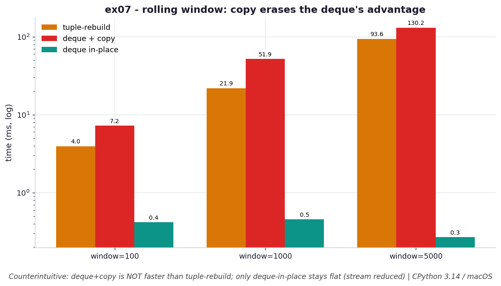

# ex07 — Rolling window: tuple rebuild versus deque, and a counterintuitive result

A rolling (sliding) window is a classic streaming pattern: as each new item arrives,
the oldest leaves and you process the current window of the last K items. The book
suggests a `deque` because it offers `O(1)` append-to-the-right and pop-from-the-left,
which sounds like the obvious win over rebuilding a tuple every step. This exercise
measures three variants — rebuilding a tuple on each slide, using a deque but copying
it to a tuple on each yield, and using a deque read *in place* with no copy — and the
result is genuinely counterintuitive: the deque-with-copy version is the *slowest* of
all, because the per-yield copy quietly erases the deque's advantage.

```bash
.venv/bin/python chapter_5/ex07_rolling_window/ex07_rolling_window.py   # run the benchmark
.venv/bin/python chapter_5/ex07_rolling_window/plot.py                  # regenerate the chart
```

Numbers below are from **CPython 3.14.0 / macOS** — magnitudes vary by machine.

## What the benchmark measures

The benchmark slides each variant across 50,000 items at three window sizes and
records the time. The numbers tell the story:

| window | tuple-rebuild | deque + copy | deque in-place |
| --- | --- | --- | --- |
| 100 | 19.8 ms | 38.8 ms | **2.3 ms** |
| 1,000 | 121 ms | 283 ms | **2.5 ms** |
| 5,000 | 842 ms | 1,174 ms | **2.5 ms** |

All three hold exactly one window of state in memory, so this is purely a CPU
comparison. The in-place deque stays flat at about **2.5 ms** no matter the window
size, while both the tuple-rebuild and the deque-plus-copy grow with the window —
and the deque-plus-copy is actually *worse* than the plain tuple rebuild.

## Reading the chart



*Counterintuitive (log y): `deque+copy` is actually slower than tuple-rebuild because the per-yield `tuple()` copy is O(window); only `deque-in-place` (no copy) stays flat across window sizes (stream reduced for speed).*

The chart uses a log y-axis. The two copying variants climb as the window grows,
with the deque-plus-copy line sitting *above* the tuple-rebuild line — the opposite
of what "use a deque, it's faster" would lead you to expect. The deque-in-place line
runs flat along the bottom, unmoved by window size. Note the stream length was
reduced to keep the plotting fast; the shape is what matters. That flat line is the
only place the deque's `O(1)` operations actually show through.

## What it means

A deque does give you `O(1)` append and popleft, but copying it to a tuple on every
yield is an `O(window)` operation, and that copy happens once per slide — so it
dominates and cancels the deque's structural advantage entirely. That is why
deque-plus-copy is no faster than (indeed slower than) rebuilding a tuple from
scratch. The deque only pays off when the consumer reads the *live* window in place
and never retains it, which is exactly what keeps the in-place variant flat at ~2.5 ms
across all window sizes. This is the book's caveat made concrete: the data structure
with the better asymptotic operations only helps if you actually use those operations
and don't bolt an `O(window)` copy onto each step. The catch with the live-window
approach is that the consumer must look at the window immediately, because it is
mutated in place on the next slide.

## Five whys

1. **Why does the rolling-window code reach for a `deque` at all?** Because a `deque` provides `O(1)` append-to-the-right and pop-from-the-left, so the window can slide in constant time instead of `O(n)` per shift.
2. **Why, then, is `deque + copy` no faster than rebuilding a tuple?** Because copying the deque into a tuple on every yield is itself an `O(window)` operation, so each slide still does work proportional to the window size.
3. **Why does that copy completely erase the deque's advantage?** The `O(1)` append and popleft are dwarfed by the `O(window)` copy that runs once per slide, so the copy, not the deque ops, sets the per-step cost.
4. **Why does the in-place deque variant stay flat across window sizes?** It never copies — the consumer reads the live deque directly — so the only per-slide work is the constant-time append and popleft, independent of K.
5. **Why is reading in place not always safe to do?** Because the live deque is mutated on the next slide, so the consumer must use the window immediately and cannot retain it for later, which is the price of avoiding the copy.

**Root cause:** the per-step cost is set by the most expensive operation in the loop, and an `O(window)` tuple copy outweighs the deque's `O(1)` ops — so the deque only helps when the window is read in place with no copy, accepting that it can't be retained.
