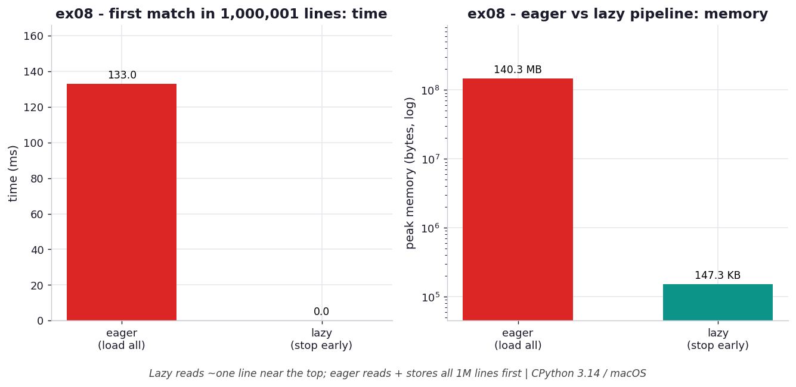

# ex08 — Converting an eager function into a lazy pipeline

A very common shape of code reads an entire file into a list, processes it, and
returns a result. It works, but it forces the whole input into memory whether or not
you need all of it. This exercise takes such a load-everything function and rewrites
it as a streaming pipeline, then uses both versions to find the *first* matching line
in a file of 1,000,001 lines. Because the match happens to sit near the top, the lazy
version can stop almost immediately — and the contrast between "read all, then search"
and "read until found" turns out to be dramatic on both time and memory.

```bash
.venv/bin/python chapter_5/ex08_eager_to_lazy/ex08_eager_to_lazy.py   # run the benchmark
.venv/bin/python chapter_5/ex08_eager_to_lazy/plot.py                 # regenerate the chart
```

Numbers below are from **CPython 3.14.0 / macOS** — magnitudes vary by machine.

## What the benchmark measures

The benchmark runs both versions against the same 1,000,001-line file and records
time and peak memory. The eager version, which loads and stores every line before
searching, takes about **139 ms** and peaks at about **140.3 MB**. The lazy version,
which reads lines one at a time and stops at the first match, takes **~0.0 ms** and
peaks at about **147.4 KB**. Because the match is near the top of the file, the lazy
pipeline reads roughly one line and allocates almost nothing, while the eager version
pays the full cost of reading and holding all million lines no matter where the match
is.

## Reading the chart



*Finding the first match in a 1,000,001-line file: the lazy pipeline reads ~one line (near-zero time, ~147 KB) while eager loads and stores all 1M lines (~140 MB, right panel log scale).*

The left panel shows time, where the eager bar stands tall and the lazy bar is
effectively invisible because it did almost no work. The right panel shows peak
memory on a log scale, with the eager version near 140 MB and the lazy version near
147 KB — about three orders of magnitude apart. The shape captures the essence of
demand-driven evaluation: when the answer is found early, a lazy pipeline simply
stops, so both its time and its memory collapse toward zero while the eager version
remains stuck at the cost of the whole file.

## What it means

The transformation from eager to lazy is mostly mechanical — return a generator
instead of a list, and let each stage pull from the one before it — but the payoff is
that work becomes *demand-driven*. The lazy pipeline reads only as far as it must to
satisfy the consumer, and the consumer here is satisfied by the first match, so the
remaining million lines are never touched. The eager version cannot benefit from an
early answer because it commits to reading everything before it begins searching. The
tradeoff to keep in mind is that the lazy result is single-pass: you have consumed the
stream by the time you find your answer, so if you need to scan the same data again
you must restart the pipeline.

## Five whys

1. **Why is the lazy version near-instant while the eager version takes ~139 ms?** The eager function reads and stores all 1,000,001 lines before searching, whereas the lazy pipeline reads one line at a time and stops at the first match.
2. **Why can the lazy pipeline stop so early?** The work is demand-driven — each `next()` reads exactly one more line — and the consumer asks for nothing more once the first match is found.
3. **Why does that early stop also drop memory from ~140 MB to ~147 KB?** Because only the line currently being examined is held; with the match near the top, almost no lines are ever read into memory at once.
4. **Why can't the eager version benefit from the early match?** It materializes the entire file into a list up front as a precondition of searching, so it has already paid the full read-and-store cost before the search even begins.
5. **Why is being single-pass the price of the lazy approach?** A generator holds only its current position in the stream and cannot rewind, so finding the answer consumes the data — scanning again means rebuilding the pipeline.

**Root cause:** returning a generator makes the work demand-driven, so a consumer that needs only the first result stops the read early and collapses both time and memory — at the cost of a single-pass stream that can't be rewound.
