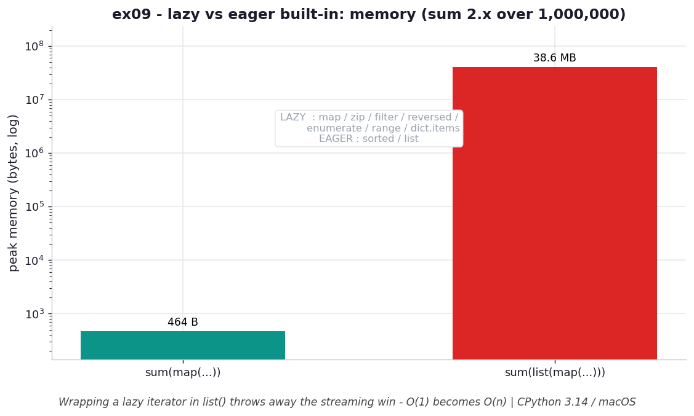

# ex09 — Which built-ins are lazy, and the `list()` tax

Python's built-ins fall into two camps. Some are *lazy* — they return an iterator
that produces values on demand — and some are *eager* — they build and return a full
collection right away. Knowing which is which matters, because the moment you wrap a
lazy iterator in `list()` you convert it back into eager storage and throw away the
streaming win. This exercise classifies the common built-ins and then measures the
cost of that mistake directly: summing `2*x` over 1,000,000 values with
`sum(map(...))` versus `sum(list(map(...)))`.

```bash
.venv/bin/python chapter_5/ex09_lazy_builtins/ex09_lazy_builtins.py   # run the benchmark
.venv/bin/python chapter_5/ex09_lazy_builtins/plot.py                 # regenerate the chart
```

Numbers below are from **CPython 3.14.0 / macOS** — magnitudes vary by machine.

## What the benchmark measures

The exercise first sorts the built-ins into the two camps. Lazy:
`map`, `zip`, `filter`, `reversed`, `enumerate`, `range`, and `dict.items` — each
returns an iterator or view that yields on demand. Eager: `sorted` and `list`, which
must build their whole result before returning. It then measures the difference the
classification makes: summing `2*x` over a million values, `sum(map(...))` peaks at
about **464 B**, while `sum(list(map(...)))` peaks at about **38.6 MB**. The only
change is the `list()` wrapper, which forces the lazy `map` to materialize its full
output before `sum` sees any of it.

## Reading the chart



*Wrapping the lazy `map` in `list()` turns O(1) (~464 B) into O(n) (~38 MB); the box recalls which built-ins are lazy (map/zip/filter/…) vs eager (sorted/list).*

The chart contrasts the two peak-memory figures on a log axis, with an inset
recalling the lazy-versus-eager classification. The `sum(map(...))` bar is a sliver
at the bottom; the `sum(list(map(...)))` bar towers above it by roughly five orders
of magnitude. The shape makes the tax visible: the `list()` call is a single word in
the source, but it changes the memory class of the whole expression from `O(1)`
streaming to `O(n)` storage.

## What it means

A lazy built-in is only lazy while it stays lazy. `map`, `filter`, `zip`, and the
rest hand you an iterator that holds essentially no state — a `zip` over 100k items
keeps only the current pair — and consumers like `sum`, `any`, `min`, or a `for`
loop are happy to fold that stream one item at a time. Wrapping the iterator in
`list()` (or in `sorted()`, which also collects) defeats the entire arrangement: it
allocates the full result, holds it, and only then passes it on. The rule worth
internalizing is to leave lazy iterators lazy and call `list()` only when you
genuinely need random access, a second pass, or a length — and not out of reflex.

## Five whys

1. **Why does `sum(map(...))` peak at ~464 B while `sum(list(map(...)))` peaks at ~38 MB?** `map` is lazy and yields one transformed value at a time straight into `sum`, but `list(map(...))` first builds a list of all 1,000,000 results before `sum` runs.
2. **Why does the `list()` wrapper force everything into memory at once?** `list` is an eager built-in: its job is to consume an iterator to exhaustion and return a finished container, so it must hold every element simultaneously.
3. **Why does that throw away `map`'s streaming advantage entirely?** `map` only saves memory while it stays an iterator pulled one item at a time; once `list` drains it into storage, the result is `O(n)` regardless of how lazy `map` was.
4. **Why are some built-ins lazy and others eager in the first place?** Lazy ones (`map`, `zip`, `filter`, `range`, `enumerate`, `reversed`, `dict.items`) can compute each item on request, while eager ones (`sorted`, `list`) need the whole input at once — `sorted` to order it, `list` to materialize it.
5. **Why does it matter that you recognize the difference?** Because composing lazy built-ins keeps a pipeline `O(1)` in memory, and a single needless `list()` silently converts it to `O(n)` — so knowing the camps tells you where the streaming win lives and where you'd forfeit it.

**Root cause:** memory class is decided by whether the outermost consumer is lazy or eager; lazy built-ins stream at `O(1)`, but wrapping one in an eager `list()`/`sorted()` materializes the whole sequence and reinstates `O(n)` storage.
