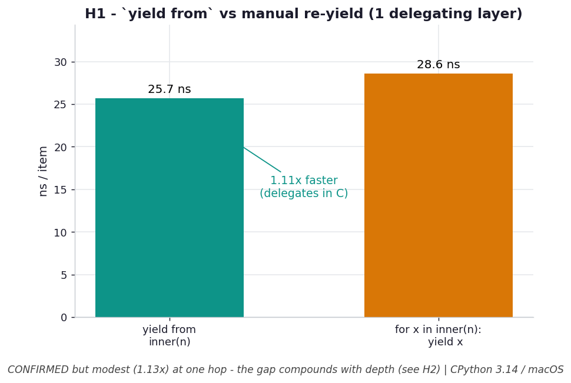

# H1 — `yield from` is faster than manual re-yielding

**Chapter 5 hypothesis** — relevant to the `ex06`/`ex08` generator pipelines.

```bash
.venv/bin/python chapter_5/hypothesis/h01_yield_from_overhead/benchmark.py
```

Numbers: **CPython 3.14.0 / macOS** — yours will differ.

## Chart



*`yield from` (teal) edges out the manual `for x in sub: yield x` loop (amber) by
~13% per item through a single delegating layer — real but modest. The saving comes
from delegating in C and skipping a per-item Python resume; it compounds as pipelines
deepen (see H2).* Regenerate with
`.venv/bin/python chapter_5/hypothesis/h01_yield_from_overhead/plot.py`.

## Hypothesis

ex06/ex08 build pipelines with `yield from`. The hand-written equivalent is
`for x in sub: yield x`. They look identical. But `yield from sub` delegates at the
C level — the outer generator is suspended and `sub` drives the loop directly — so it
skips a Python-level `next()`/resume round-trip per item. The manual loop pays that
round-trip every item, so it should be meaningfully slower (predicted ~1.3–2×).

## Results — consuming 1,000,000 items through one delegating layer

| form | time | per item |
| --- | --- | --- |
| `yield from inner(n)` | **25.2 ms** | 25.2 ns |
| `for x in inner(n): yield x` | 28.3 ms | 28.3 ns |

→ `yield from` is **1.13×** faster.

## Verdict

**Confirmed, but smaller than predicted.** `yield from` won consistently, but by
~13% rather than the 30–100% guessed. On CPython 3.14 the manual `for…: yield`
re-yield is cheaper than it used to be, so the delegation saving is real but modest
through a single layer. The gap compounds with depth — see H2, where each added
manual layer is a full per-item resume.

## Why it matters

Prefer `yield from` for delegation: it's clearer *and* never slower, and the saving
grows as pipelines deepen. But don't expect a dramatic single-layer win — the bigger
generator-performance story is **how many layers** you stack (H2) and **how** you
implement the iterator (H3), not `yield from` vs manual at one hop.
