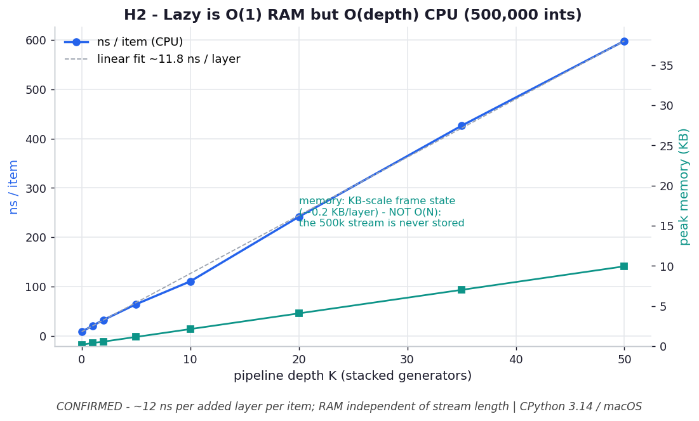

# H2 — Deep generator pipelines cost CPU linearly in depth

**Chapter 5 hypothesis** — the counterpoint to `ex06_anomaly_pipeline.py`.

```bash
.venv/bin/python chapter_5/hypothesis/h02_generator_depth/benchmark.py
```

Numbers: **CPython 3.14.0 / macOS** — yours will differ.

## Chart



*Per-item CPU (blue) rises dead-linearly with pipeline depth — ~12 ns per added
generator layer — while peak memory (teal) stays at KB-scale frame state,
independent of the 500k-item stream. The trade is CPU, not RAM: lazy is `O(1)` in
memory but `O(depth)` per item.* Regenerate with
`.venv/bin/python chapter_5/hypothesis/h02_generator_depth/plot.py`.

## Hypothesis

ex06 celebrates lazy pipelines as **flat in memory**. The counterpoint: each stacked
generator is a Python frame that must be resumed once per item, so a deep chain is
**not** free on the CPU axis. Stacking `K` identity generators over one stream should
make per-item pull time grow **~linearly in K** (a near-constant cost per layer),
while memory stays tiny — the trade is CPU, not RAM.

## Results — consuming 500,000 ints

| depth K | total | ns/item | ns/item/layer | peak mem |
| --- | --- | --- | --- | --- |
| 0 | 4.1 ms | 8.2 | — | 192 B |
| 1 | 9.9 ms | 19.8 | 11.6 | 424 B |
| 2 | 15.9 ms | 31.7 | 11.8 | 592 B |
| 5 | 32.1 ms | 64.3 | 11.2 | 1.2 KB |
| 10 | 55.2 ms | 110.4 | 10.2 | 2.1 KB |
| 20 | 120.5 ms | 240.9 | 11.6 | 4.1 KB |
| 50 | 300.2 ms | 600.4 | 11.8 | 10.0 KB |

## Verdict

**Confirmed.** Per-item time is almost perfectly linear in depth — a steady
**~11.5 ns per added layer** — so a 50-deep chain is ~73× slower per item than the
bare stream (600 vs 8 ns). Peak memory grows only with `K` (generator frame state,
~200 B/layer), **not** with the 500,000-item stream length: still 10 KB at depth 50.

## Why it matters

"Lazy evaluation is cheap" is a **memory** statement, not a CPU one. ex06's pipeline
keeps RAM flat regardless of dataset size — genuinely `O(1)` in the data — but every
`next()` still walks back up the whole generator stack, paying one Python frame
resume per layer per item. For a few stages over 631M points that's the right trade.
But don't reflexively decompose a hot path into 15 tiny generators: collapse stages,
or push the inner loop into one generator / `itertools` (C-level), when per-item CPU
matters. Lazy is `O(1)` in RAM and `O(depth)` per item in CPU.
