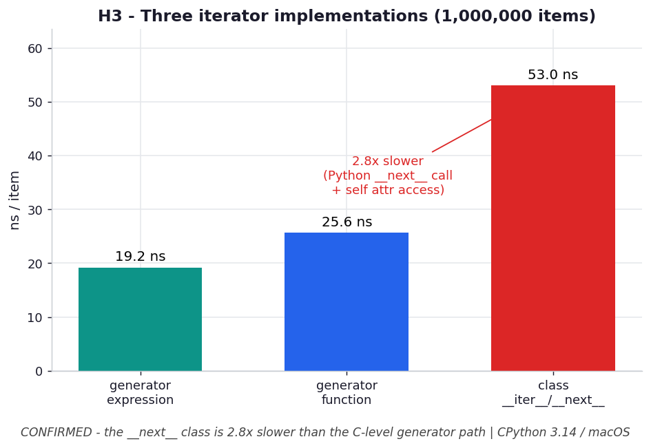

# H3 — Native generators beat a hand-rolled `__next__` class

**Chapter 5 hypothesis** — extends `ex01_for_deconstructed.py`.

```bash
.venv/bin/python chapter_5/hypothesis/h03_iterator_impls/benchmark.py
```

Numbers: **CPython 3.14.0 / macOS** — yours will differ.

## Chart



*The hand-rolled `__next__` class (red) is ~2.8× slower per item than a generator
expression/function — every value pays a Python-level method call plus `self`
attribute loads/stores that the C-level generator machinery avoids.* Regenerate with
`.venv/bin/python chapter_5/hypothesis/h03_iterator_impls/plot.py`.

## Hypothesis

ex01 notes a generator *is* its own iterator. Three common ways to build an iterator
over a sequence:

1. generator function (`def …: yield`)
2. generator expression (`(i for i in …)`)
3. a class implementing `__iter__`/`__next__`

(1) and (2) should be roughly equal and fast (suspend/resume handled by the C-level
generator machinery); (3) should be markedly slower (predicted 3–5×): every item
pays a Python-level `__next__` call plus attribute loads/stores on `self`.

## Results — summing 1,000,000 items

| implementation | time | ns/item |
| --- | --- | --- |
| generator expression | **19.1 ms** | 19.1 |
| generator function | 25.8 ms | 25.8 |
| class `__iter__`/`__next__` | 52.8 ms | 52.8 |

→ the `__next__` class is **2.8× slower** than the fastest generator.

## Verdict

**Confirmed (lower end).** The hand-rolled class is the clear loser at 2.8× — each
item crosses the Python/C boundary for a `__next__` call and does two attribute
accesses on `self` (`self.i`, `self.n`) plus a store. The generator expression edged
out the generator function here (less bytecode per item); both let CPython's frame
suspend/resume do the work without a per-item method dispatch.

## Why it matters

If you find yourself writing a class with `__iter__`/`__next__` and a manual index,
you're almost always better served by a generator function or expression — shorter,
clearer, and ~3× faster per item, because you inherit the interpreter's optimized
generator path instead of paying Python method-call overhead on every value. Reserve
the explicit class for cases that genuinely need richer iterator state or methods
beyond iteration.
