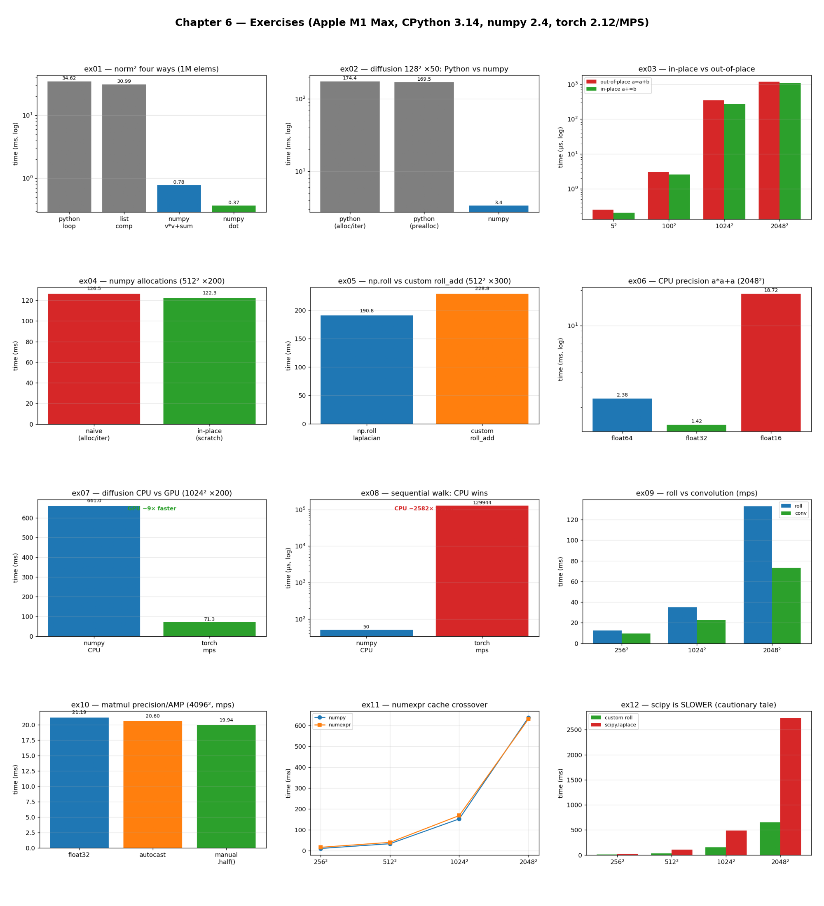

# Chapter 6 — Matrix and Vector Computation: Practice Exercises

Runnable drills for *High Performance Python (3rd ed.)*, Chapter 6. Each script
self-reports **time** (`timeit`) and, where relevant, **memory** (`tracemalloc`
peak, via the shared `perf.py`) — so the wins are visible without an external
profiler.

The chapter's running example is the **2D diffusion equation**. These exercises
follow its optimization arc: pure Python → numpy → fewer allocations →
specialization → precision → **GPU** → numexpr/scipy. ex01–ex06 use **numpy**;
ex07–ex10 use **PyTorch on Apple's Metal (MPS) GPU**; ex11 uses **numexpr** and
ex12 **scipy** (all are project dependencies — `uv sync` installs them).

Numbers below are from **CPython 3.14.0 / numpy 2.4 / macOS (Apple Silicon)** —
yours will differ, sometimes a lot (cache sizes and CPU instruction sets change
the story, as the exercises call out).

```bash
.venv/bin/python chapter_6/ex01_list_vs_numpy_norm/ex01_list_vs_numpy_norm.py
```

**Core idea:** runtime is governed by *how fast data reaches the compute unit*,
not how fast it computes. Python lists store pointers (scattered data, no
vectorization); numpy stores contiguous typed blocks and runs specialized C. The
fastest code is code you don't run — and every "optimization" must be benchmarked,
never assumed.

**Verified learnings** (measured on this machine — Apple M1 Max, CPython 3.14, numpy 2.4, torch 2.12 / MPS):

1. **Contiguous + typed + specialized beats general + boxed.** numpy is ~50× faster
   than pure Python on the *identical* diffusion algorithm (ex02); fusing operations
   to avoid temporaries wins again (`dot`, ex01).
2. **Allocation is a kernel round-trip, worse than a cache miss.** Preallocate scratch
   and use in-place ops; in-place beat out-of-place at *every* array size here (ex03/ex04).
   *Caveat: isolate the op when timing — allocating inside the timed call hides the effect.*
3. **Specialization isn't automatically a win — benchmark it.** A hand-rolled `roll_add`
   was *slower* than modern `np.roll` here, contradicting the book (ex05). This is the
   chapter's cautionary tale, reproduced.
4. **Precision is a speed knob on the GPU but a penalty on the CPU.** float16 is ~1.7×
   *faster* than float32 on the MPS GPU (ex07) yet ~8× *slower* than float64 on the CPU
   (ex06) — the CPU lacks native float16 instructions.
5. **GPUs win on parallel bulk math, lose on sequential/branchy work.** MPS ran the
   diffusion ~10× faster than the CPU (ex07), but the CPU was ~2,600× faster on a
   data-dependent walk (ex08). *Apple's unified memory means the book's CUDA
   "transfer is the #1 killer" lesson only partly applies — see ex08.*

---

## Exercises

Each exercise lives in its own folder with a runnable script, a `README.md`, and a
`chart.png`. Charts are generated by `visualize_exercises.py` (which reuses each
exercise's own functions to measure).

| exercise | what it shows |
| --- | --- |
| [`ex01_list_vs_numpy_norm`](ex01_list_vs_numpy_norm/) | norm² four ways — numpy & `dot` vs Python |
| [`ex02_diffusion_python_vs_numpy`](ex02_diffusion_python_vs_numpy/) | the diffusion benchmark: Python vs numpy (~53×) |
| [`ex03_inplace_vs_outofplace`](ex03_inplace_vs_outofplace/) | `a+=b` vs `a=a+b` — allocation as a page fault |
| [`ex04_numpy_diffusion_memory`](ex04_numpy_diffusion_memory/) | preallocated scratch + in-place ops |
| [`ex05_roll_vs_roll_add`](ex05_roll_vs_roll_add/) | specialize np.roll — and find it loses (cautionary) |
| [`ex06_float_precision_cpu`](ex06_float_precision_cpu/) | float64/32/16 on the CPU — float16 is slower |
| [`ex07_diffusion_mps`](ex07_diffusion_mps/) | diffusion + precision on the MPS GPU |
| [`ex08_when_not_gpu`](ex08_when_not_gpu/) | sequential walk — when the CPU crushes the GPU |
| [`ex09_diffusion_conv_mps`](ex09_diffusion_conv_mps/) | laplacian as a GPU convolution |
| [`ex10_amp_bfloat16`](ex10_amp_bfloat16/) | bfloat16 trade-off + Automatic Mixed Precision |
| [`ex11_numexpr_crossover`](ex11_numexpr_crossover/) | numexpr's cache-size crossover |
| [`ex12_scipy_cautionary`](ex12_scipy_cautionary/) | scipy.laplace is slower — verify your optimizations |



The dashboard above is a 4×3 contact sheet — one chart per exercise — so you can take
in the whole chapter's arc at once: the pure-Python and numpy comparisons up top, the
GPU results in the middle rows, and the numexpr/scipy results at the bottom. Each
exercise's own `README.md` walks through how to read its individual chart and adds a
"5 Whys" that drills from the surface result down to the root cause.

```bash
# run any exercise
.venv/bin/python chapter_6/ex01_list_vs_numpy_norm/ex01_list_vs_numpy_norm.py
# regenerate every chart + the dashboard above
.venv/bin/python chapter_6/visualize_exercises.py
```

See also **[`hypothesis/`](hypothesis/)** — extra hypotheses beyond the book's
examples, each benchmarked and visualized the same way.

## 5 Whys: why does this whole chapter revolve around data movement?

1. **Why do these exercises keep coming back to memory rather than arithmetic?** Because
   nearly every speed-up here came from getting data to the compute unit faster, not from
   doing the maths faster — numpy, in-place ops, contiguous layout, and batching are all
   about data movement.
2. **Why is data movement the bottleneck rather than computation?** Modern CPUs and GPUs
   compute far faster than memory can feed them, so most numerical code spends its time
   waiting on data, not on the ALU.
3. **Why can't the hardware just move data faster?** Memory bandwidth between RAM and the
   compute unit is physically limited — the *von Neumann bottleneck* — which is why there
   are tiered caches in the first place.
4. **Why do layout and allocation matter so much given that bottleneck?** Contiguous,
   typed data can be streamed and vectorized through the caches; scattered data and fresh
   allocations cause cache misses and page faults that stall the pipeline.
5. **Why does every optimization still need benchmarking (ex05, ex11, ex12)?** Because the
   balance of these effects is machine- and library-specific, so a sound mechanism can
   still lose on your hardware — only measurement tells you which.

**Root cause:** the speed of numerical code is governed by how fast data reaches the
compute unit, so the whole chapter is really about arranging data — and then verifying
each arrangement actually helped.

---

## `bench_summary.py` — the summary tables (6-1 / 6-2)

A grid-size sweep that times **every** available implementation and prints a runtime
table + a speedup-vs-pure-Python table, reproducing the chapter's two summary tables.

```bash
.venv/bin/python chapter_6/bench_summary.py             # defaults: 50 iters, 64–512
.venv/bin/python chapter_6/bench_summary.py 50 64,128,256,512,1024
```

Sample (50 iters, MPS) — speedup vs pure Python (`~` = baseline extrapolated):

| impl | 64² | 128² | 256² | 512² | 1024² |
| --- | ---: | ---: | ---: | ---: | ---: |
| numpy | 31.2× | 52.1× | 78.7× | ~84.4× | ~66.2× |
| numpy+inplace | 31.0× | 53.9× | 81.2× | ~88.4× | ~76.3× |
| numpy+roll_add | 46.7× | 57.2× | 69.8× | ~72.7× | ~70.0× |
| numpy+numexpr | 7.7× | 23.4× | 45.2× | ~67.1× | **~77.2×** |
| numpy+scipy | 33.1× | 37.7× | 29.5× | ~27.2× | ~21.5× |
| torch (mps) | 4.8× | 27.0× | 109.4× | ~296.7× | ~623.1× |
| torch+conv (mps) | 4.4× | 27.3× | 147.1× | ~444.2× | ~928.6× |

**Learning:** the book's three performance bands reappear — pure Python at the
bottom, numpy/CPU in the middle, GPU on top. Read across the rows for the chapter's
whole story at once: **numexpr** starts terrible (7.7×) and climbs past plain numpy
by 1024² (the cache crossover); **scipy** is the lone CPU method that *declines* with
size (the cautionary tale); the **GPU** loses at tiny grids (launch overhead) then
runs away (conv 928× at 1024²). *Honesty notes baked in:* iterations are
fewer than the book's 1,000 (ratios stay comparable); pure Python is measured to
256² and **extrapolated** (`~`) above (it's cleanly O(n²·iters)); GPU is MPS, not CUDA.

---

### Not reproduced here (platform, not libraries)

All of the chapter's *library* examples are now covered — numpy, numexpr (ex11),
scipy (ex12), and PyTorch/GPU (ex07–ex10) are all project dependencies. What remains
unreproduced is **platform-bound profiler output**, not lessons:

- **`perf stat` counters** (cache-misses, page-faults, IPC, branch-misses) — `perf`
  is Linux-only; macOS can't run it. These scripts substitute `timeit` + `tracemalloc`
  (time + memory). The *lessons* those counters teach — fragmentation,
  allocations-as-faults, branch cost — are demonstrated through timing/memory deltas.
- **`kernprof`/`line_profiler` line tables** and **`torch.utils.bottleneck`** — these
  are profiler *outputs*, not benchmarks; line-profiler is installed if you want to run
  `kernprof -l -v` on any script yourself.

Companion notes: `Chapter 6 Matrix and Vector Computation.md` in the Obsidian vault.
