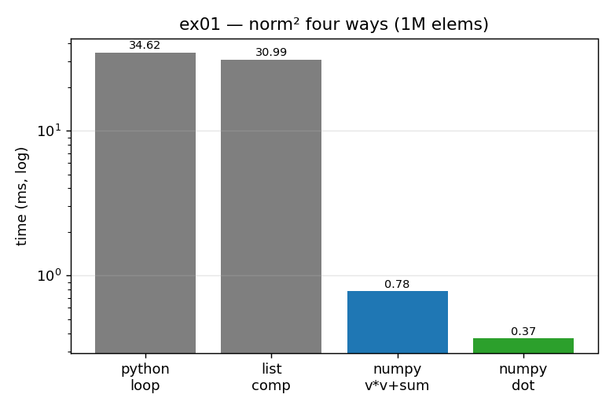

# ex01_list_vs_numpy_norm

This exercise computes the same simple quantity — the sum of squares of a vector,
`sum(v*v)` — in four different ways, and measures how long each one takes and how
much memory it uses. The four versions are a plain Python `for` loop, a list
comprehension, `numpy.sum(v * v)`, and `numpy.dot(v, v)`. They all return the exact
same number; the only thing that changes is *how* the work reaches the CPU.

## What it measures

Over a one-million-element vector:

| version | time | speedup vs loop | peak memory |
| --- | ---: | ---: | ---: |
| Python `for` loop | 33.6 ms | 1× | ~248 B |
| list comprehension | 30.5 ms | ~1.1× | 38.6 MB |
| `numpy.sum(v*v)` | 0.75 ms | ~45× | 7.6 MB |
| `numpy.dot(v, v)` | 0.35 ms | ~97× | 5.3 KB |

The headline is that the two numpy versions are dozens of times faster, and that
`dot` is both the fastest *and* the lightest on memory — it never builds a temporary
array at all.

## What we found

The pure-Python versions are slow because they walk a list of a million separate
Python objects, doing a dynamically-typed multiply on each one. numpy instead hands
the whole array to a tight, pre-compiled C routine that already knows the data is a
single block of doubles, so it skips all the per-element type-checking. `dot` then
goes one step further than `sum(v*v)`: it folds the multiply and the running total
into a single pass, so it never has to allocate or re-read the intermediate `v*v`
array — which is why its memory footprint is a few kilobytes instead of several
megabytes.

## Reading the chart



The chart is a bar of the four run-times on a **logarithmic** y-axis (each gridline
is 10× the one below it). The two grey Python bars sit near the top at tens of
milliseconds; the two coloured numpy bars drop to well under a millisecond. The log
scale is deliberate — on a linear axis the numpy bars would be invisible slivers.
The rightmost bar (`numpy.dot`, green) is the shortest, showing the extra win from
fusing the two loops into one.

## 5 Whys

1. **Why is `numpy.dot` ~97× faster than the Python loop?** It runs the whole
   multiply-and-sum as one optimized C routine over a contiguous block of doubles,
   instead of stepping through a million separate Python objects.
2. **Why does the Python loop have to step through separate objects?** A Python list
   stores *pointers* to boxed number objects scattered across the heap, so each
   iteration dereferences a pointer and operates on an individual object.
3. **Why is operating on individual boxed objects so costly?** Python is dynamically
   typed, so every multiply must check the operand types at runtime and dispatch to
   the right handler — overhead that numpy's C code pays once for the entire array.
4. **Why is `dot` faster than even `numpy.sum(v*v)`?** `sum(v*v)` first builds a
   whole new million-element array for `v*v`, then reads it back to add it up; `dot`
   fuses both steps into a single pass and never materializes that intermediate.
5. **Why does avoiding the intermediate matter so much?** Allocating and re-walking a
   second large array costs memory bandwidth and a fresh allocation, while the fused
   version keeps its running total in a register and touches the data only once.

**Root cause:** performance here comes from *removing work*. Specialized typed C
deletes the per-element interpreter overhead, and fusion deletes the temporary array
entirely — the fastest code is the code you never run.

## Run

```bash
.venv/bin/python chapter_6/ex01_list_vs_numpy_norm/ex01_list_vs_numpy_norm.py
# regenerate this chart:
.venv/bin/python chapter_6/visualize_exercises.py --only ex01
```
