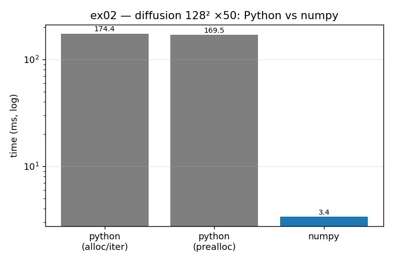

# ex02_diffusion_python_vs_numpy

This is the chapter's central benchmark: solving the 2D diffusion equation, written
three different ways that all run the *identical* algorithm. The first is pure
Python that builds a fresh output grid on every iteration. The second is pure Python
that allocates one scratch grid up front and reuses it, swapping references each
step (the book's Example 6-6). The third uses numpy with `roll`. Because the maths
is the same in all three, any speed difference comes purely from how the data is
stored and moved.

## What it measures

On a 128×128 grid over 50 iterations:

| version | time | speedup |
| --- | ---: | ---: |
| pure Python (fresh grid each iter) | 165.9 ms | 1× |
| pure Python (preallocated scratch + swap) | 161.1 ms | ~1.03× |
| numpy + `roll` | 3.1 ms | **~53×** |

All three produce the same grid (verified to a rounding error of ~1e-18). Notice how
small the pure-Python preallocation win is, and how large the jump to numpy is.

## What we found

A Python grid is a list of lists, and every cell holds a *pointer* to a float object
that lives somewhere else in memory. So a single `grid[i][j]` is two pointer lookups,
and the actual numbers are scattered all over RAM rather than sitting together. That
scattering is fatal for numerical work: the CPU can only move and vectorize data that
is contiguous, so it ends up fetching one value at a time. Preallocating the scratch
buffer removes one allocation per iteration, which is why it helps a little — but it
does nothing about the fragmentation, which is the real bottleneck. numpy stores the
whole grid as one contiguous block of typed numbers, so the same algorithm suddenly
vectorizes and runs in compiled C, roughly 53× faster.

## Reading the chart



The chart shows the three run-times on a **logarithmic** y-axis. The two grey
Python bars are nearly the same height — visual proof that preallocation barely
moves the needle. The blue numpy bar is far below them; on this log scale it is more
than a full decade lower, which corresponds to the ~53× speedup. The takeaway you
should read off the picture: the big lever is *the data layout* (Python → numpy), not
the small allocation tweak within Python.

## 5 Whys

1. **Why is numpy ~53× faster than pure Python on the same algorithm?** numpy keeps
   the grid in one contiguous block of typed numbers and processes it with vectorized
   C, while Python interprets a nested loop over scattered objects.
2. **Why is the Python grid scattered?** A list of lists stores pointers, so the
   actual float values live at random heap addresses rather than next to each other.
3. **Why does scattering hurt so much?** The CPU moves memory in contiguous chunks and
   can only vectorize contiguous data; scattered values must be gathered one at a time,
   stalling on memory.
4. **Why doesn't preallocating the output grid fix it?** Preallocation removes one
   allocation per iteration, but the values are still pointer-chased and fragmented —
   so it shaves only ~3%.
5. **Why is fragmentation the dominant cost rather than allocation?** Because runtime is
   governed by how fast data reaches the CPU; once data is scattered, every cell access
   risks a cache miss, and that bandwidth limit dwarfs the cost of an occasional malloc.

**Root cause:** the speed of numerical code is set by *memory layout*, not by the
arithmetic. Contiguous, typed storage is what unlocks vectorization; a pointer-based
container forecloses it no matter how you tune the Python around it.

## Run

```bash
.venv/bin/python chapter_6/ex02_diffusion_python_vs_numpy/ex02_diffusion_python_vs_numpy.py
# regenerate this chart:
.venv/bin/python chapter_6/visualize_exercises.py --only ex02
```
