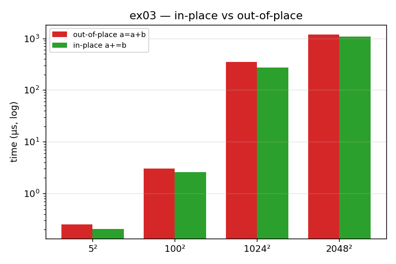

# ex03_inplace_vs_outofplace

This exercise compares two ways of adding two arrays together: the in-place form
`a += b`, which writes the result back into `a`'s existing memory, and the
out-of-place form `a = a + b`, which builds a brand-new array to hold the result.
It first proves the difference is real using Python's `id()` (the memory address),
and then times both forms at several array sizes.

## What it measures

First, the `id()` check: after `a += b` the address of `a` is unchanged (same
buffer reused), while after `a = a + b` the address changes (a new array was
allocated). Then the timings, with the input arrays built **once, outside** the
timed loop:

| size | out-of-place `a = a + b` | in-place `a += b` | winner |
| --- | ---: | ---: | --- |
| 5² | 0.27 µs | 0.25 µs | in-place 1.10× |
| 100² | 3.32 µs | 2.67 µs | in-place 1.24× |
| 1024² | 349 µs | 284 µs | in-place 1.23× |
| 2048² | 1251 µs | 1132 µs | in-place 1.10× |

In-place wins at every size tested on this machine.

## What we found

Every out-of-place `a = a + b` allocates a fresh result array, and on Linux/macOS
that allocation is *lazy*: the first time you write into the new memory, the kernel
has to fault each page in. That round-trip into the kernel is more expensive than a
cache miss, which the hardware resolves on its own. The in-place form skips all of
that by reusing the buffer it already owns. The book notes that for very small arrays
that fit entirely in cache, the out-of-place version can sometimes win because it
vectorizes more freely — but that effect is hardware-dependent and did **not**
reproduce on this M1 Max.

There is also a methodology lesson baked in. If you build the random input arrays
*inside* the timed call, that allocation (which both versions pay) swamps the small
difference you are actually trying to measure, and the result becomes noise. The
inputs must be created once, before timing — exactly as the book's `%%timeit` setup
line does.

## Reading the chart



The chart groups the two bars (red = out-of-place, green = in-place) at each array
size, with time on a **logarithmic** y-axis so all four sizes fit on one picture. In
every group the green in-place bar is a little shorter than the red one — a small but
consistent margin. The point of the picture is the *consistency*: green is never
taller, which is what "in-place wins at every size here" looks like.

## 5 Whys

1. **Why is `a += b` faster than `a = a + b`?** The in-place form writes into memory
   it already owns, while the out-of-place form allocates a brand-new result array
   every call.
2. **Why is allocating a new array costly?** Memory is handed out lazily, so the first
   write into the new array triggers a *minor page fault* for each page the kernel
   must actually map.
3. **Why is a page fault worse than a cache miss?** A cache miss is resolved by the
   hardware on the motherboard; a page fault traps into the kernel — a context switch
   into another process and back.
4. **Why doesn't the "out-of-place wins in cache" effect from the book show up here?**
   The M1 Max has large caches and fast memory, so the allocation cost dominates at
   every size we tested; the vectorization edge that can favor out-of-place never
   overtakes it.
5. **Why must the inputs be built outside the timed call?** If you allocate the random
   arrays inside the timing, both variants pay that large identical cost, which buries
   the small allocation difference you're trying to isolate and turns the result into
   noise.

**Root cause:** allocating memory is a conversation with the kernel, not a hardware
op — so reusing a buffer you already hold avoids the page-fault tax that the
out-of-place form pays on every single call.

## Run

```bash
.venv/bin/python chapter_6/ex03_inplace_vs_outofplace/ex03_inplace_vs_outofplace.py
# regenerate this chart:
.venv/bin/python chapter_6/visualize_exercises.py --only ex03
```
