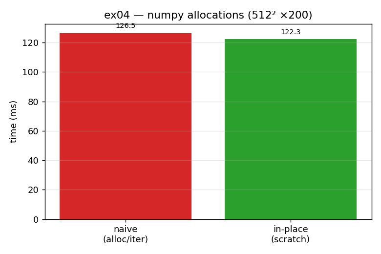

# ex04_numpy_diffusion_memory

Once the diffusion code is in numpy (ex02), the next inefficiency is memory churn.
The naive numpy version allocates several temporary arrays on every iteration — each
`grid + dt * laplacian(grid)` builds new arrays behind the scenes. This exercise
rewrites it to allocate a single scratch buffer once, do all the maths in place with
`copyto` and `+=`, and then swap the two grid references at the end of each step.
Same result, far fewer allocations.

## What it measures

On a 512×512 grid over 200 iterations:

| version | time | peak memory |
| --- | ---: | ---: |
| naive (allocates temporaries each iter) | 130.7 ms | 8.0 MB |
| in-place (one scratch buffer + swap) | 121.3 ms | 6.0 MB |

The speed gain is modest (~1.08×) but the memory difference is clear: the in-place
version holds two grids resident instead of repeatedly building extra ones.

## What we found

The in-place version is faster for the same reason as ex03: every temporary array the
naive version allocates has to be faulted into memory on first use, and each of those
minor page faults briefly traps into the kernel, flushes cache state, and breaks the
CPU's instruction pipeline. By preallocating one scratch grid and reusing it with
`+=` and `copyto`, we pay that cost once instead of every iteration. The reference
swap at the end of each step (`grid, scratch = scratch, grid`) is essentially free —
it just renames two pointers, it does not copy any data. One honest caveat: `np.roll`
*still* allocates four temporaries internally, so there is more to remove — that is
exactly what ex05 attempts.

## Reading the chart



The chart shows the two run-times as bars (red = naive, green = in-place) on a linear
y-axis. The green bar is a little shorter — the ~8% time saving. The more important
result, the memory drop from 8 MB to 6 MB, is reported by the script's text output
(`tracemalloc` peak) rather than the chart; the bars here are about time. Read the
chart as "preallocation buys a small, reliable speed-up," with the bigger structural
payoff being the reduced allocation/fault traffic.

## 5 Whys

1. **Why is the in-place version faster than the naive one?** It avoids allocating
   several temporary arrays per iteration, so it triggers far fewer minor page faults.
2. **Why does each fresh temporary cause a page fault?** Memory is mapped lazily, so
   the first write into a newly allocated array faults its pages in one by one.
3. **Why do those faults slow the whole loop, not just the allocation?** Each fault
   traps into the kernel, which also flushes cache state and stalls the CPU pipeline —
   so you lose accumulated optimizations on top of the kernel round-trip.
4. **Why is the grid swap effectively free?** `grid, scratch = scratch, grid` only
   rebinds two Python references; the underlying buffers stay exactly where they are,
   so no data moves.
5. **Why is the speed-up still only ~8% here?** Because `np.roll` inside the laplacian
   keeps allocating four temporaries of its own — the remaining allocation traffic that
   ex05 sets out to eliminate.

**Root cause:** repeated allocation is repeated kernel work; allocating scratch space
once and reusing it keeps the hot loop on the fast, in-process path where the cache
and pipeline stay warm.

## Run

```bash
.venv/bin/python chapter_6/ex04_numpy_diffusion_memory/ex04_numpy_diffusion_memory.py
# regenerate this chart:
.venv/bin/python chapter_6/visualize_exercises.py --only ex04
```
