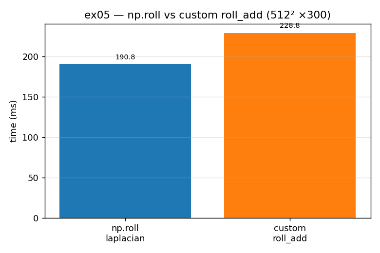

# ex05_roll_vs_roll_add

The laplacian in our diffusion code calls `np.roll` four times, and each call
allocates a new array. This exercise tries to remove those allocations by writing a
specialized helper, `roll_add`, that does the shift-and-accumulate directly with
fancy indexing — no temporaries, no general-purpose machinery, because we only ever
shift by ±1 along axis 0 or 1. The book reported a ~7% speed-up from this. On a
modern numpy, the result is more interesting: **the specialization loses.** That makes
this a cautionary tale rather than a clean win.

## What it measures

First a correctness gate: `test_roll_add` checks that `roll_add` produces exactly the
same result as `np.roll` for every combination of ±1 shift and axis 0/1. Then the
timing, on a 512×512 grid over 300 iterations:

| version | time |
| --- | ---: |
| `np.roll` laplacian (allocates 4 temporaries/iter) | 186 ms |
| custom `roll_add` laplacian (in-place, no temporaries) | 222 ms |

The hand-rolled version is about **1.2× slower** here, the opposite of the book's
result.

## What we found

On the hardware and numpy version the book used, replacing `np.roll` with a
hand-written in-place shift shaved a few percent. But modern `np.roll` is already
heavily optimized C, and our `roll_add` adds several extra Python-level statements
(four slice-assignments per call, each crossing back into the interpreter). Here those
extra statements cost more than the temporary arrays they were meant to avoid, so the
"optimization" is actually a regression. This is precisely the discipline the chapter
keeps preaching: you may have a sound mechanism in mind ("fewer allocations must be
faster"), but you cannot know whether it pays off on *your* machine and *your* library
version until you benchmark it — and you must weigh any speed-up against the
readability you give up by leaving simple, obvious code behind.

## Reading the chart



Two bars: blue for the `np.roll` laplacian, orange for the custom `roll_add`. The
orange bar is the *taller* one, which is the whole point — the "optimized" version
takes longer. When you see the specialized bar standing above the library bar, you are
looking at an optimization that didn't pay off. (On the book's hardware the orange bar
would have been slightly shorter; reproducing the opposite is itself the lesson.)

## 5 Whys

1. **Why is the custom `roll_add` slower than `np.roll` here?** Its four
   slice-assignments per call run extra Python-level statements that cost more than the
   temporary arrays they avoid.
2. **Why doesn't avoiding the temporaries pay off?** Modern `np.roll` is already
   well-optimized C, so the allocations it makes are cheap relative to the interpreter
   overhead of the hand-written version.
3. **Why did the book see a ~7% win then?** Different hardware and an older numpy, where
   `roll`'s allocations were comparatively more expensive — the trade-off tipped the
   other way.
4. **Why does the trade-off flip between machines?** Because it's a balance between
   allocation cost and per-statement interpreter cost, and both depend on the CPU,
   memory system, and library build you happen to be running on.
5. **Why does this matter beyond one function?** It shows that a plausible, mechanism-
   based optimization can still be a regression — so "specialized must be faster" is a
   hypothesis to test, never a fact to assume.

**Root cause:** specialization removes generality you may not need, but it also adds
code and assumptions; whether the net effect is faster is hardware- and
version-dependent, so it must be measured — and the readability cost weighed — every
time.

## Run

```bash
.venv/bin/python chapter_6/ex05_roll_vs_roll_add/ex05_roll_vs_roll_add.py
# regenerate this chart:
.venv/bin/python chapter_6/visualize_exercises.py --only ex05
```
