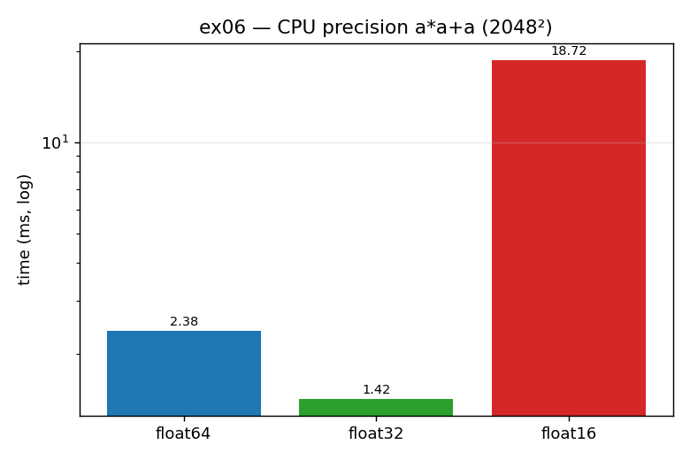

# ex06_float_precision_cpu

It is tempting to assume that smaller numbers are always faster — that dropping from
64-bit to 16-bit floats means less data to move and therefore quicker maths. This
exercise tests that assumption on the CPU by running the same expression, `a*a + a`,
over a 2048×2048 array at three precisions: `float64`, `float32`, and `float16`. The
result is a useful surprise.

## What it measures

| dtype | bytes/element | time | vs float64 |
| --- | ---: | ---: | --- |
| `float64` | 8 | 2.40 ms | 1× |
| `float32` | 4 | 1.22 ms | ~2× **faster** |
| `float16` | 2 | 18.3 ms | ~7.6× **slower** |

So `float32` behaves as expected (half the bytes, roughly twice as fast), but
`float16` is dramatically *slower* than even the 64-bit version.

## What we found

Going from `float64` to `float32` halves the amount of data the memory bus has to
carry, and the CPU has native 32-bit floating-point instructions, so the operation
really does run about twice as fast. `float16` is different: most CPUs (including this
M1 Max, for general numpy array maths) have **no native 16-bit float arithmetic**. So
to compute `a*a + a` in `float16`, numpy has to convert every element up to a
supported precision, do the maths, and convert back down — and that per-element
conversion costs far more than the bytes it saves. The lesson is that on the CPU,
lower precision is not a free speed knob; below the natively supported width it
becomes a penalty. (ex07 shows the GPU behaving the opposite way, because GPU silicon
*was* built for low-precision throughput.)

## Reading the chart



Three bars on a **logarithmic** y-axis: blue `float64`, green `float32`, red
`float16`. The green bar is the shortest (fastest), matching the intuition that
narrower is quicker. But the red `float16` bar is by far the *tallest* — it towers
over even `float64`. That inverted-from-expectation red bar is the whole story:
narrower is not automatically faster, and below native width it is much slower.

## 5 Whys

1. **Why is `float16` ~7.6× slower than `float64` on the CPU?** This CPU has no native
   16-bit float instructions, so numpy must convert each element to a supported
   precision to do the maths.
2. **Why is that conversion so expensive?** It happens per element across four million
   values, and the conversion work dwarfs the memory-bandwidth savings from the smaller
   type.
3. **Why does `float32` still get faster then?** The CPU *does* have native 32-bit
   float instructions, so there's no conversion — you simply move half the bytes and
   run a real 32-bit op.
4. **Why doesn't the CPU just support `float16` natively like the GPU?** CPUs are
   general-purpose and optimized for 32/64-bit scalar and SIMD work; low-precision
   throughput wasn't a design priority the way it is for graphics/ML hardware.
5. **Why care about this distinction?** Because the same "use lower precision" advice
   that speeds up a GPU can silently *slow down* CPU code — the right move depends
   entirely on which hardware runs the op.

**Root cause:** numeric precision is only a performance knob where the hardware has
native instructions for that width. On the CPU, below 32-bit there are none, so
`float16` trades a small bandwidth saving for a large conversion penalty.

## Run

```bash
.venv/bin/python chapter_6/ex06_float_precision_cpu/ex06_float_precision_cpu.py
# regenerate this chart:
.venv/bin/python chapter_6/visualize_exercises.py --only ex06
```
