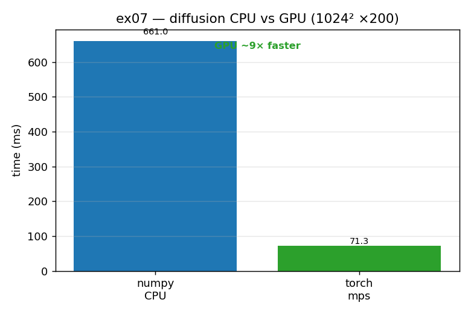

# ex07_diffusion_mps *(GPU)*

This exercise takes the numpy diffusion code and moves it onto the GPU using PyTorch.
The book targets NVIDIA/CUDA hardware; this machine is an Apple M1 Max, so we use
PyTorch's **MPS** (Metal) backend instead. The port is almost mechanical — swap numpy
for torch and put the tensors on the GPU — and the speed-up is large. We then repeat
the precision experiment from ex06, this time on the GPU, and find the result flips.

## What it measures

| benchmark | CPU | GPU (MPS) | result |
| --- | ---: | ---: | --- |
| diffusion 1024², 200 iters | numpy 667 ms | torch 69 ms | **~9.7× faster on GPU** |
| precision `a*a+a`, 4096² | float32 1.13 ms | float16 0.66 ms | float16 **1.7× faster** |

The GPU port is verified to match the numpy result to about `2e-9` (the small
difference is just float32-vs-float64 rounding).

## What we found

The diffusion update is "embarrassingly parallel" — every grid cell is updated
independently from its neighbours — which is exactly what a GPU's thousands of cores
are built for, hence the ~10× speed-up. The precision result is the interesting part:
on the GPU, `float16` is *faster* than `float32`, the **exact opposite** of ex06 on
the CPU. That's because GPU silicon was designed from the start to trade precision for
throughput — it has native low-precision instructions and can pack more values into
each fixed-width transfer. So precision is a genuine speed knob on the GPU and a
penalty on the CPU. Two practical notes: because MPS/CUDA run asynchronously, the
timing code must call `synchronize()` before reading the clock and must warm up first
(the first call pays a compilation cost); and because this is Apple MPS rather than
NVIDIA CUDA, the absolute magnitudes differ from the book even though the lessons hold.

## Reading the chart



The chart compares the diffusion run-time as two bars: blue for numpy on the CPU,
green for torch on the GPU. The green GPU bar is far shorter, and the annotation
spells out the ratio ("GPU ~10× faster"). Read it as the visual confirmation that a
parallel, bulk-maths workload belongs on the GPU. (The precision flip — float16 faster
than float32 on the GPU — is reported in the script's text output; contrast it with
the red `float16` tower in ex06's chart to see the same dtype behaving oppositely on
the two devices.)

## 5 Whys

1. **Why is the diffusion ~10× faster on the GPU?** Every cell update is independent,
   so the work spreads across the GPU's thousands of cores at once.
2. **Why can a GPU exploit that when a CPU can't?** A GPU has orders of magnitude more
   (individually slower) cores, ideal for doing the same operation over a huge array
   simultaneously.
3. **Why is `float16` faster than `float32` on the GPU but slower on the CPU?** GPU
   hardware has native low-precision instructions and moves more values per transfer;
   the CPU lacks native `float16` and must convert (see ex06).
4. **Why was the GPU built for low precision in the first place?** It descends from
   graphics hardware, where approximate results were always acceptable and trading
   precision for speed was the norm.
5. **Why must the timing call `synchronize()` and warm up?** GPU ops run asynchronously
   and the first call compiles a kernel, so without a barrier and a warm-up you'd be
   timing queueing and compilation, not compute.

**Root cause:** the GPU is a massively parallel machine tuned for throughput, so it
wins big on bulk, independent numeric work and treats reduced precision as a lever to
pull — the mirror image of the CPU.

## Run

```bash
.venv/bin/python chapter_6/ex07_diffusion_mps/ex07_diffusion_mps.py
# regenerate this chart:
.venv/bin/python chapter_6/visualize_exercises.py --only ex07
```
