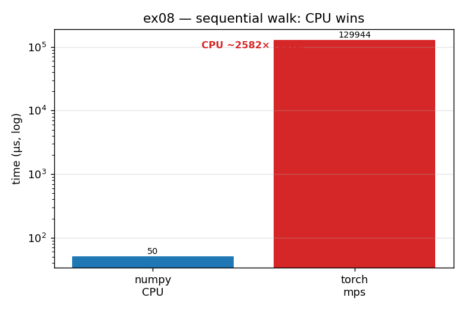

# ex08_when_not_gpu *(GPU)*

ex07 showed the GPU winning by ~10×, so it's easy to conclude the GPU is simply
faster. This exercise is the deliberate counter-example (the book's Example 6-25). It
runs a task that is the GPU's worst case: a sequential walk through an array where
each step's index is the previous step's value, so step *k+1* cannot begin until step
*k* finishes. There is nothing to parallelize, and the CPU wins overwhelmingly.

## What it measures

A 321-step dependent walk (target sum 200,000), on the same input both ways:

| device | time per run | result |
| --- | ---: | --- |
| numpy (CPU) | 45.5 µs | — |
| torch (MPS GPU) | 118 ms | **CPU ~2,600× faster** |

The GPU is over two thousand times *slower* on this task.

## What we found

A GPU has thousands of cores, but each one is individually slow; a CPU has only a
handful, but each is fast. When the work is one dependent step at a time, the GPU's
many-cores advantage is worthless — there is only ever one thing to do — so what
matters is single-core speed, where the CPU dominates. It gets worse: reading one
element at a time off a GPU tensor (`A[i]`) forces a tiny synchronization between CPU
and GPU on *every* step, so the 321-step loop pays that penalty hundreds of times.
This is also the closest Apple Silicon gets to the book's CUDA lesson that "data
transfer is the #1 killer" — Apple's unified memory makes a one-shot `.to()` cheap, so
the dramatic cost here comes from the repeated per-element syncs in the hot loop, not
from a single big copy.

## Reading the chart



Two bars on a **logarithmic** y-axis: blue for numpy (CPU), red for torch (GPU), with
an annotation reading "CPU ~2,600× faster." The red GPU bar is enormously taller — so
much so that the log scale is necessary to fit both on one picture. This is the visual
opposite of ex07: same two devices, but here the GPU bar towers over the CPU bar.
Together, ex07 and ex08 are the two halves of the rule — use the GPU for parallel bulk
maths, never for sequential branchy work.

## 5 Whys

1. **Why is the CPU ~2,600× faster than the GPU on this task?** The walk is purely
   sequential, so the GPU's thousands of cores sit idle while one slow core does all
   the work.
2. **Why can't the GPU parallelize it?** Each step needs the previous step's result to
   know which index to read next — there is never more than one operation available to
   run.
3. **Why does that favor the CPU specifically?** With no parallelism to exploit, only
   single-core speed matters, and a CPU core is far faster than a GPU core.
4. **Why is the GPU version *so* much slower, not just a bit?** Reading `A[i]` off a GPU
   tensor forces a CPU↔GPU sync each step, so the loop pays a transfer/stall penalty
   hundreds of times over.
5. **Why doesn't Apple's unified memory rescue it?** Unified memory makes a single bulk
   `.to()` copy cheap, but it does nothing for per-element syncs inside a hot loop —
   those still stall execution every iteration.

**Root cause:** a GPU is a throughput machine made of many slow cores; a task with no
parallelism and constant fine-grained data dependencies plays to none of its strengths
and all of its weaknesses, so the CPU wins by orders of magnitude.

## Run

```bash
.venv/bin/python chapter_6/ex08_when_not_gpu/ex08_when_not_gpu.py
# regenerate this chart:
.venv/bin/python chapter_6/visualize_exercises.py --only ex08
```
