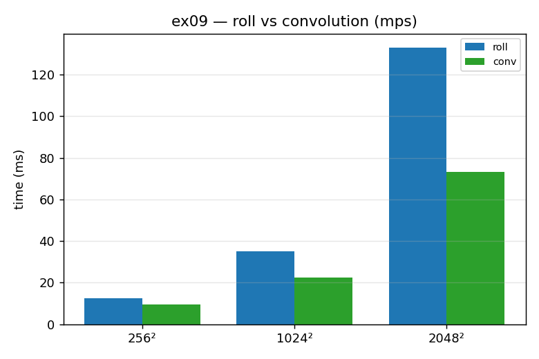

# ex09_diffusion_conv_mps *(GPU)*

The laplacian we have been computing — shift the grid up, down, left, right and
subtract four times the centre — is mathematically a 3×3 convolution. GPUs have
hardware specifically tuned for convolutions, so this exercise expresses the laplacian
as a `Conv2d` with a circular-padding kernel and compares it against the explicit
`roll` version from ex07, both running on the MPS GPU. It is the same computation
routed through a more specialized primitive.

## What it measures

First correctness: the convolution reproduces the roll laplacian to about `9e-10`.
(One subtlety — the book prints the *negated* kernel `[[0,-1,0],[-1,4,-1],[0,-1,0]]`;
to match our roll laplacian's sign we use the standard `[[0,1,0],[1,-4,1],[0,1,0]]`.)
Then the timing, 100 iterations at three grid sizes:

| grid | roll | conv | result |
| --- | ---: | ---: | --- |
| 256² | 14.3 ms | 8.4 ms | conv **1.70×** faster |
| 1024² | 35.2 ms | 22.2 ms | conv **1.59×** faster |
| 2048² | 132.5 ms | 72.2 ms | conv **1.84×** faster |

The convolution wins at every size on MPS.

## What we found

Crucially, this is *not* an algorithmic change — the convolution computes exactly the
same numbers as the four rolls and the subtraction. The speed-up comes entirely from
running the work through a purpose-built, heavily optimized convolution kernel instead
of assembling it by hand from general shift-and-add operations. On the book's CUDA
hardware the convolution only overtook the roll version at large grid sizes; on MPS it
wins everywhere. The broader lesson is that swapping in an optimized primitive like
this is something *you* have to recognize and reach for — the library will not
automatically rewrite your hand-assembled rolls into a convolution.

## Reading the chart



The chart groups two bars at each grid size: blue for the roll laplacian, green for
the convolution. In every group the green convolution bar is shorter, and the gap
holds up as the grids grow. Read across the three groups to see that the win is
consistent (and slightly larger at 2048²) — the same maths, made faster purely by
using the kernel the GPU was built to run.

## 5 Whys

1. **Why is the convolution faster than the roll version on the GPU?** It runs the work
   through a single purpose-built convolution kernel instead of four separate shifts
   plus adds.
2. **Why is the dedicated kernel faster if the maths is identical?** GPU silicon and
   libraries are heavily optimized for convolutions specifically, so they stream memory
   and schedule work more efficiently than the hand-assembled equivalent.
3. **Why doesn't the library do this swap for me?** Optimizers can fuse and reorder
   operations, but turning "four rolls and a subtract" into "a convolution" is an
   algorithmic recognition step they don't perform automatically.
4. **Why does it win at every size on MPS but only large grids on CUDA?** Different
   hardware and kernel-selection heuristics; the crossover where the specialized kernel
   pays off sits at a different point on each platform.
5. **Why does it stay a constant-factor win rather than changing the scaling?** Because
   we didn't change the algorithm's complexity — we just used a faster implementation of
   the same O(n²) work, so the curve shifts down, it doesn't bend.

**Root cause:** reaching for an already-optimized primitive (a convolution) beats
hand-building the same computation from general-purpose pieces — but recognizing the
opportunity is on you, not the optimizer.

## Run

```bash
.venv/bin/python chapter_6/ex09_diffusion_conv_mps/ex09_diffusion_conv_mps.py
# regenerate this chart:
.venv/bin/python chapter_6/visualize_exercises.py --only ex09
```
