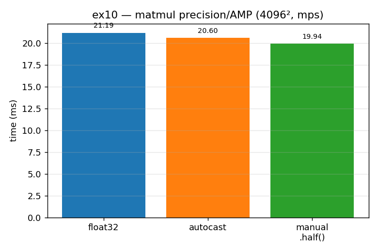

# ex10_amp_bfloat16 *(GPU)*

This exercise looks at two related ideas for trading precision for speed on the GPU.
The first is the difference between `float16` and `bfloat16` — two 16-bit float
formats that split their bits very differently. The second is Automatic Mixed
Precision (AMP), PyTorch's `autocast`, which automatically picks a lower precision for
eligible operations so you don't have to choose by hand. We look at both the numbers
involved and the measured speed.

## What it measures

The two 16-bit formats, via `torch.finfo` (both use 2 bytes):

| format | max value | resolution (step size) |
| --- | ---: | ---: |
| `float16` | 65,504 | 0.001 (more precise) |
| `bfloat16` | 3.4e38 | 0.01 (more range) |

The AMP behaviour and matmul speed (4096²):

- **autocast gotcha:** inside an `autocast` block, `mm(float32, float32)` returns a
  `float16` — the inputs are auto-downcast.
- **speed:** float32 **21.1 ms**, autocast **20.2 ms** (1.04×), manual `.half()`
  **19.8 ms** (1.07×).

## What we found

`float16` and `bfloat16` cost the same two bytes but make opposite compromises:
`float16` keeps more precision (smaller step) but overflows at 65,504, while
`bfloat16` sacrifices precision for a `float32`-sized range. Deep learning generally
prefers range over precision, which is why `bfloat16` is so common in training. AMP's
`autocast` automatically casts eligible operations (like matmul and convolution) to a
lower precision — convenient, but with a gotcha worth knowing: a `float32 @ float32`
inside `autocast` comes back as `float16`. As for speed, the honest result is that on
this MPS GPU the matmul gains almost nothing (~1.04×), because Apple's `float16` matmul
throughput is close to its `float32`; the book sees roughly 3× on CUDA. So the *value*
of AMP is hardware-dependent — what's portable is its mechanism (per-operation
precision selection), not the size of the speed-up.

## Reading the chart



The chart shows three matmul times as bars: blue `float32`, orange `autocast`, green
manual `.half()`. The striking thing is how *similar* the three bars are — there is no
dramatic drop. That near-flatness is the finding: on this GPU, mixed precision barely
helps matmul, unlike the large win the book reports on CUDA. Read the chart as "don't
assume AMP is a free speed-up — measure it on your hardware." (The `float16`-vs-
`bfloat16` range/precision trade-off is in the script's text output, not the bars.)

## 5 Whys

1. **Why does `bfloat16` have such a larger range than `float16`?** It spends more of
   its 16 bits on the exponent and fewer on the mantissa, buying range at the cost of
   precision.
2. **Why would you want range over precision?** Deep-learning values and gradients span
   many orders of magnitude, and the training process tolerates noise — so overflow is a
   bigger risk than rounding error.
3. **Why does `autocast` return `float16` from a `float32` matmul?** It auto-downcasts
   eligible ops to a faster precision; matmul is on that list, so its output comes back
   in the reduced type.
4. **Why is the matmul speed-up near zero on this MPS GPU?** Apple's `float16` matrix
   throughput is close to its `float32`, so casting buys little — unlike CUDA tensor
   cores, where low precision is dramatically faster.
5. **Why keep AMP if it doesn't speed things up here?** Because the *mechanism* (let the
   framework pick precision per op) is portable and pays off on hardware that does
   accelerate low precision — the benefit is hardware-dependent, the API isn't.

**Root cause:** mixed precision is a hardware-dependent optimization; the bit-layout
trade-off and the `autocast` mechanics are universal, but the actual speed-up only
materializes where the silicon accelerates the lower precision.

## Run

```bash
.venv/bin/python chapter_6/ex10_amp_bfloat16/ex10_amp_bfloat16.py
# regenerate this chart:
.venv/bin/python chapter_6/visualize_exercises.py --only ex10
```
