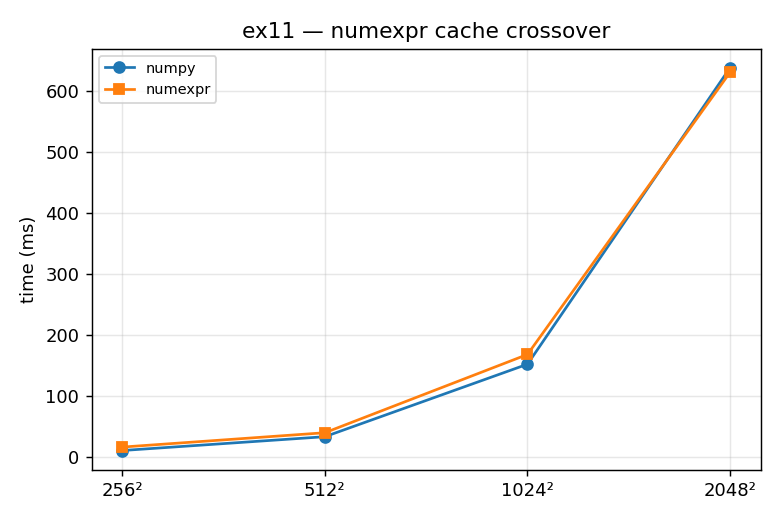

# ex11_numexpr_crossover

`numexpr` compiles a whole array expression into a single optimized pass instead of
letting numpy evaluate it one operation at a time. The promise is fewer temporaries
and better cache behaviour. This exercise swaps the diffusion's combine step,
`out*0.1 + grid`, for `numexpr.evaluate(...)` and sweeps the grid size to find out
where (and whether) numexpr actually helps. The answer is: it depends on size, and for
small grids it is a net loss.

## What it measures

The diffusion evolve step, 50 iterations, at four grid sizes:

| grid | numpy | numexpr | result |
| --- | ---: | ---: | --- |
| 256² | faster | — | numexpr **1.67× slower** |
| 512² | faster | — | numexpr **1.24× slower** |
| 1024² | faster | — | numexpr **1.10× slower** |
| 2048² | — | faster | numexpr **overtakes** numpy |

numexpr starts out clearly behind and only pulls ahead once the arrays are large.

## What we found

numexpr's advantage is that it fuses the expression into one cache-aware, multi-
threaded pass: it chunks the arrays so the pieces it's working on stay in CPU cache,
avoids building intermediate arrays, and spreads the work across cores. But all of
that — compiling the expression string, chunking, coordinating threads — is overhead,
and that overhead isn't repaid while the data still fits comfortably in the last-level
cache. Plain numpy is simply hard to beat when everything is already cache-resident. It
is only once the arrays grow past the cache (roughly two 1000×1000 double grids on a
typical L3) that numexpr's careful cache management starts avoiding the memory stalls
that hurt numpy, and it pulls ahead. This is a textbook size-dependent optimization:
genuinely helpful at scale, actively harmful below the crossover, so you must know
which regime you're in.

## Reading the chart



The chart plots two lines of run-time against grid size: blue for numpy, orange for
numexpr. At the small sizes the orange line sits *above* the blue one (numexpr slower).
As the grids grow, the lines converge and then cross — orange dips to or below blue at
the largest size. That crossing point is the whole story: the optimization is a loss on
the left of the chart and a win on the right, with the cache size setting where the
lines meet.

## 5 Whys

1. **Why is numexpr slower than numpy on small grids?** Its compile, chunking, and
   threading overhead isn't repaid when the data already fits in cache and numpy is
   already fast.
2. **Why does that overhead exist at all?** numexpr compiles the expression string and
   splits the arrays into cache-sized tiles coordinated across threads — real setup
   work before any arithmetic happens.
3. **Why does numexpr eventually win on large grids?** Once arrays overflow the
   last-level cache, plain numpy stalls waiting on memory; numexpr's tiling keeps the
   working set in cache and hides those stalls.
4. **Why is the crossover near ~1000²?** That's roughly where two double-precision grids
   stop fitting in a typical L3 cache, so the memory-bandwidth wall numexpr is built to
   dodge starts to bite numpy.
5. **Why does this make numexpr a "benchmark-first" tool?** Because the same call helps
   or hurts depending purely on array size relative to cache — there's no universally
   right answer, only a measured one.

**Root cause:** numexpr trades fixed overhead for better cache behaviour, so it only
pays off once data is large enough that cache misses, not setup cost, dominate the
run-time.

## Run

```bash
.venv/bin/python chapter_6/ex11_numexpr_crossover/ex11_numexpr_crossover.py
# regenerate this chart:
.venv/bin/python chapter_6/visualize_exercises.py --only ex11
```
