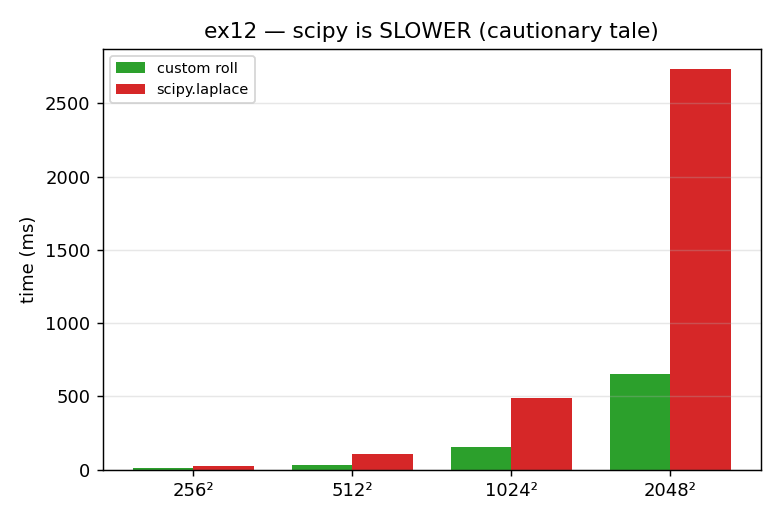

# ex12_scipy_cautionary

This is the chapter's cautionary tale, made concrete. `scipy.ndimage.laplace` is a
ready-made laplacian filter with built-in boundary handling, and `mode="wrap"` gives
exactly the periodic boundaries our diffusion code needs. It is a one-line drop-in for
our hand-written laplacian, and since Laplacians are bread-and-butter in image
processing, surely the library version is faster — right? This exercise checks that it
produces the correct answer, then benchmarks it. The "obvious" optimization turns out
to be a regression.

## What it measures

First correctness: `scipy.laplace(mode="wrap")` is *numerically identical* to our roll
laplacian, so this is a fair comparison. Then the timing, 50 iterations at four sizes:

| grid | custom roll | scipy.laplace | result |
| --- | ---: | ---: | --- |
| 256² | 9.3 ms | 23.0 ms | scipy **2.60× slower** |
| 512² | 31.4 ms | 102.7 ms | scipy **3.54× slower** |
| 1024² | 137.3 ms | 554.1 ms | scipy **3.83× slower** |
| 2048² | 603.0 ms | 2636.2 ms | scipy **4.41× slower** |

scipy is slower at every size, and — importantly — the gap *widens* as the grids grow.

## What we found

scipy's filter loses because it is built to be completely general: it handles any
number of dimensions, any boundary mode, and any filter footprint. All that
flexibility means extra code and, in particular, extra branches — runtime checks for
"which case am I in?" that prevent the tight vectorization our specialized roll
laplacian enjoys. Our version does exactly one thing and does it without conditionals,
so it issues far fewer instructions. The widening gap with size confirms it isn't a
fixed startup cost but a per-element overhead. The lesson is the heart of the whole
chapter: "it's a well-known, mature library, so it must be fast" is a *hypothesis*, and
a plausible one — but you only learn whether it holds by benchmarking it against the
specialized code you already have.

## Reading the chart



The chart groups two bars at each grid size: green for our custom roll laplacian, red
for `scipy.laplace`. The red bars are taller in every group, and notice how the red
bars grow *disproportionately* taller as the grids increase — that widening gap is the
signature of a per-element overhead, not a one-time cost. A taller bar for the
"obvious upgrade" is the picture of an optimization that backfired.

## 5 Whys

1. **Why is `scipy.laplace` slower than our hand-written laplacian?** It's a fully
   general filter, so it carries extra code and branches that our single-purpose
   version doesn't.
2. **Why do those branches hurt performance?** Conditional, case-by-case code can't
   vectorize or pipeline cleanly — the CPU can't stream through it the way it can
   through a tight, branch-free loop.
3. **Why is scipy written so generally?** It must serve every use case — arbitrary
   dimensionality, boundary modes, and filter shapes — which is valuable for an image
   library but costly for our one specific case.
4. **Why does the gap *widen* with grid size?** Because the overhead is per element, not
   a fixed startup cost, so it scales right along with the data.
5. **Why is this the chapter's key lesson?** Because "a mature library must be faster"
   sounds obviously true and is easy to act on without checking — and here it's flatly
   wrong, which is exactly why you benchmark before believing.

**Root cause:** general-purpose code pays for its flexibility with extra instructions
and branches; specialized code that does exactly one thing can be far faster — so an
assumed optimization must be measured, not trusted.

## Run

```bash
.venv/bin/python chapter_6/ex12_scipy_cautionary/ex12_scipy_cautionary.py
# regenerate this chart:
.venv/bin/python chapter_6/visualize_exercises.py --only ex12
```
