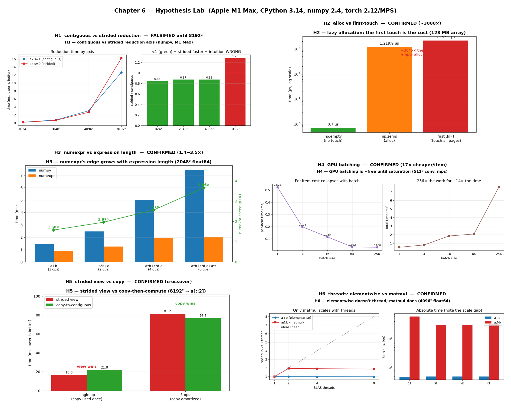

# Chapter 6 — Hypothesis Lab

Chapter 6's real lesson isn't any single optimization — it's the **discipline**:
*hypothesize a mechanism, predict an outcome, then benchmark to find out if you were
right.* These are extra hypotheses beyond the book's examples, each in its own folder
with a runnable `bench.py` and a `README.md` recording the prediction, the measured
numbers, and the verdict.

All numbers are from **Apple M1 Max / CPython 3.14 / numpy 2.4 / torch 2.12 (MPS) /
numexpr 2.14** — yours will differ.

```bash
# print results for one hypothesis
.venv/bin/python chapter_6/hypothesis/h1_reduction_axis_locality/bench.py

# add --plot to also save that folder's chart PNG
.venv/bin/python chapter_6/hypothesis/h1_reduction_axis_locality/bench.py --plot

# regenerate every chart AND the combined dashboard
.venv/bin/python chapter_6/hypothesis/visualize.py
```

## Dashboard



Every `bench.py` has a `--plot` flag that saves its own chart in its folder;
`visualize.py` runs all six and tiles them into `hypothesis_dashboard.png` above. The
dashboard is a 3×2 contact sheet — one panel per hypothesis, each captioned with its
verdict — so you can scan all six results at a glance before opening any single folder.
Each folder's own `README.md` walks through how to read its individual chart.

## The hypotheses

| # | Hypothesis | Prediction | Verdict |
| --- | --- | --- | --- |
| **H1** | Reducing along the contiguous axis beats the strided axis | contig faster everywhere | **FALSIFIED** until 8192² — strided was faster (vectorized row accumulation) |
| **H2** | Allocation is cheap; the first *touch* is the cost | touch ≫ alloc | **CONFIRMED** — `np.empty` 0.8 µs vs first-write 2286 µs (~2900×) |
| **H3** | numexpr's edge grows with expression length | speedup rises with #ops | **CONFIRMED** — 1.57× (1 op) → 3.47× (6 ops) |
| **H4** | GPU batching is ~free until cores saturate | per-item collapses then flattens | **CONFIRMED** — 17× cheaper/item by batch 256 |
| **H5** | Copy-to-contiguous can beat operating on a strided view | view wins once, copy wins when reused | **CONFIRMED** — view 1.56× (1 op); copy 1.08× (5 ops) |
| **H6** | Elementwise doesn't thread; matmul does | `a+b` flat, `a@b` scales | **CONFIRMED** — a+b 1.14×, a@b 1.96× (1→8 threads) |

## Why these matter

- **H1** is the standout: a plausible, mechanism-based prediction that the benchmark
  *overturns* — the purest demonstration of the chapter's "measure, don't assume" rule.
- **H3** sharpens `ex11` (numexpr): the win scales with expression complexity, not just
  grid-vs-cache size.
- **H4** confirms the GPU-batching aside in `ex09`; **H6** is the CPU mirror of it
  (`ex08`) — parallel hardware only helps when the work is actually parallel.
- **H2** isolates the page-fault mechanism behind `ex04`; **H5** turns "make it
  contiguous" from a rule into a measured break-even.

Two findings beat the naive intuition (H1 fully; H5 partially). That's the point of a
hypothesis lab — the surprises are where the learning is.

## 5 Whys: why run a hypothesis lab at all?

1. **Why benchmark hypotheses instead of reasoning them out?** Because two of these six
   (H1 fully, H5 partially) contradicted a perfectly plausible mechanism — reasoning
   alone would have left those beliefs wrong.
2. **Why does sound reasoning lead to wrong predictions here?** Performance depends on
   many interacting layers — vectorization shape, cache size, kernel behaviour, thread
   scaling — and intuition usually models only one of them.
3. **Why can't you just account for all the layers up front?** They interact in
   machine-specific ways (cache sizes, instruction sets, library builds), so the same
   prediction holds on one machine and fails on another.
4. **Why structure it as explicit prediction → measurement?** Writing the prediction down
   first turns a vague hunch into a falsifiable claim, so the benchmark can actually
   confirm or refute it rather than just produce a number.
5. **Why keep the refuted results instead of hiding them?** Because a confidently wrong
   prediction that the data overturns is the most valuable thing here — it's where your
   mental model gets corrected.

**Root cause:** computer performance is too layered and hardware-specific to predict
reliably, so the only trustworthy path is to hypothesize a mechanism, predict an
outcome, and let the measurement decide.
