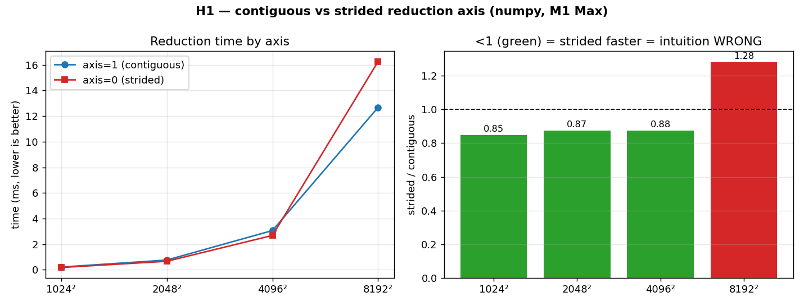

# H1 — Reduction axis & cache locality: when intuition is wrong

A very natural piece of intuition says: if your data is laid out in rows
(C-contiguous), then summing *along* a row should be faster than summing *across*
rows, because walking contiguous memory is cache-friendly and jumping between rows is
not. This hypothesis tests that belief directly by timing `sum(axis=1)` (reduce along
the contiguous direction) against `sum(axis=0)` (reduce along the strided direction)
on the same array, at growing sizes.

**Hypothesis:** `sum(axis=1)` is faster than `sum(axis=0)`, and the gap widens with size.

**Prediction (naive):** the contiguous axis wins at every size, increasingly so.

## Run

```bash
.venv/bin/python chapter_6/hypothesis/h1_reduction_axis_locality/bench.py
```

## Measured (Apple M1 Max, numpy 2.4)

| size | axis=1 (contiguous) | axis=0 (strided) | verdict |
| --- | ---: | ---: | --- |
| 1024² | 0.20 ms | 0.17 ms | strided **1.14× faster** — intuition wrong |
| 2048² | 0.76 ms | 0.66 ms | strided **1.16× faster** — intuition wrong |
| 4096² | 3.02 ms | 2.68 ms | strided **1.13× faster** — intuition wrong |
| 8192² | 12.67 ms | 14.60 ms | contiguous **1.15× faster** — intuition holds |

## Reading the chart



The left panel plots both run-times against array size — the two lines track closely,
crossing only at the far right. The right panel is the clearer one: it shows the ratio
`strided / contiguous` as a bar at each size, with a dashed line at 1.0. Bars *below*
1.0 (green) mean the strided axis was faster — i.e. the naive intuition is wrong — and
that's three of the four sizes. Only the last bar (8192², red) rises above 1.0, where
locality finally takes over. The picture is designed so the surprise is unmistakable:
mostly green, with one red bar at the end.

## Verdict: **FALSIFIED** (until very large sizes)

The naive prediction is actually backwards for small and mid-sized arrays. The reason
is *how* numpy implements the two reductions. For `sum(axis=0)` it accumulates whole
rows into a contiguous result buffer — adding long contiguous runs of memory together
with SIMD, which is very efficient. For `sum(axis=1)` it instead collapses each
contiguous row down to a single scalar, which vectorizes less well per element. So the
"strided" reduction is genuinely faster, right up until the array (8192² = 512 MB)
overflows the cache, at which point raw memory locality reasserts itself and the
intuition finally holds.

## 5 Whys

1. **Why is the "strided" `sum(axis=0)` faster than the "contiguous" `sum(axis=1)`?**
   numpy accumulates whole rows into a contiguous buffer with SIMD, which is more
   efficient than collapsing each row to a single scalar.
2. **Why is row-accumulation more SIMD-friendly than per-row collapse?** Adding two
   long contiguous runs maps cleanly onto vector instructions; reducing a run to one
   value involves a horizontal sum that vectorizes less well.
3. **Why does the access pattern intuition fail here?** Because the loop's
   *vectorization shape* matters more than the raw read order — numpy still streams
   memory contiguously in both cases, just differently.
4. **Why does the intuition finally hold at 8192²?** At 512 MB the array no longer fits
   in cache, so the cost of fetching memory dominates and the genuinely better locality
   of `axis=1` wins.
5. **Why is this worth knowing?** Because it shows a mechanism-based prediction can be
   confidently wrong — locality reasoning is necessary but not sufficient, and only the
   benchmark settles it.

**Root cause:** run-time is shaped by how the library vectorizes the loop, not by the
access pattern alone — so a plausible locality argument has to be measured before it's
believed.

*(regenerate the chart: `bench.py --plot`)*
