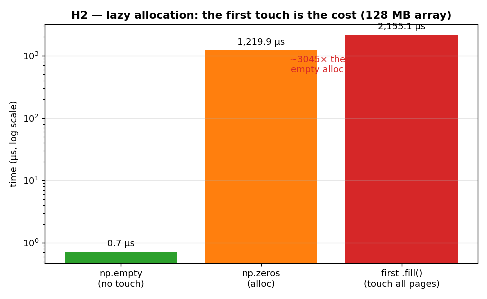

# H2 — Lazy allocation: the cost is the first touch

When you ask the operating system for a big block of memory, almost nothing happens
right away — the kernel just hands back a reference and promises to provide the pages
later. The real work, mapping each page into your process, is deferred until you first
*write* to that memory. This hypothesis measures that gap directly, by separating the
cost of allocating an array from the cost of first touching it.

**Hypothesis:** allocation is nearly free; the first write, which faults each page in,
is where the time goes.

**Prediction:** `np.empty` (no initialization) ≈ 0; the first write ≫ the allocation.

## Run

```bash
.venv/bin/python chapter_6/hypothesis/h2_lazy_allocation/bench.py
```

## Measured (Apple M1 Max) — a 128 MB float64 array

| operation | time |
| --- | ---: |
| `np.empty` allocation (no touch) | **0.8 µs** |
| `np.zeros` allocation | 1269.5 µs |
| first `.fill(1.0)` over the buffer | 2286.4 µs |

The first touch costs roughly **2,900×** as much as the bare `np.empty` allocation.

## Reading the chart



The chart is three bars on a **logarithmic** y-axis (each gridline is 10× the one
below). The green `np.empty` bar is a tiny sliver near the bottom — sub-microsecond.
The orange `np.zeros` and red first-`fill` bars stand more than three decades higher,
in the milliseconds. The log scale is essential: on a linear axis the `np.empty` bar
would simply be invisible. The shape of the picture — one microscopic bar and two tall
ones — *is* the lesson: getting the memory is free, using it for the first time is not.

## Verdict: **CONFIRMED**

`np.empty` is effectively instant because it touches no pages, so it triggers no page
faults at all. The first write walks the entire buffer and pays a *minor page fault*
for every page the kernel has to map, which is where nearly all the time goes.
`np.zeros` sits in between: it must guarantee the memory is zeroed, so it does more
than `empty`, but the dominant cost is still that per-page work.

## 5 Whys

1. **Why is `np.empty` ~2,900× faster than the first write?** It only reserves a
   reference and touches no pages, so there's no per-page work to do yet.
2. **Why does the first write cost so much?** It faults each page into the process for
   the first time, and a 128 MB buffer is tens of thousands of pages.
3. **Why is memory mapped lazily instead of up front?** It's an optimization — programs
   often allocate more than they use, so the kernel defers the real work until a page is
   actually touched.
4. **Why is each fault expensive?** A page fault traps into the kernel, which verifies
   and wires up the page — work done outside your program, interrupting its flow.
5. **Why does this matter for hot loops?** Because re-allocating a buffer each iteration
   re-pays this fault tax every time; allocating scratch once and reusing it pays it only
   on the first pass (the lesson `ex04` puts into practice).

**Root cause:** allocation is a cheap promise from the kernel; the bill comes due on
first use, when each page must actually be faulted in — so reuse buffers to pay it once.

*(regenerate the chart: `bench.py --plot`)*
