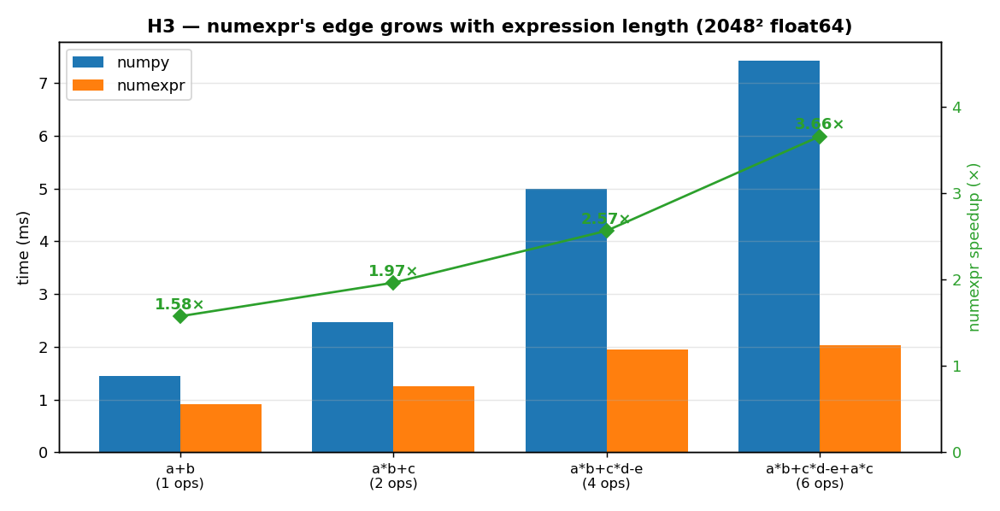

# H3 — numexpr's advantage grows with expression length

`ex11` showed that numexpr beats numpy once arrays overflow the cache. But cache size
isn't the only thing that determines whether numexpr is worth it. This hypothesis
holds the array size *fixed* and varies the length of the expression instead, on the
theory that numexpr's whole advantage comes from fusing away the temporary arrays
numpy builds between operations — so the more operations there are, the more
temporaries it avoids, and the bigger its edge should be.

**Hypothesis:** at a fixed array size, numexpr's speed-up over numpy grows with the
number of operations in the expression.

**Prediction:** the speed-up rises monotonically as the expression gets longer.

## Run

```bash
.venv/bin/python chapter_6/hypothesis/h3_numexpr_expression_length/bench.py
```

## Measured (Apple M1 Max, 2048² float64, numexpr 10 threads)

| expression | ops | numpy | numexpr | speed-up |
| --- | ---: | ---: | ---: | ---: |
| `a+b` | 1 | 1.45 ms | 0.92 ms | 1.57× |
| `a*b+c` | 2 | 2.43 ms | 1.25 ms | 1.95× |
| `a*b+c*d-e` | 4 | 4.82 ms | 2.08 ms | 2.32× |
| `a*b+c*d-e+a*c` | 6 | 7.46 ms | 2.15 ms | **3.47×** |

## Reading the chart



The chart pairs a bar comparison with a trend line. The blue (numpy) and orange
(numexpr) bars at each expression show the absolute times: the blue bars climb steeply
as the expression lengthens, while the orange bars stay almost flat. The green diamond
line, read against the right-hand axis, is the speed-up — and it rises steadily from
~1.6× to ~3.5×. Read the diverging bars together with the climbing line: numpy's cost
grows with every added operation, numexpr's barely does, so the gap between them widens.

## Verdict: **CONFIRMED** — cleanly monotonic

As the expression gets longer, numpy's time grows almost linearly, because each
operation allocates and then re-reads another full-size temporary array. numexpr's time
barely moves, because it folds the entire expression into one pass over the data and
never materializes those intermediates. The speed-up therefore climbs steadily with the
operation count — exactly as predicted.

## 5 Whys

1. **Why does numexpr's advantage grow with expression length?** Each extra operation is
   one more temporary array numpy must build and re-walk, and one more thing numexpr
   simply fuses into its single pass.
2. **Why does numpy create a temporary per operation?** It evaluates one operation at a
   time, so `a*b+c` first computes `a*b` into a new array, then adds `c` — two passes,
   one intermediate.
3. **Why doesn't numexpr need those intermediates?** It compiles the whole expression and
   walks the data once, computing each output element through the entire formula before
   moving on.
4. **Why does that compound as the formula lengthens?** numpy's overhead scales with the
   number of operations (more temporaries, more memory traffic); numexpr's stays roughly
   constant, so their ratio grows.
5. **Why does this refine ex11's lesson?** Because numexpr's payoff isn't only about
   array-size-vs-cache — at a fixed size it also scales with expression complexity, so
   long fused expressions are its sweet spot.

**Root cause:** numexpr wins by eliminating the per-operation temporaries numpy
materializes, so the more operations you fuse, the more work it removes — complexity,
not just size, drives the gain.

*(regenerate the chart: `bench.py --plot`)*
