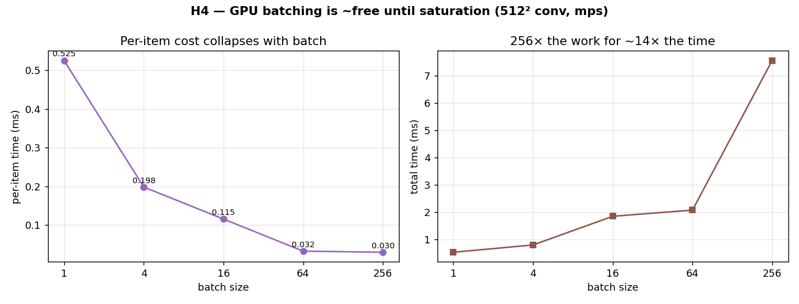

# H4 — GPU batching is nearly free until the cores saturate

A single 512×512 convolution is far too small to keep a GPU's thousands of cores busy
— most of them sit idle. So if you hand the GPU a *batch* of independent convolutions
to do at once, it should be able to fit them into that idle capacity, and the cost per
item should fall dramatically as the batch grows — right up until the batch is big
enough to fill all the cores. This hypothesis measures that directly.

**Hypothesis:** processing B independent convolutions together costs little more than
processing one, so the per-item time collapses as B grows, then flattens at saturation.

**Prediction:** per-item time drops sharply with B, then levels off.

## Run

```bash
.venv/bin/python chapter_6/hypothesis/h4_gpu_batching/bench.py
```

Requires a GPU (MPS/CUDA); on a CPU it prints a note and exits.

## Measured (Apple M1 Max / MPS) — 512² convolution

| batch B | total time | per-item time | per-item speed-up |
| ---: | ---: | ---: | ---: |
| 1 | 0.49 ms | 0.492 ms | 1.0× |
| 4 | 0.78 ms | 0.195 ms | 2.5× |
| 16 | 1.89 ms | 0.118 ms | 4.2× |
| 64 | 2.59 ms | 0.040 ms | 12.2× |
| 256 | 7.53 ms | 0.029 ms | **16.7×** |

## Reading the chart



The left panel plots per-item time against batch size: it falls steeply at first and
then flattens — a classic diminishing-returns curve that bottoms out around batch 64,
where the cores are nearly full. The right panel plots *total* time against batch size,
and its title makes the headline explicit: processing 256 grids takes only ~14× as long
as processing 1, even though it does 256× the work. Read the two panels together: the
left shows cost-per-item collapsing, the right shows that 256× more work is nearly free
in wall-clock terms.

## Verdict: **CONFIRMED**

Doing 256 convolutions costs only about 15× the time of doing one — that is, 256× the
work for roughly 15× the time — and the per-item cost falls by about 17× before
flattening. A single small convolution leaves most of the GPU idle; batching packs that
idle capacity with useful work until the cores saturate, after which adding more items
finally starts costing proportionally.

## 5 Whys

1. **Why does the per-item time collapse as the batch grows?** A small convolution uses
   only a fraction of the cores; batching fills the idle ones, so more work finishes in
   nearly the same wall-clock time.
2. **Why are so many cores idle for one convolution?** A 512² grid simply doesn't have
   enough independent work to occupy thousands of cores at once.
3. **Why does the curve flatten at large batches?** Once every core is busy, the GPU is
   saturated — adding more items now costs proportionally, because there's no spare
   capacity left to absorb them.
4. **Why is this specific to GPUs?** A CPU has only a handful of cores and little spare
   parallel capacity, so batching can't hide work the way it does on a GPU (this is the
   flip side of `ex08`).
5. **Why does this shape how we feed GPUs?** Because throughput is measured in
   items/second at a tuned batch size — too small wastes cores, too large overflows
   memory — which is exactly why batch size is a real tuning knob in deep learning.

**Root cause:** a GPU finishes a batch in the time of its slowest core's queue, so
until the cores are full, extra independent items ride along almost for free.

*(regenerate the chart: `bench.py --plot`)*
