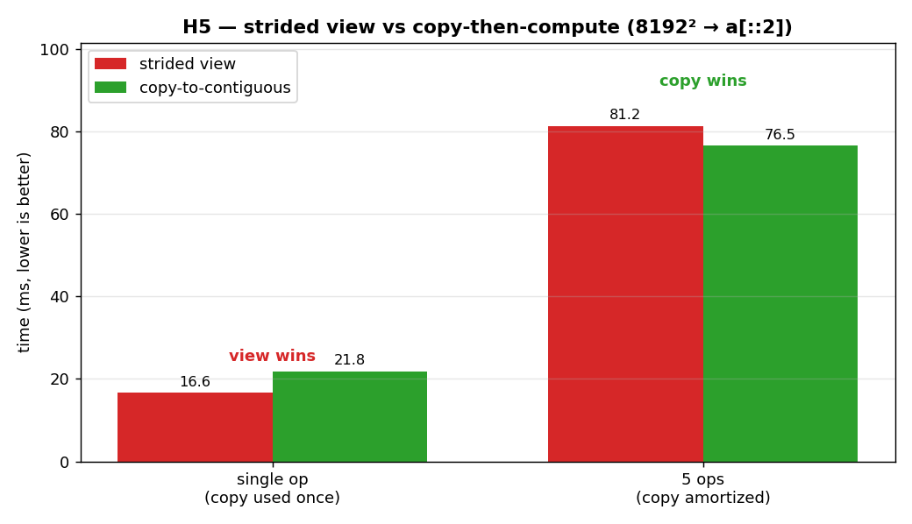

# H5 — Copy-to-contiguous can beat operating on a strided view

When you slice an array like `a[::2]`, you get a *view* — a window onto the original
memory with a stride, not a fresh contiguous array. Operating on that strided view
means the CPU jumps through memory rather than streaming it, which is less
cache-friendly. So you might expect that copying the view into a contiguous array first
(`np.ascontiguousarray`) and then operating on it would be faster — but only if you
reuse that copy enough times to pay back the cost of making it. This hypothesis finds
the break-even point.

**Hypothesis:** for a single operation the view wins (the copy isn't worth it); for
repeated operations, copying once and reusing wins.

**Prediction:** view faster at one op; copy faster when the contiguous buffer is reused.

## Run

```bash
.venv/bin/python chapter_6/hypothesis/h5_strided_vs_copy/bench.py
```

## Measured (Apple M1 Max) — `a[::2]` of an 8192² array (a non-contiguous 4096×8192 view)

| scenario | strided view | copy + op | winner |
| --- | ---: | ---: | --- |
| single op `(v*v).sum()` | 16.61 ms | 25.84 ms | **view** (1.56×) |
| 5 ops (one copy amortized) | 84.79 ms | 78.31 ms | **copy** (1.08×) |

## Reading the chart



The chart has two groups of bars — "single op" and "5 ops" — with red for the strided
view and green for the copy-then-compute approach, and the winner labelled above each
group. In the left group the red (view) bar is shorter: with only one operation the
copy can't pay for itself. In the right group the green (copy) bar edges ahead: once the
contiguous buffer is reused five times, the one-time copy has amortized. The switch of
the shorter bar from red to green across the two groups is the crossover the hypothesis
is about.

## Verdict: **CONFIRMED** — but the crossover is the whole point

For a single operation, copying simply isn't worth it, so working on the strided view
directly is faster. Once the contiguous buffer is reused — here across five operations —
the one-time copy amortizes and the contiguous version pulls ahead. The lesson isn't
"always copy" or "never copy"; it's that there is a **break-even reuse count**, and
which side of it you're on depends on how many times you'll touch the data. The margin
is modest on this machine because the M1 Max has large caches and fast memory, so
strided access is comparatively cheap; on hardware with a tighter cache, the copy would
win sooner and by more.

## 5 Whys

1. **Why does the strided view win for a single operation?** The one-time cost of copying
   to contiguous memory isn't repaid when you only use the result once.
2. **Why does copying win once you reuse the buffer?** The copy is paid only once, but
   every subsequent operation runs on cache-friendly contiguous memory, so the savings
   add up.
3. **Why is contiguous access faster per operation at all?** The CPU streams contiguous
   memory and vectorizes it cleanly, whereas a strided view forces it to gather values
   that are spread out.
4. **Why is the margin small on this machine?** The M1 Max's large caches and high memory
   bandwidth make even strided access relatively cheap, so the contiguous advantage is
   modest.
5. **Why does the right answer depend on the hardware?** Because the break-even reuse
   count is set by the ratio of copy cost to per-op strided penalty, and both depend on
   the cache size and memory speed you're running on.

**Root cause:** making data contiguous is a real optimization but a *conditional* one —
it pays off only when reuse amortizes the copy, so the right call depends on access
pattern and hardware, and must be measured.

*(regenerate the chart: `bench.py --plot`)*
