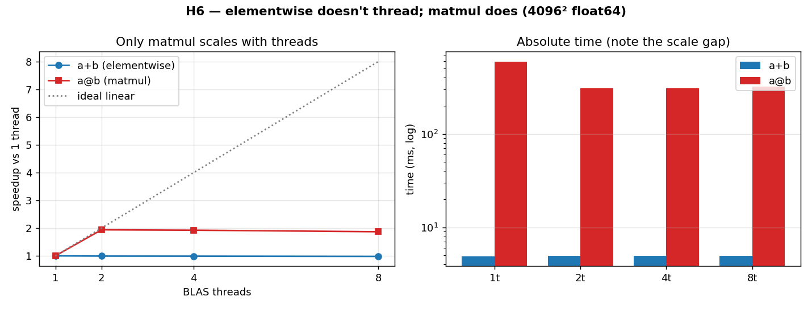

# H6 — Elementwise ops don't thread; BLAS matmul does

"Use all my cores" is common performance advice, but it only helps if the operation is
actually parallelized underneath. This hypothesis contrasts two numpy operations: a
simple elementwise add (`a+b`) and a matrix multiply (`a@b`). The add is handled by
numpy's own single-threaded core loop and is limited by memory bandwidth; the matmul is
dispatched to a multithreaded BLAS library and is limited by compute. So adding threads
should change the matmul time but leave the add essentially untouched.

**Hypothesis:** `a+b` is unaffected by thread count; `a@b` speeds up with more threads.

**Prediction:** `a+b` flat from 1 → N threads; `a@b` drops with N.

## Run

```bash
.venv/bin/python chapter_6/hypothesis/h6_threading_elementwise_vs_matmul/bench.py
```

The number of BLAS threads is fixed when numpy first imports its backend, so the script
**re-launches itself as a separate subprocess per thread count**, pinning
`OMP_NUM_THREADS` / `OPENBLAS_NUM_THREADS` / `VECLIB_MAXIMUM_THREADS` /
`MKL_NUM_THREADS` before numpy loads.

## Measured (Apple M1 Max) — 4096² float64

| threads | a+b (elementwise) | a@b (matmul) |
| ---: | ---: | ---: |
| 1 | 5.59 ms | 612.2 ms |
| 2 | 4.95 ms | 312.3 ms |
| 4 | 5.09 ms | 328.8 ms |
| 8 | 4.90 ms | 311.7 ms |

- **a+b**, 1 → 8 threads: **1.14×** (essentially flat)
- **a@b**, 1 → 8 threads: **1.96×** (and most of the win arrives by 2 threads)

## Reading the chart



The left panel plots speed-up relative to one thread, with a dotted "ideal linear" line
for reference. The blue `a+b` line is almost flat along the bottom — more threads buy
nothing. The red `a@b` line jumps up to ~2× and then plateaus (well short of ideal,
because it saturates early on this machine). The right panel shows the absolute times on
a **logarithmic** axis, which makes the enormous scale gap visible: `a+b` is a few
milliseconds while `a@b` is hundreds. Read the left panel for "only matmul responds to
threads," and the right for "and the two operations live in completely different time
regimes."

## Verdict: **CONFIRMED**

`a+b` is memory-bandwidth bound and runs single-threaded in numpy's core, so extra
cores have nothing to do and the time barely moves. `a@b` is compute-bound — it does
O(n³) work over O(n²) data — and is farmed out to a multithreaded BLAS, so it nearly
halves with threads before saturating (here the BLAS stops scaling past two threads,
likely capped by memory bandwidth or Apple's Accelerate implementation).

## 5 Whys

1. **Why does `a@b` speed up with threads but `a+b` doesn't?** Matmul is dispatched to a
   multithreaded BLAS; the elementwise add runs in numpy's single-threaded core loop.
2. **Why isn't the elementwise add threaded?** It's memory-bandwidth bound — it touches
   each value once and does almost no arithmetic — so more cores can't help; the
   bottleneck is moving data, not computing.
3. **Why is matmul a good candidate for threading?** It does O(n³) arithmetic on O(n²)
   data, so it's compute-bound with lots of independent work to spread across cores.
4. **Why does the matmul speed-up plateau so early here?** It saturates available memory
   bandwidth (or Apple's Accelerate caps thread scaling), so beyond ~2 threads the cores
   wait on memory rather than compute.
5. **Why does this reframe "use all my cores"?** Because threads only help operations
   that are actually parallel *and* compute-bound — for bandwidth-bound vector work, the
   bottleneck is memory, and adding threads is futile.

**Root cause:** parallel hardware only helps when the work is genuinely parallel and
compute-bound; elementwise vector ops are memory-bound and single-threaded, so the lever
is bandwidth, not core count.

*(regenerate the chart: `bench.py --plot`)*
