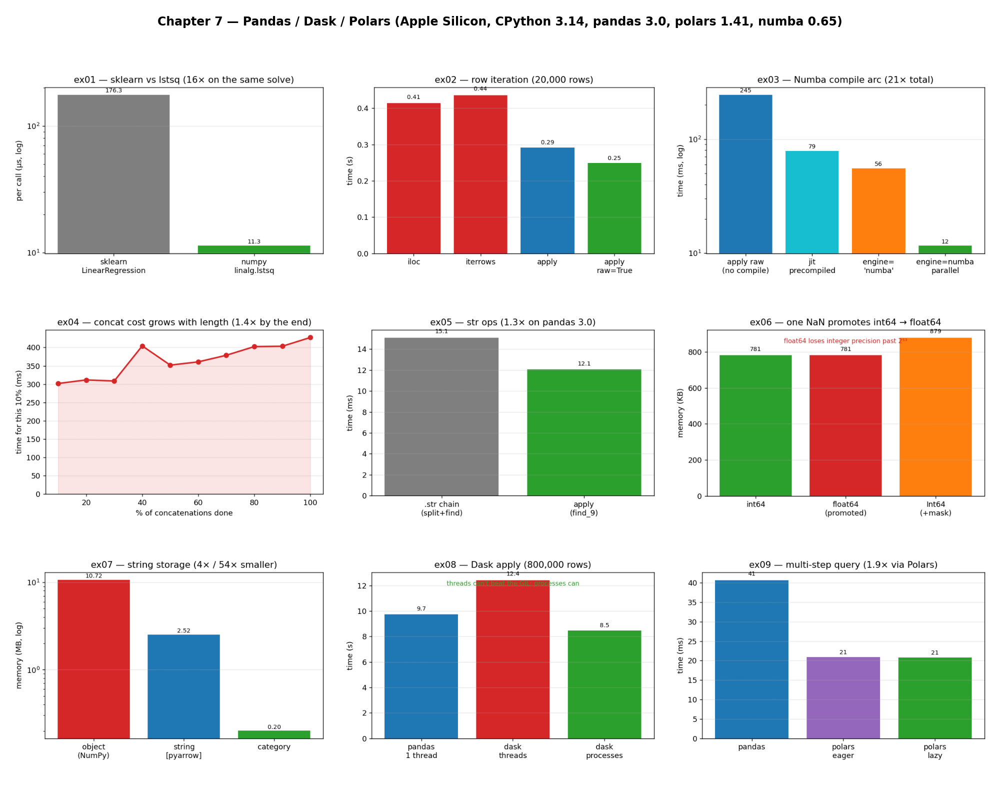

# Chapter 7 — Pandas, Dask, Polars: Practice Exercises

Runnable drills for *High Performance Python (3rd ed.)*, Chapter 7. Each script self-reports
**time** (`timeit` / `perf_counter`) and, where it matters, **memory** (pandas'
`memory_usage(deep=True)`, or `tracemalloc` via the shared `perf.py`) — so the wins are
visible without reaching for an external profiler.

The chapter's running example is a real one from the authors' consulting work: fitting an
**Ordinary Least Squares** line (a slope `m`) to every row of a DataFrame, where each row is a
synthetic user's 14 days of phone usage. The full job is a million users across hundreds of
time windows — hundreds of millions of OLS fits — so how you apply that tiny function to each
row decides whether the work takes hours or minutes. These exercises follow that arc and then
branch out into the storage, scaling, and library choices the chapter raises.

Numbers below are from **CPython 3.14 / pandas 3.0 / numpy 2.4 / polars 1.41 / numba 0.65 /
dask 2026.3 on Apple Silicon (10 cores)** — yours will differ, sometimes a lot. One thing
worth flagging up front: this repo runs **pandas 3.0**, the version where Copy-on-Write is the
default. That is exactly the change the book's note anticipates, and it has already narrowed at
least one of the chapter's results (see ex05) — a live reminder that benchmarks age.

```bash
.venv/bin/python chapter_7/ex01_ols_sklearn_vs_lstsq/ex01_ols_sklearn_vs_lstsq.py
```

**Core idea:** in dataframe code the *vehicle* usually costs more than the *computation*.
Choosing how you iterate rows, how you store columns, how you accumulate results, and which
engine runs the query matters far more than the arithmetic inside — and every one of those
choices should be measured, never assumed.

**Verified learnings** (measured on this machine):

1. **Library safety is a per-call tax.** scikit-learn's `LinearRegression` is ~15× slower than
   raw `np.linalg.lstsq` (ex01) even though both end in the *same* solve — over 85% of its time
   is input validation, which dominates because the actual maths is microscopic.
2. **The row-iteration vehicle sets the speed.** `apply` beats `iloc`/`iterrows` by avoiding a
   fresh per-row `Series`, and `raw=True` beats `apply` by handing over the bare NumPy array
   (ex02) — which is also the prerequisite for compiling.
3. **Compilation compounds.** Numba takes the `raw=True` apply from ~255 ms to ~10 ms — a ~26×
   win (ex03) — but only on NumPy storage; it cannot touch a Series or a PyArrow array.
4. **Iterative `concat` is a quadratic trap** (ex04): each call copies the whole growing Series,
   so accumulate in a Python list and build the Series once — ~3.8× faster even at 8k rows.
5. **Storage is a memory lever for strings, a wash for numbers** (ex06/ex07): one NaN silently
   promotes `int64`→`float64` (losing precision past 2⁵³) unless you use nullable `Int64`; and
   Arrow/`category` shrink a low-cardinality string column ~4×/~53× while numeric columns tie.
6. **Parallelism needs the right scheduler** (ex08): pandas `apply` is GIL-bound, so Dask's
   default `threads` is *slower* than single-threaded; only `processes` wins, and only once each
   partition's work outweighs the cost of shipping its data.
7. **Polars is ~2× faster on equivalent code** (ex09): Arrow-only storage, a built-in query
   optimizer, and automatic multicore, with no manual tuning — the low end of the book's 2–10×.

---

## Exercises

Each exercise lives in its own folder with a runnable script, a `README.md`, and a `chart.png`.
Charts are generated by `visualize_exercises.py`, which reuses each exercise's own functions to
measure.

| exercise | what it shows |
| --- | --- |
| [`ex01_ols_sklearn_vs_lstsq`](ex01_ols_sklearn_vs_lstsq/) | sklearn vs raw `lstsq` — safety is a per-call tax (~15×) |
| [`ex02_row_iteration`](ex02_row_iteration/) | iloc / iterrows / apply / apply raw — Table 7-1 |
| [`ex03_numba_compile`](ex03_numba_compile/) | compiling the row apply with Numba (~26×) |
| [`ex04_concat_quadratic`](ex04_concat_quadratic/) | build-from-list vs iterative `concat` (Figure 7-3) |
| [`ex05_str_apply_vs_chain`](ex05_str_apply_vs_chain/) | `.str` chain vs `apply` — and how CoW narrowed it |
| [`ex06_nan_int_promotion`](ex06_nan_int_promotion/) | one NaN promotes int→float; nullable `Int64` |
| [`ex07_arrow_vs_numpy_strings`](ex07_arrow_vs_numpy_strings/) | Arrow/category strings vs NumPy; numeric break-even |
| [`ex08_dask_parallel_apply`](ex08_dask_parallel_apply/) | Dask threads vs processes — the GIL and the scheduler |
| [`ex09_polars_vs_pandas`](ex09_polars_vs_pandas/) | a multi-step query: Polars eager/lazy vs pandas (~2×) |



The dashboard above is a 3×3 contact sheet — one chart per exercise — so you can take in the
whole chapter's arc at once: the OLS optimization story across the top (the sklearn tax, the
row-iteration ladder, the Numba leap), the data-shape lessons in the middle (the concat trap,
the string-ops gap, the NaN promotion), and the scaling/storage results along the bottom (Arrow
memory, Dask scheduling, Polars). Each exercise's own `README.md` walks through how to read its
individual chart and ends with a "5 Whys" that drills from the surface number to the root cause.

```bash
# run any exercise
.venv/bin/python chapter_7/ex01_ols_sklearn_vs_lstsq/ex01_ols_sklearn_vs_lstsq.py
# regenerate every chart + the dashboard above (ex08's Dask run makes this take a couple of minutes)
.venv/bin/python chapter_7/visualize_exercises.py
```

See also **[`hypothesis/`](hypothesis/)** — five extra falsifiable drills beyond the book's
examples, each benchmarked and visualized the same way. Two of them finish stories the
exercises only gesture at (H2: when Dask's process-parallelism actually pays off; H3: Polars
`lazy` winning via Parquet pushdown), and one overturns a piece of common folklore (H4:
`category` does *not* become a liability at high cardinality).

## 5 Whys: why does this chapter keep coming back to the vehicle, not the maths?

1. **Why do these exercises keep optimizing *around* the computation rather than the computation
   itself?** Because the per-row OLS is microseconds; nearly every speed-up came from changing
   how rows are reached, how columns are stored, or which engine runs the query — not the
   arithmetic.
2. **Why is the surrounding machinery the bottleneck?** A DataFrame is a rich, dynamically-typed
   structure — per-row `Series` objects, mixed dtypes, eager evaluation — and that bookkeeping
   dwarfs a tiny numeric kernel run millions of times.
3. **Why does that machinery exist if it's so costly?** It buys generality and safety — mixed
   types, missing-data handling, a huge ergonomic API — which is exactly what makes pandas
   pleasant for everyday analysis.
4. **Why do the fixes (raw arrays, Numba, Arrow, Polars) work?** Each one *removes* a layer of
   that machinery from the hot path — the per-row Series, the interpreter, the NumPy
   object-string, the dual-backend codebase — getting closer to bare typed data.
5. **Why must every one of these still be benchmarked?** Because the balance is
   version- and hardware-specific — pandas 3.0's Copy-on-Write already shrank ex05's gap — so a
   sound mechanism can still under- or over-deliver on your data.

**Root cause:** a DataFrame's flexibility is paid for in per-operation overhead, so high-
performance pandas is the art of stripping that overhead off the hot path — and then measuring
to confirm each strip actually helped.

---

### A note on what's reproduced

All of the chapter's library examples are covered as runnable benchmarks: the OLS row-apply
ladder and its Numba compilation (ex01–ex03), the build-vs-concat and string-ops lessons
(ex04–ex05), the dtype/storage material (ex06–ex07), Dask's multicore apply (ex08), and a
Polars-vs-pandas query (ex09). **Swifter** is installed as a project dependency and is a
one-line wrapper over the same Dask parallelism shown in ex08, so it isn't given a separate
drill. The Dask **diagnostic dashboard** and **task-graph visualizations** the chapter
describes are live-cluster, browser-based tools rather than benchmarks, so they're left for you
to explore interactively on a running `Client`.

Companion notes: `Chapter 7 Pandas, Dask, Polars.md` in the Obsidian vault.
