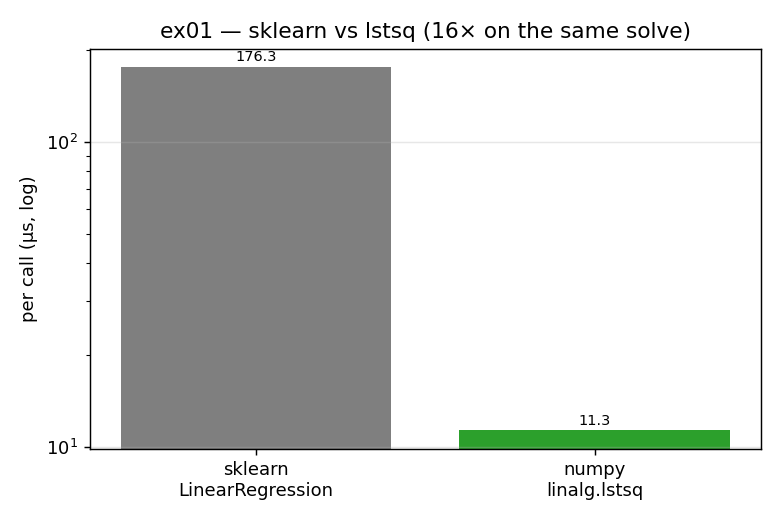

# ex01_ols_sklearn_vs_lstsq

This exercise fits the same straight line to a row of data two different ways and times a
single call to each. The first way is the one most machine-learning practitioners reach for
by reflex — scikit-learn's `LinearRegression`. The second is a bare call to
`numpy.linalg.lstsq`, the kind of thing someone with a linear-algebra background might write.
Both recover the *same* slope to floating-point tolerance, so the only thing that differs is
how much work surrounds the actual solve.

The surprise — and it is the whole point of the chapter's opening — is that scikit-learn is
many times slower even though, at the very bottom, it calls the exact same `linalg.lstsq`
that the terse version calls directly.

## What it measures

A single OLS slope on one synthetic 14-element row (the book's "hours used per day" data:
`Poisson(60 minutes) / 60`), averaged over 2,000 calls:

| version | per call | peak memory | projected to 730M calls |
| --- | ---: | ---: | ---: |
| scikit-learn `LinearRegression` | ~170 µs | ~13.8 KB | ~34 hours |
| numpy `linalg.lstsq` | ~11 µs | ~4.0 KB | ~2 hours |

The book reports a 7× gap on its hardware; here it comes out around **15×**. The exact
multiple is machine-dependent, but the shape is identical: the popular, friendly API is the
expensive one, and the cost grows into the realm of *hours* once you remember the real job is
a million users × up to 730 time windows ≈ 730 million calls.

## What we found

Profiling `LinearRegression.fit` (as the book does with `line_profiler`) reveals that the
`linalg.lstsq` solve is only about an eighth of scikit-learn's runtime. The other ~85% is
spent in two helper methods, `_validate_data` and `_preprocess_data`, which scan for NaN/Inf,
check that the array is 2-D and non-empty, look for sparse inputs, and mean-centre the data
for numerical stability. None of that is wasted in general — those checks have saved every one
of us from feeding mis-shaped or dirty data into an estimator and chasing the bug for an hour.
But on a clean, tiny, 14-element row they are pure overhead, and they run on *every single
call*. That is the trade the chapter wants you to see clearly: you are spending execution time
to buy developer safety, and only you can decide when that trade stops being worth it.

## Reading the chart



The chart is two bars on a **logarithmic** y-axis (each gridline is 10× the one below). The
grey scikit-learn bar towers an order of magnitude above the green `lstsq` bar. The log scale
matters: on a linear axis the two would look merely "a bit different", but the log scale makes
the *ratio* — the thing that turns into 30+ hours at scale — the visual headline.

## 5 Whys

1. **Why is `LinearRegression` ~15× slower than raw `lstsq` when both fit the same line?**
   They call the *same* `linalg.lstsq` at the bottom; profiling shows that solve is only ~13%
   of scikit-learn's time, while `_validate_data` and `_preprocess_data` eat the other ~85%.
2. **Why do those two helpers cost so much?** They run defensive work on every call —
   sparse-array detection, NaN/Inf scanning, shape and non-empty checks, plus mean-centring —
   none of which a clean 14-element row needs.
3. **Why run those checks every single time?** scikit-learn is general-purpose and can't
   assume clean input, so it converts silently-wrong answers into loud, debuggable errors —
   trading execution time for developer sanity.
4. **Why does that fixed cost dominate so badly here?** OLS on 14 numbers is trivially cheap,
   so the *constant* per-call validation overhead swamps the actual arithmetic — and at 730M
   calls that tax is the entire bill.
5. **Why not just switch the checks off?** `set_config(skip_parameter_validation=True)`
   removes only the cheap wrapper-level checks, not the expensive ones inside `fit`, so there
   is no cheap opt-out — which is why the chapter drops to raw `lstsq`.

**Root cause:** library safety is a fixed per-call tax; when the real computation is
microscopic and you run it hundreds of millions of times, it is validation, not maths, that
sets the runtime.

## Run

```bash
.venv/bin/python chapter_7/ex01_ols_sklearn_vs_lstsq/ex01_ols_sklearn_vs_lstsq.py
# regenerate this chart:
.venv/bin/python chapter_7/visualize_exercises.py --only ex01
```
